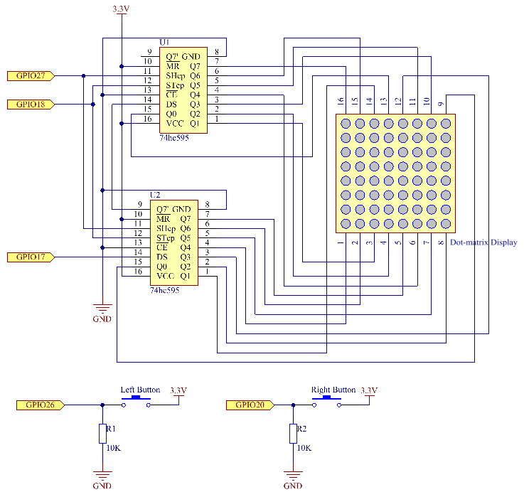

.. note::

    Bonjour, bienvenue dans la communauté des passionnés de SunFounder Raspberry Pi, Arduino & ESP32 sur Facebook ! Plongez dans l’univers du Raspberry Pi, Arduino et ESP32 avec d’autres passionnés.

    **Pourquoi nous rejoindre ?**

    - **Support d’experts** : Résolvez les problèmes techniques post-vente avec l’aide de notre communauté et de notre équipe.
    - **Apprendre et partager** : Échangez des conseils et des tutoriels pour améliorer vos compétences.
    - **Aperçus exclusifs** : Accédez en avant-première aux annonces de nouveaux produits.
    - **Réductions spéciales** : Profitez de réductions exclusives sur nos nouveaux produits.
    - **Promotions festives et cadeaux** : Participez à des promotions spéciales et des concours lors des fêtes.

    👉 Prêt à explorer et créer avec nous ? Cliquez sur [|link_sf_facebook|] et rejoignez-nous dès aujourd'hui !

3.1.14 JEU – Not Not
======================

Introduction
-------------

Dans cette leçon, nous allons créer un appareil de jeu amusant que nous appelons « Not Not ».

Pendant le jeu, la matrice de points affiche aléatoirement une flèche. Votre objectif est de presser le bouton dans la direction opposée de la flèche dans un temps limité. Si le temps est écoulé ou si vous appuyez sur le bouton correspondant à la même direction que la flèche, vous perdez.

Ce jeu permet de pratiquer votre capacité de réflexion inversée. Voulez-vous essayer ?

Composants
-----------

.. image:: img/list_GAME_Not_Not.png
    :align: center

Schéma de montage
-----------------

============ ======== ======== ===
T-Board Name physical wiringPi BCM
GPIO17       Pin 11   0        17
GPIO18       Pin 12   1        18
GPIO27       Pin 13   2        27
GPIO20       Pin 38   28       20
GPIO26       Pin 37   25       26
============ ======== ======== ===

Procédures expérimentales
----------------------------

**Étape 1 :** Construisez le circuit.

.. image:: img/image280.png
   :width: 800

**Étape 2 :** Accédez au dossier du code.

.. raw:: html

   <run></run>

.. code-block::

    cd ~/davinci-kit-for-raspberry-pi/c/3.1.14/

**Étape 3 :** Compilez le code.

.. raw:: html

   <run></run>

.. code-block::

    gcc 3.1.14_GAME_NotNot.c -lwiringPi

**Étape 4 :** Exécutez le fichier compilé.

.. raw:: html

   <run></run>

.. code-block::

     sudo ./a.out

Lorsque le programme démarre, une flèche vers la gauche ou la droite sera affichée 
aléatoirement sur la matrice de points. Vous devez appuyer sur le bouton correspondant 
à la direction opposée de la flèche dans un temps limité. Ensuite, un symbole « **√** » 
apparaîtra sur la matrice. Si le temps est écoulé ou si vous appuyez dans la même direction 
que la flèche, vous perdez et un « x » s'affichera sur la matrice. Vous pouvez également 
ajouter deux nouveaux boutons ou les remplacer par un joystick pour contrôler quatre 
directions (haut, bas, gauche et droite) et augmenter la difficulté du jeu.

.. note::

    Si cela ne fonctionne pas après l'exécution ou si un message d'erreur apparaît : "wiringPi.h: Aucun fichier ou répertoire de ce type", veuillez vous référer à :ref:`C code is not working?`.

**Explication du code**

Basé sur **1.1.6 LED Dot Matrix**, cette leçon ajoute **2** boutons pour créer un appareil 
de jeu amusant. Si vous n'êtes pas encore familier avec la matrice de points, veuillez 
vous référer à :ref:`1.1.6 LED Dot Matrix`.

Le déroulement complet du programme est le suivant :

1. Sélectionnez aléatoirement une direction de flèche et générez le **timer 1**.

2. Affichez l’image de la flèche sur la matrice de points.

3. Détectez l’entrée du bouton. Si le bouton est pressé ou si le **timer 1** indique 
que le temps est écoulé, la phase de jugement commence.

4. Affichez l’image en fonction du résultat du jugement, puis générez le **timer 2**.

5. Revenez à **l'étape 1** lorsque le **timer 2** indique que le temps est écoulé.

.. code-block:: c

    struct GLYPH{
        char *word;
        unsigned char code[8];
    };

    struct GLYPH arrow[2]=
    {
        {"right",{0xFF,0xEF,0xDF,0x81,0xDF,0xEF,0xFF,0xFF}},
        // {"down",{0xFF,0xEF,0xC7,0xAB,0xEF,0xEF,0xEF,0xFF}},
        // {"up",{0xFF,0xEF,0xEF,0xEF,0xAB,0xC7,0xEF,0xFF}},    
        {"left",{0xFF,0xF7,0xFB,0x81,0xFB,0xF7,0xFF,0xFF}}
    };

    struct GLYPH check[2]=
    {
        {"wrong",{0xFF,0xBB,0xD7,0xEF,0xD7,0xBB,0xFF,0xFF}},
        {"right",{0xFF,0xFF,0xF7,0xEB,0xDF,0xBF,0xFF,0xFF}}
    };

La structure **GLYPH** fonctionne comme un dictionnaire : l’attribut **word** 
correspond à la clé dans le dictionnaire et l’attribut **code** correspond à la valeur.

Ici, le code stocke un tableau pour que la matrice de points affiche des images 
(tableau 8x8 bits).

Le tableau **arrow** est utilisé pour afficher le motif de flèche vers la gauche ou 
la droite sur la matrice LED.

Le tableau **check** est utilisé pour afficher les deux symboles : « **×** » et « **√** ».

.. code-block:: c

    char *lookup(char *key,struct GLYPH *glyph,int length){
        for (int i=0;i<length;i++)
        {
            if(strcmp(glyph[i].word,key)==0){
                return glyph[i].code;
            }
        }    
    }

La fonction **lookup()** permet de « vérifier le dictionnaire ». Elle prend une
 **clé** en entrée, recherche les mots correspondants à cette **clé** dans la 
 structure **GLYPH \*glyph** et renvoie les informations associées, à savoir le 
 « **code** » du mot en question.

La fonction **Strcmp()** est utilisée pour comparer deux chaînes de caractères 
**glyph[i].word** et **key**. Si elles sont identiques, la fonction renvoie 
**glyph[i].code** (comme illustré ci-dessous).

.. code-block:: c

    void display(char *glyphCode){
        for(int i;i<8;i++){
            hc595_in(glyphCode[i]);
            hc595_in(0x80>>i);
            hc595_out();
        }
    }

Affiche le motif spécifié sur la matrice de points.

.. code-block:: c

    void createGlyph(){
        srand(time(NULL));
        int i=rand()%(sizeof(arrow)/sizeof(arrow[0]));
        waypoint=arrow[i].word;
        stage="PLAY";
        alarm(2);
    }

La fonction **createGlyph()** est utilisée pour sélectionner aléatoirement une 
direction (l’attribut **word** d’un élément du tableau **arrow[]** : « **left** », 
« **right** »... ). Elle définit ensuite l’étape à « PLAY » et lance une fonction 
d’alarme de 2 secondes.

**srand(time(NULL)) :** Initialise la graine de génération aléatoire à partir de 
l’horloge du système.

**(sizeof(arrow)/sizeof(arrow[0])) :** Calcule la longueur du tableau, qui est de 2.

**rand()%2 :** Le reste de la division par 2 donne **0** ou **1**.

**waypoint=arrow[i].word :** Le résultat sera « right » ou « left ».

.. code-block:: c

    void checkPoint(char *inputKey){
        alarm(0)==0;
        if(inputKey==waypoint||inputKey=="empty")
        {
            waypoint="wrong";
        }
        else{
            waypoint="right";
        }
        stage="CHECK";
        alarm(1);
    }

La fonction **checkPoint()** est utilisée pour vérifier l’entrée du bouton ; 
si le bouton n’est pas pressé ou si le bouton correspondant à la même direction 
que la flèche est pressé, le résultat est « faux » et « **x** » apparaît sur la 
matrice de points. Sinon, le résultat est « vrai » et la matrice affiche « **√** ». 
L’étape devient alors « CHECK », et une alarme de 1 seconde est définie.

La fonction **alarm()** est un « réveil » qui déclenche un signal **SIGALRM** 
lorsque le temps défini est écoulé.

.. code-block:: c

    void getKey(){
        if (digitalRead(AButtonPin)==1&&digitalRead(BButtonPin)==0)
        {checkPoint("right");}
        else if (digitalRead(AButtonPin)==0&&digitalRead(BButtonPin)==1)
        {checkPoint("left");}
    }

La fonction **getKey()** lit l’état de deux boutons : si le bouton droit est pressé, 
le paramètre de **checkPoint()** est **right** ; si le bouton gauche est pressé, le 
paramètre est **left**.

.. code-block:: c

    void timer(){
        if (stage=="PLAY"){
            checkPoint("empty");
        }
        else if(stage=="CHECK"){
            createGlyph();
        }
    }

La fonction **timer()** est appelée lorsque le **timer** (défini par **alarm()**) est 
écoulé. Sous le mode « PLAY », **checkPoint()** est appelé pour juger le résultat. Si 
le mode est défini sur « CHECK », **createGlyph()** est appelé pour sélectionner de 
nouveaux motifs.

.. code-block:: c

    void main(){
        setup();
        signal(SIGALRM,timer);
        createGlyph();
        char *code = NULL;
        while(1){
            if (stage == "PLAY")
            {
                code=lookup(waypoint,arrow,sizeof(arrow)/sizeof(arrow[0]));
                display(code);
                getKey();
            }
            else if(stage == "CHECK")
            {
                code = lookup(waypoint,check,sizeof(check)/sizeof(check[0]));
                display(code);
            }
        }
    }

Le fonctionnement de la fonction **signal(SIGALRM,timer)** : elle appelle la 
fonction **timer()** lorsqu’un signal **SIGALRM** (généré par la fonction alarme 
**alarm()**) est reçu.

Lorsque le programme démarre, il appelle d’abord **createGlyph()** une fois, 
puis entre dans la boucle.

Dans la boucle : en mode « PLAY », la matrice de points affiche les motifs de 
flèche et vérifie l’état du bouton ; en mode « CHECK », elle affiche « **x** » ou « **√** ».

