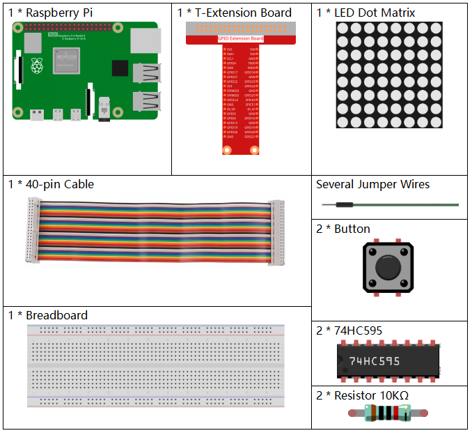

.. note::

    ¡Hola! Bienvenido a la Comunidad de Entusiastas de SunFounder para Raspberry Pi, Arduino y ESP32 en Facebook. Únete para profundizar en el mundo de Raspberry Pi, Arduino y ESP32 junto a otros aficionados.

    **¿Por qué unirse?**

    - **Soporte Experto**: Resuelve problemas post-venta y desafíos técnicos con ayuda de nuestra comunidad y equipo.
    - **Aprende y Comparte**: Intercambia consejos y tutoriales para mejorar tus habilidades.
    - **Previsualizaciones Exclusivas**: Accede anticipadamente a anuncios de nuevos productos y adelantos exclusivos.
    - **Descuentos Especiales**: Disfruta de descuentos exclusivos en nuestros productos más recientes.
    - **Promociones Festivas y Sorteos**: Participa en sorteos y promociones especiales.

    👉 ¿Listo para explorar y crear con nosotros? Haz clic en [|link_sf_facebook|] y únete hoy mismo.

3.1.14 JUEGO – Not Not
==========================

Introducción
--------------------

En esta lección, crearemos un juego divertido al que llamaremos \"Not Not\".

Durante el juego, la matriz de puntos mostrará una flecha de forma aleatoria. Tu tarea es presionar el botón en la dirección opuesta a la flecha dentro de un tiempo limitado. Si el tiempo se agota o presionas el botón en la misma dirección de la flecha, pierdes.

Este juego puede mejorar tu pensamiento inverso, ¿te animas a intentarlo?

Componentes
---------------

Diagrama Esquemático
----------------------

============ ======== ======== ===
T-Board Name physical wiringPi BCM
GPIO17       Pin 11   0        17
GPIO18       Pin 12   1        18
GPIO27       Pin 13   2        27
GPIO20       Pin 38   28       20
GPIO26       Pin 37   25       26
============ ======== ======== ===

.. image:: img/Schematic_three_one14.png
   :align: center

Procedimientos Experimentales
---------------------------------

**Paso 1:** Ensambla el circuito.

.. image:: img/image280.png
    :width: 800

**Paso 2:** Accede a la carpeta del código.

.. raw:: html

   <run></run>

.. code-block::

    cd ~/davinci-kit-for-raspberry-pi/c/3.1.14/

**Paso 3**: Compila.

.. raw:: html

   <run></run>

.. code-block::

    gcc 3.1.14_GAME_NotNot.c -lwiringPi

**Paso 4**: Ejecuta el archivo.

.. raw:: html

   <run></run>

.. code-block::

     sudo ./a.out

Después de iniciar el programa, una flecha (izquierda o derecha) aparecerá 
aleatoriamente en la matriz de puntos. Debes presionar el botón en la 
dirección opuesta a la flecha antes de que el tiempo se agote. Si aciertas, 
aparecerá \"**√**\" en la matriz. Si el tiempo se acaba o presionas el botón 
en la misma dirección de la flecha, pierdes y se mostrará una \"x\" en la matriz. 
Puedes agregar dos botones nuevos o sustituirlos con los botones de un joystick 
para manejar las direcciones arriba, abajo, izquierda y derecha, aumentando la 
dificultad del juego.

.. note::

    Si el juego no funciona después de ejecutarlo, o aparece un mensaje de error como : \"wiringPi.h: No such file or directory\", consulta :ref:`C code is not working?`.

**Explicación del Código**

Basado en **1.1.6 Matriz de LEDs**, esta lección añade **2** botones para 
hacer un dispositivo de juego entretenido. Si no estás familiarizado con 
la matriz de puntos, consulta :ref:`1.1.6 LED Dot Matrix`.

El proceso completo del programa es el siguiente:

1. Seleccionar aleatoriamente una dirección de flecha y generar el **temporizador 1**.

2. Mostrar la imagen de la flecha en la matriz de puntos.

3. Comprobar la entrada del botón. Si se presiona un botón o el 
   **temporizador 1** indica que el tiempo ha terminado, comienza la verificación.

4. Mostrar la imagen según el resultado de la verificación, mientras se genera 
   el **temporizador 2**.
5. Volver al **paso 1** cuando el **temporizador 2** indique que el tiempo ha terminado.

.. code-block:: c

    struct GLYPH{
        char *word;
        unsigned char code[8];
    };

    struct GLYPH arrow[2]=
    {
        {"right",{0xFF,0xEF,0xDF,0x81,0xDF,0xEF,0xFF,0xFF}},
        // {"down",{0xFF,0xEF,0xC7,0xAB,0xEF,0xEF,0xEF,0xFF}},
        // {"up",{0xFF,0xEF,0xEF,0xEF,0xAB,0xC7,0xEF,0xFF}},    
        {"left",{0xFF,0xF7,0xFB,0x81,0xFB,0xF7,0xFF,0xFF}}
    };

    struct GLYPH check[2]=
    {
        {"wrong",{0xFF,0xBB,0xD7,0xEF,0xD7,0xBB,0xFF,0xFF}},
        {"right",{0xFF,0xFF,0xF7,0xEB,0xDF,0xBF,0xFF,0xFF}}
    };

La estructura GLYPH funciona como un diccionario: el atributo **word** 
se corresponde con la **clave** del diccionario, y el atributo **code** 
con el **valor**.

Aquí, el código se utiliza para almacenar un arreglo que permite que la matriz de puntos muestre imágenes (un arreglo de 8x8 bits).

El arreglo **arrow** se puede usar para mostrar una flecha en las direcciones arriba, abajo, izquierda y derecha en la matriz LED.

Por ahora, **down** y **up** están comentados, y puedes descomentarlos si es necesario.

El arreglo **check** se usa para mostrar las dos imágenes: \"**×**\" y \"**√**\".

.. code-block:: c

    char *lookup(char *key,struct GLYPH *glyph,int length){
        for (int i=0;i<length;i++)
        {
            if(strcmp(glyph[i].word,key)==0){
                return glyph[i].code;
            }
        }    
    }

La función **lookup()** funciona como un "chequeo del diccionario". Define una
**clave**, busca palabras iguales a **key** en la estructura **GLYPH
\*glyph** y devuelve la información correspondiente—el "código" (**code**)
de la palabra específica.

La función **strcmp()** se utiliza para comparar la identidad de dos
cadenas de caracteres: **glyph[i].word** y **key**. Si coinciden, 
devuelve **glyph[i].code** (como se muestra).

.. code-block:: c

    void display(char *glyphCode){
        for(int i;i<8;i++){
            hc595_in(glyphCode[i]);
            hc595_in(0x80>>i);
            hc595_out();
        }
    }

Muestra el patrón especificado en la matriz de puntos.

.. code-block:: c

    void createGlyph(){
        srand(time(NULL));
        int i=rand()%(sizeof(arrow)/sizeof(arrow[0]));
        waypoint=arrow[i].word;
        stage="PLAY";
        alarm(2);
    }

La función **createGlyph()** se usa para seleccionar aleatoriamente una dirección
(el atributo word de un elemento en el arreglo **arrow[]:**
"**left**", "**right**"... ). Configura el stage como "PLAY" y empieza
una función de alarma de 2 segundos.

**srand(time(NULL))**: Inicializa las semillas aleatorias a partir del reloj
del sistema.

**(sizeof(arrow) / sizeof(arrow[0]))**: Obtiene la longitud del arreglo, cuyo
resultado es 2.

**rand() % 2**: El resultado es **0** o **1**, obtenido al dividir un número
aleatorio generado por 2.

**waypoint=arrow[i].word**: El resultado debe ser "right" o "left".

.. code-block:: c

    void checkPoint(char *inputKey){
        alarm(0)==0;
        if(inputKey==waypoint||inputKey=="empty")
        {
            waypoint="wrong";
        }
        else{
            waypoint="right";
        }
        stage="CHECK";
        alarm(1);
    }

**checkPoint()** se usa para verificar la entrada del botón; si no se presiona
el botón o se presiona el botón en la misma dirección de la flecha, el
resultado del waypoint es "wrong" y aparece "x" en la matriz de puntos. De lo
contrario, el waypoint es "right" y la matriz de puntos muestra "√". Aquí el
**stage** es **CHECK**, y se puede configurar una función de alarma de 1 segundo.

**alarm()** se llama "alarma", en la cual se puede configurar un temporizador, y
envía señales **SIGALRM** al proceso cuando el tiempo definido se acaba.

.. code-block:: c

    void getKey(){
        if (digitalRead(AButtonPin)==1&&digitalRead(BButtonPin)==0)
        {checkPoint("right");}
        else if (digitalRead(AButtonPin)==0&&digitalRead(BButtonPin)==1)
        {checkPoint("left");}
    }

**getKey()** lee los estados de estos dos botones; si se presiona el botón derecho,
el parámetro de la función **checkPoint()** es "right" y si se presiona el
botón izquierdo, el parámetro es "left".

.. code-block:: c

    void timer(){
        if (stage=="PLAY"){
            checkPoint("empty");
        }
        else if(stage=="CHECK"){
            createGlyph();
        }
    }

Previamente, **timer()** se llamaba cuando se alcanzaba el tiempo configurado
en **alarm()**. Luego, en el modo "PLAY", se llama a **checkPoint()** para
evaluar el resultado. Si el programa está configurado en el modo "CHECK",
debería llamarse a la función **createGlyph()** para seleccionar nuevos patrones.

.. code-block:: c

    void main(){
        setup();
        signal(SIGALRM,timer);
        createGlyph();
        char *code = NULL;
        while(1){
            if (stage == "PLAY")
            {
                code=lookup(waypoint,arrow,sizeof(arrow)/sizeof(arrow[0]));
                display(code);
                getKey();
            }
            else if(stage == "CHECK")
            {
                code = lookup(waypoint,check,sizeof(check)/sizeof(check[0]));
                display(code);
            }
        }
    }

La función **signal(SIGALRM, timer)**: llama a la función **timer()** 
cuando se recibe una señal **SIGALRM** (generada por la función de alarma **alarm()**).

Cuando el programa inicia, llama a **createGlyph()** una vez y luego
empieza el bucle.

En el bucle: en modo PLAY, la matriz de puntos muestra los patrones de
flecha y verifica el estado del botón; si está en modo CHECK, lo que se
muestra es "x" o "√".

