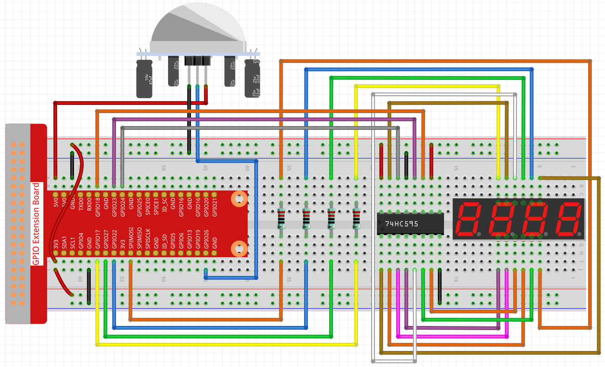

.. note::

    Hello, welcome to the SunFounder Raspberry Pi & Arduino & ESP32 Enthusiasts Community on Facebook! Dive deeper into Raspberry Pi, Arduino, and ESP32 with fellow enthusiasts.

    **Why Join?**

    - **Expert Support**: Solve post-sale issues and technical challenges with help from our community and team.
    - **Learn & Share**: Exchange tips and tutorials to enhance your skills.
    - **Exclusive Previews**: Get early access to new product announcements and sneak peeks.
    - **Special Discounts**: Enjoy exclusive discounts on our newest products.
    - **Festive Promotions and Giveaways**: Take part in giveaways and holiday promotions.

    👉 Ready to explore and create with us? Click [|link_sf_facebook|] and join today!

3.1.1 Counting Device
==============================

Introduction
-----------------

Here we will make a number-displaying counter system, consisting of a
PIR sensor and a 4-digit segment display. When the PIR detects that
someone is passing by, the number on the 4-digit segment display will
add 1. You can use this counter to count the number of people walking 
through the passageway.

Components
---------------

.. image:: img/list_Counting_Device1.png
    :align: center

.. image:: img/list_Counting_Device2.png
    :align: center

Schematic Diagram
----------------------

============ ======== ======== ===
T-Board Name physical wiringPi BCM
GPIO17       Pin 11   0        17
GPIO27       Pin 13   2        27
GPIO22       Pin 15   3        22
SPIMOSI      Pin 19   12       10
GPIO18       Pin 12   1        18
GPIO23       Pin 16   4        23
GPIO24       Pin 18   5        24
GPIO26       Pin 37   25       26
============ ======== ======== ===

.. image:: img/Schematic_three_one1.png
   :align: center

Experimental Procedures
-----------------------------

**Step 1**: Build the circuit.

**Step 2**: Go to the folder of the code.

.. raw:: html

   <run></run>

.. code-block:: 

    cd ~/davinci-kit-for-raspberry-pi/c/3.1.1/

**Step 3**: Compile the code.

.. raw:: html

   <run></run>

.. code-block:: 

    gcc 3.1.1_CountingDevice.c -lwiringPi

**Step 4**: Run the executable file.

.. raw:: html

    <run></run>
 
.. code-block:: 
 
    sudo ./a.out
 
After the code runs, when the PIR detects that someone is passing by,
the number on the 4-digit segment display will add 1.

There are two potentiometers on
the PIR module: one is to adjust sensitivity and the other is to adjust
the detection distance. To make the PIR module work better, you
You need to turn both of them counterclockwise to the end.

.. note::

    If it does not work after running, or there is an error prompt: \"wiringPi.h: No such file or directory\", please refer to :ref:`C code is not working?`.
    
**Code Explanation**

.. code-block:: c

    void display()
    {
        clearDisplay();
        pickDigit(0);
        hc595_shift(number[counter % 10]);

        clearDisplay();
        pickDigit(1);
        hc595_shift(number[counter % 100 / 10]);

        clearDisplay();
        pickDigit(2);
        hc595_shift(number[counter % 1000 / 100]);
     
        clearDisplay();
        pickDigit(3);
        hc595_shift(number[counter % 10000 / 1000]);
    }

First, start the fourth segment display, write the single-digit number.
Then start the third segment display, and type in the tens digit; after
that, start the second and the first segment display respectively, and
write the hundreds and thousands digits respectively. Because the
refreshing speed is very fast, we see a complete four-digit display.

.. code-block:: c

    void loop(){
        int currentState =0;
        int lastState=0;
        while(1){
            display();
            currentState=digitalRead(sensorPin);
            if((currentState==0)&&(lastState==1)){
                counter +=1;
            }
            lastState=currentState;
        }
    }

This is the main function: display the number on the 4-digit segment
display and read the PIR value. When the PIR detects that someone is
passing by, the number on the 4-digit segment display will add 1.
