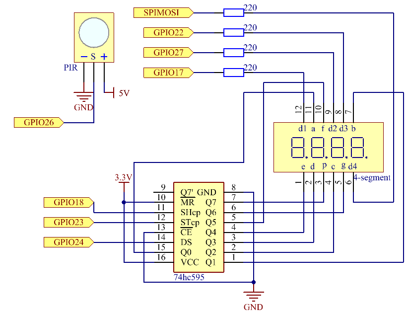
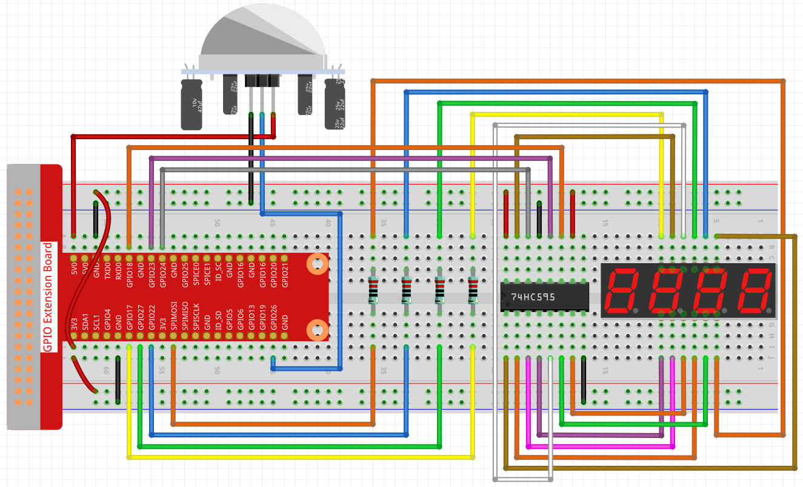

.. note::

    Hallo und willkommen in der SunFounder Raspberry Pi & Arduino & ESP32 Enthusiasten-Gemeinschaft auf Facebook! Tauchen Sie tiefer ein in die Welt von Raspberry Pi, Arduino und ESP32 mit anderen Enthusiasten.

    **Warum beitreten?**

    - **Expertenunterstützung**: Lösen Sie Nachverkaufsprobleme und technische Herausforderungen mit Hilfe unserer Gemeinschaft und unseres Teams.
    - **Lernen & Teilen**: Tauschen Sie Tipps und Anleitungen aus, um Ihre Fähigkeiten zu verbessern.
    - **Exklusive Vorschauen**: Erhalten Sie frühzeitigen Zugang zu neuen Produktankündigungen und exklusiven Einblicken.
    - **Spezialrabatte**: Genießen Sie exklusive Rabatte auf unsere neuesten Produkte.
    - **Festliche Aktionen und Gewinnspiele**: Nehmen Sie an Gewinnspielen und Feiertagsaktionen teil.

    👉 Sind Sie bereit, mit uns zu erkunden und zu erschaffen? Klicken Sie auf [|link_sf_facebook|] und treten Sie heute bei!

3.1.1 Zählgerät
===================

Einführung
-----------------

Hier werden wir ein Zählersystem mit Nummeranzeige herstellen, 
das aus einem PIR-Sensor und einer 4-stelligen Segmentanzeige besteht. 
Wenn der PIR feststellt, dass jemand vorbeikommt, addiert die Nummer auf der 4-stelligen Segmentanzeige 1. 
Mit diesem Zähler können Sie die Anzahl der Personen zählen, die durch den Durchgang gehen.

Komponenten
---------------

.. image:: ../img/list_Counting_Device1.png
    :align: center

.. image:: ../img/list_Counting_Device2.png
    :align: center

Schematische Darstellung
------------------------------------

============ ======== ======== ===
T-Board Name physical wiringPi BCM
GPIO17       Pin 11   0        17
GPIO27       Pin 13   2        27
GPIO22       Pin 15   3        22
SPIMOSI      Pin 19   12       10
GPIO18       Pin 12   1        18
GPIO23       Pin 16   4        23
GPIO24       Pin 18   5        24
GPIO26       Pin 37   25       26
============ ======== ======== ===

Experimentelle Verfahren
-----------------------------

Schritt 1: Bauen Sie die Schaltung auf.

Schritt 2: Gehen Sie zum Ordner der Kode.

.. raw:: html

   <run></run>

.. code-block:: 

    cd ~/davinci-kit-for-raspberry-pi/c/3.1.1/

Schritt 3: Kompilieren Sie die Kode.

.. raw:: html

   <run></run>

.. code-block:: 

    gcc 3.1.1_CountingDevice.c -lwiringPi

Schritt 4: Führen Sie die ausführbare Datei aus.

.. raw:: html

    <run></run>
 
.. code-block:: 
 
    sudo ./a.out
 
Wenn der PIR nach dem Ausführen der Kode feststellt, dass jemand vorbeikommt, addiert die Nummer auf der 4-stelligen Segmentanzeige 1.

There are two potentiometers on the PIR module: one is to adjust sensitivity and the other is to adjust the detection distance. To make the PIR module work better, you You need to turn both of them counterclockwise to the end.

**Code Erklärung**

.. code-block:: c

    void display()
    {
        clearDisplay();
        pickDigit(0);
        hc595_shift(number[counter % 10]);

        clearDisplay();
        pickDigit(1);
        hc595_shift(number[counter % 100 / 10]);

        clearDisplay();
        pickDigit(2);
        hc595_shift(number[counter % 1000 / 100]);
     
        clearDisplay();
        pickDigit(3);
        hc595_shift(number[counter % 10000 / 1000]);
    }

Starten Sie zuerst die vierte Segmentanzeige und schreiben Sie die einstellige Nummer. 
Dann starten Sie die Anzeige des dritten Segments und geben Sie die Zehnerstelle ein. 
Starten Sie danach die zweite bzw. die erste Segmentanzeige und schreiben Sie die Hunderter- bzw. 
Tausenderstellen. Da die Aktualisierungsgeschwindigkeit sehr hoch ist, 
sehen wir eine vollständige vierstellige Anzeige.

.. code-block:: c

    void loop(){
        int currentState =0;
        int lastState=0;
        while(1){
            display();
            currentState=digitalRead(sensorPin);
            if((currentState==0)&&(lastState==1)){
                counter +=1;
            }
            lastState=currentState;
        }
    }

Dies ist die Hauptfunktion: 
Zeigen Sie die Nummer auf der 4-stelligen Segmentanzeige an und lesen Sie den PIR-Wert. 
Wenn der PIR feststellt, 
dass jemand vorbeikommt, addiert die Nummer auf der 4-stelligen Segmentanzeige 1.

