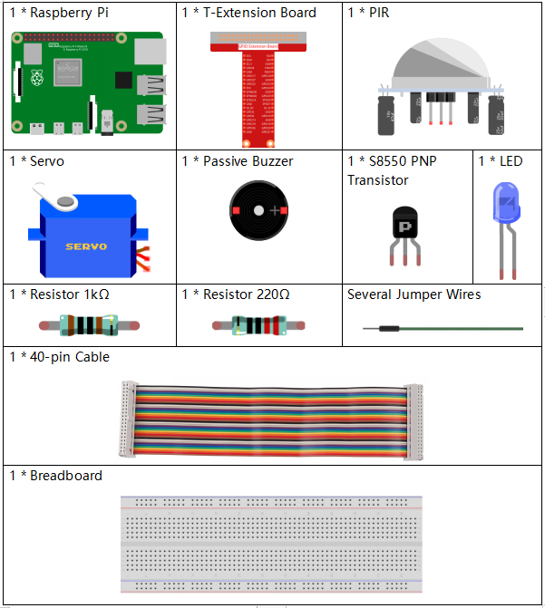
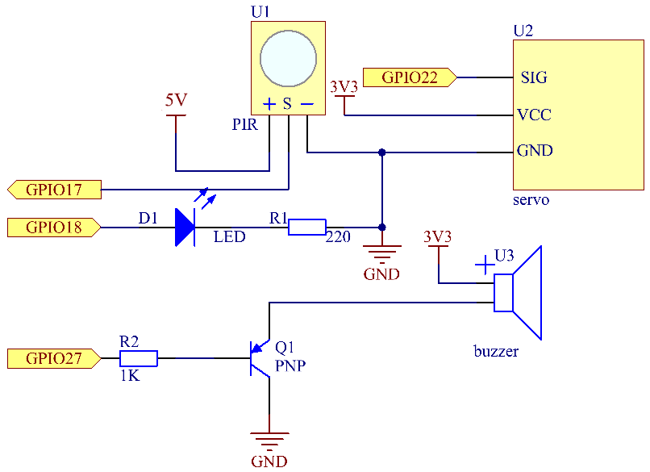
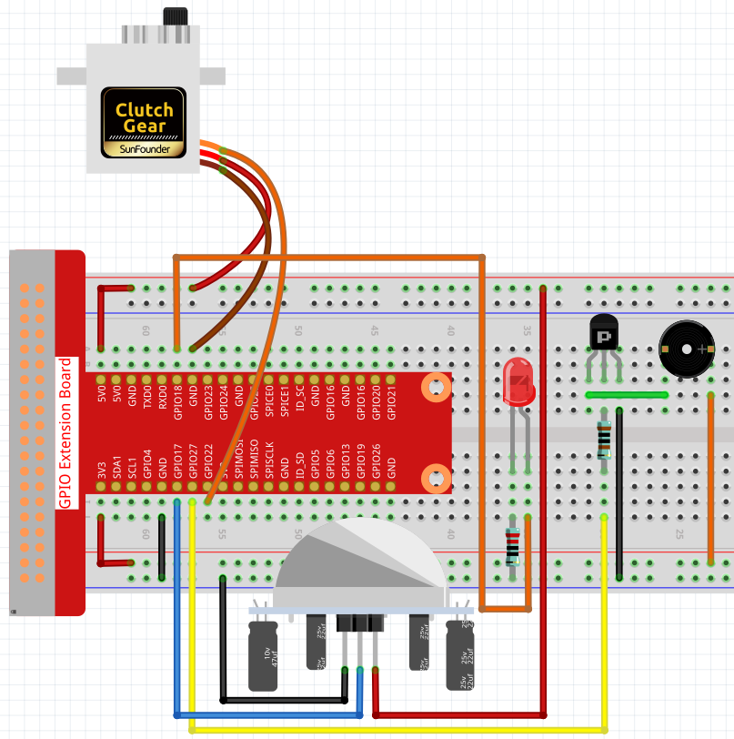

.. note::

    Ciao, benvenuto nella Community su Facebook per gli appassionati di SunFounder Raspberry Pi, Arduino e ESP32! Approfondisci le tue conoscenze su Raspberry Pi, Arduino ed ESP32 insieme ad altri appassionati.

    **Perché unirti a noi?**

    - **Supporto esperto**: Risolvi i problemi post-vendita e le sfide tecniche con l’aiuto della nostra community e del nostro team.
    - **Impara e Condividi**: Scambia consigli e tutorial per migliorare le tue competenze.
    - **Anteprime Esclusive**: Ottieni accesso anticipato agli annunci dei nuovi prodotti e anteprime esclusive.
    - **Sconti Speciali**: Approfitta di sconti esclusivi sui nostri prodotti più recenti.
    - **Promozioni e Giveaway Festivi**: Partecipa a concorsi e promozioni in occasione delle festività.

    👉 Pronto a esplorare e creare con noi? Clicca su [|link_sf_facebook|] e unisciti oggi stesso!

3.1.2 Benvenuto
==================

Introduzione
--------------

In questo progetto, utilizzeremo un sensore PIR per rilevare il movimento 
dei passanti e useremo servomotori, LED e un cicalino per simulare il 
funzionamento della porta automatica di un negozio. Quando un pedone entra 
nel raggio di rilevamento del PIR, si accenderà la luce di indicazione, la 
porta si aprirà e il cicalino suonerà il campanello di apertura.

Componenti
------------

Schema di Collegamento
-------------------------

============ ======== ======== ===
T-Board Name physical wiringPi BCM
GPIO18       Pin 12   1        18
GPIO17       Pin 11   0        17
GPIO27       Pin 13   2        27
GPIO22       Pin 15   3        22
============ ======== ======== ===

Procedure Sperimentali
-------------------------

**Passo 1:** Costruisci il circuito.

**Passo 2:** Cambia directory.

.. raw:: html

   <run></run>

.. code-block:: 

    cd ~/davinci-kit-for-raspberry-pi/c/3.1.2/

**Passo 3:** Compila.

.. raw:: html

   <run></run>

.. code-block:: 

    gcc 3.1.2_Welcome.c -lwiringPi

**Passo 4:** Esegui.

.. raw:: html

   <run></run>

.. code-block:: 

    sudo ./a.out

Dopo l’esecuzione del codice, se il sensore PIR rileva il passaggio 
di qualcuno, la porta si aprirà automaticamente (simulata dal servo), 
si accenderà la luce di indicazione e suonerà la musica del campanello. 
Dopo la riproduzione della musica, il sistema chiuderà automaticamente 
la porta e spegnerà la luce di indicazione, in attesa del passaggio successivo.

Sul modulo PIR sono presenti due potenziometri: uno per regolare la 
sensibilità e l'altro per regolare la distanza di rilevamento. Per 
migliorare le prestazioni del modulo PIR, è necessario ruotare entrambi 
in senso antiorario fino alla fine.

.. note::

    Se non funziona dopo l'esecuzione o compare un messaggio di errore: \"wiringPi.h: No such file or directory\", consulta :ref:`Il codice C non funziona?`.

**Spiegazione del Codice**

.. code-block:: c

    void setAngle(int pin, int angle){    //Crea una funzione per controllare l'angolo del servomotore.
        if(angle < 0)
            angle = 0;
        if(angle > 180)
            angle = 180;
        softPwmWrite(pin, Map(angle, 0, 180, 5, 25));   
    } 

Crea la funzione setAngle per impostare l'angolo nel servomotore da 
0 a 180 gradi.

.. code-block:: c

    void doorbell(){
        for(int i=0;i<sizeof(song)/4;i++){
            softToneWrite(BuzPin, song[i]); 
            delay(beat[i] * 250);
        }

Crea la funzione doorbell per far suonare il cicalino.

.. code-block:: c

    void closedoor(){
        digitalWrite(ledPin, LOW);   //spegne il LED
        for(int i=180;i>-1;i--){  //fa ruotare il servo dall'angolo massimo all'angolo minimo
            setAngle(servoPin, i);
            delay(1);
        }
    }

Crea la funzione closedoor per simulare la chiusura della porta, spegnere 
il LED e fare ruotare il servo da 180 a 0 gradi.

.. code-block:: c

    void opendoor(){
        digitalWrite(ledPin, HIGH);   //accende il LED
        for(int i=0;i<181;i++){  //fa ruotare il servo dall'angolo minimo all'angolo massimo
            setAngle(servoPin, i);
            delay(1);
        }
        doorbell();
        closedoor();
    }

La funzione opendoor() comprende varie azioni: accendere la luce di 
indicazione, ruotare il servo (simulando l'apertura della porta), 
suonare il campanello del negozio e chiamare la funzione closedoor() 
dopo la riproduzione della musica.

.. code-block:: c

    int main(void)
    {
        if(wiringPiSetup() == -1){ //se l'inizializzazione di wiring fallisce, stampa un messaggio a schermo
            printf("setup wiringPi failed !");
            return 1;
        }
        if(softToneCreate(BuzPin) == -1){
            printf("setup softTone failed !");
            return 1;
        }
    ......

Nella funzione main(), inizializza la libreria wiringPi e configura softTone, 
quindi imposta ledPin come uscita e pirPin come ingresso. Se il sensore PIR 
rileva il passaggio di qualcuno, verrà chiamata la funzione opendoor per 
simulare l'apertura della porta.

