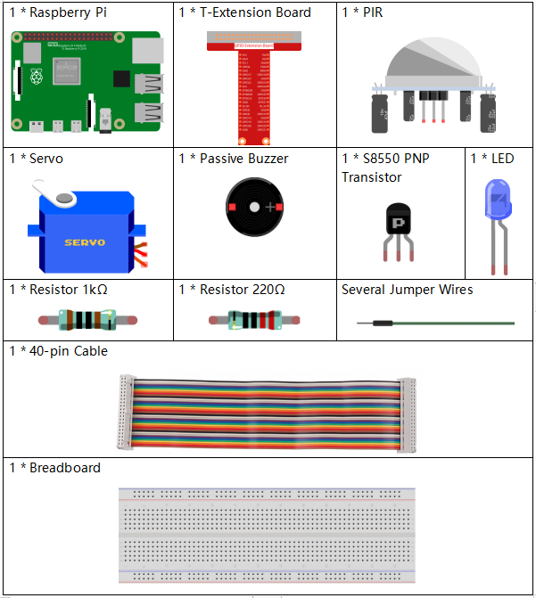
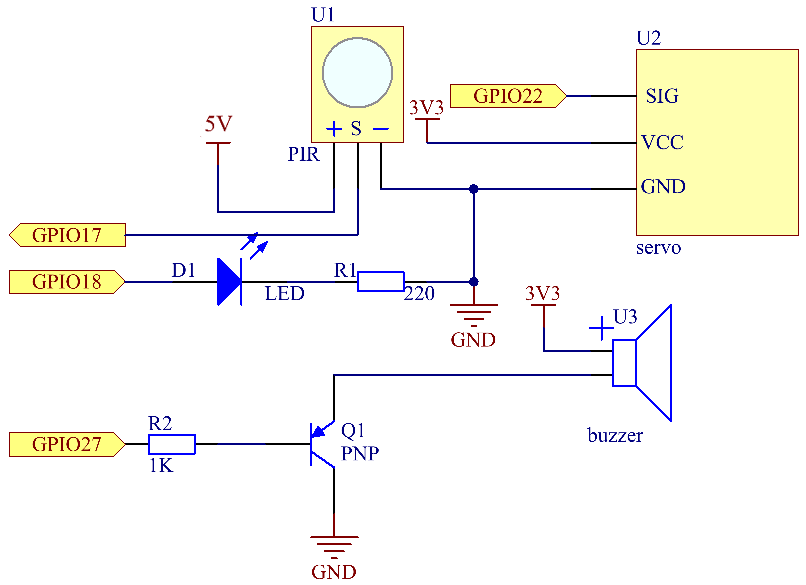
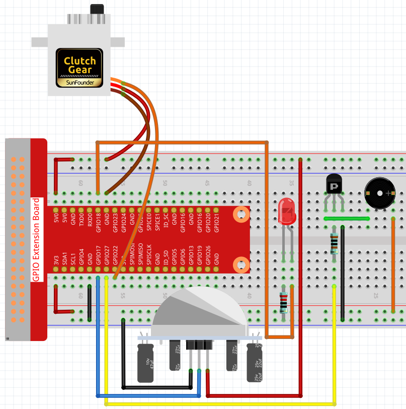

.. note::

    Hallo und willkommen in der SunFounder Raspberry Pi & Arduino & ESP32 Enthusiasten-Gemeinschaft auf Facebook! Tauchen Sie tiefer ein in die Welt von Raspberry Pi, Arduino und ESP32 mit anderen Enthusiasten.

    **Warum beitreten?**

    - **Expertenunterstützung**: Lösen Sie Nachverkaufsprobleme und technische Herausforderungen mit Hilfe unserer Gemeinschaft und unseres Teams.
    - **Lernen & Teilen**: Tauschen Sie Tipps und Anleitungen aus, um Ihre Fähigkeiten zu verbessern.
    - **Exklusive Vorschauen**: Erhalten Sie frühzeitigen Zugang zu neuen Produktankündigungen und exklusiven Einblicken.
    - **Spezialrabatte**: Genießen Sie exklusive Rabatte auf unsere neuesten Produkte.
    - **Festliche Aktionen und Gewinnspiele**: Nehmen Sie an Gewinnspielen und Feiertagsaktionen teil.

    👉 Sind Sie bereit, mit uns zu erkunden und zu erschaffen? Klicken Sie auf [|link_sf_facebook|] und treten Sie heute bei!

3.1.2 Willkommen
===================

Einführung
-------------

In diesem Projekt werden wir PIR verwenden, um die Bewegung von Fußgängern zu erfassen, und Servos, LED und Summer verwenden, um die Arbeit der Sensortür des Supermarkts zu simulieren. Wenn der Fußgänger innerhalb des Erfassungsbereichs des PIR erscheint, leuchtet die Anzeigelampe, die Tür wird geöffnet und der Summer ertönt die Öffnungsglocke.

Komponenten
---------------

Schematische Darstellung
-----------------------------------

============ ======== ======== ===
T-Board Name physical wiringPi BCM
GPIO18       Pin 12   1        18
GPIO17       Pin 11   0        17
GPIO27       Pin 13   2        27
GPIO22       Pin 15   3        22
============ ======== ======== ===

Experimentelle Verfahren
-------------------------------------

Schritt 1: Bauen Sie die Schaltung auf.

Schritt 2: Verzeichnis wechseln.

.. raw:: html

   <run></run>

.. code-block:: 

    cd /home/pi/davinci-kit-for-raspberry-pi/c/3.1.2/

Schritt 3: Kompilieren.

.. raw:: html

   <run></run>

.. code-block:: 

    gcc 3.1.2_Welcome.c -lwiringPi

Schritt 4: Ausführen.

.. raw:: html

   <run></run>

.. code-block:: 

    sudo ./a.out

Wenn der PIR-Sensor nach dem Ausführen der Kode jemanden erkennt, der vorbeikommt, öffnet sich die Tür automatisch (vom Servo simuliert), schaltet die Anzeige ein und spielt die Türklingelmusik ab. Nachdem die Türklingelmusik abgespielt wurde, schließt das System automatisch die Tür und schaltet die Anzeigelampe aus, um auf das nächste Mal zu warten, wenn jemand vorbeikommt.

There are two potentiometers on the PIR module: one is to adjust sensitivity and the other is to adjust the detection distance. To make the PIR module work better, you You need to turn both of them counterclockwise to the end.

**Code Erklärung**

.. code-block:: c

    void setAngle(int pin, int angle){    //Create a funtion to control the angle of the servo.
        if(angle < 0)
            angle = 0;
        if(angle > 180)
            angle = 180;
        softPwmWrite(pin,Map(angle, 0, 180, 5, 25));   
    } 

Erstellen Sie eine Funktion, setAngle, um den Winkel im Servo von 0-180 zu schreiben.

.. code-block:: c

    void doorbell(){
    for(int i=0;i<sizeof(song)/4;i++){
            softToneWrite(BuzPin, song[i]); 
            delay(beat[i] * 250);
        }

Erstellen Sie eine Funktion, Türklingel, damit der Summer Musik abspielen kann.

.. code-block:: c

    void closedoor(){
    digitalWrite(ledPin, LOW);   //led off
    for(int i=180;i>-1;i--){  //make servo rotate from maximum angle to minimum angle
        setAngle(servoPin,i);
        delay(1);
        }
    }

Erstellen Sie eine Closedoor-Funktion, um das Schließen der Tür zu simulieren, schalten Sie die LED aus und lassen Sie das Servo von 180 Grad auf 0 Grad drehen.

.. code-block:: c

    void opendoor(){
        digitalWrite(ledPin, HIGH);   //led on
        for(int i=0;i<181;i++){  //make servo rotate from minimum angle to maximum angle
            setAngle(servoPin,i);
            delay(1);
        }
        doorbell();
        closedoor();
    }

Die Funktion ``opendoor()`` besteht aus mehreren Teilen: Schalten Sie die Anzeigelampe ein, 
schalten Sie das Servo ein (simulieren Sie das Öffnen der Tür), 
spielen Sie die Klingelmusik des Supermarkts und rufen Sie nach dem Abspielen der Musik die Funktion geschlossene ``closedoor()`` auf.

.. code-block:: c

        int main(void)
    {
        if(wiringPiSetup() == -1){ //when initialize wiring failed,print message to screen
            printf("setup wiringPi failed !");
            return 1;
        }
        if(softToneCreate(BuzPin) == -1){
            printf("setup softTone failed !");
            return 1;
    ......

Initialisieren Sie in der Funktion ``main()`` die Bibliothek wiringPi und richten Sie softTone ein. Setzen Sie dann ledPin in den Ausgabestatus und pirPin in den Eingabestatus. Wenn der PIR-Sensor jemanden erkennt, der vorbeikommt, wird die Funktion opendoor aufgerufen, um das Öffnen der Tür zu simulieren.

