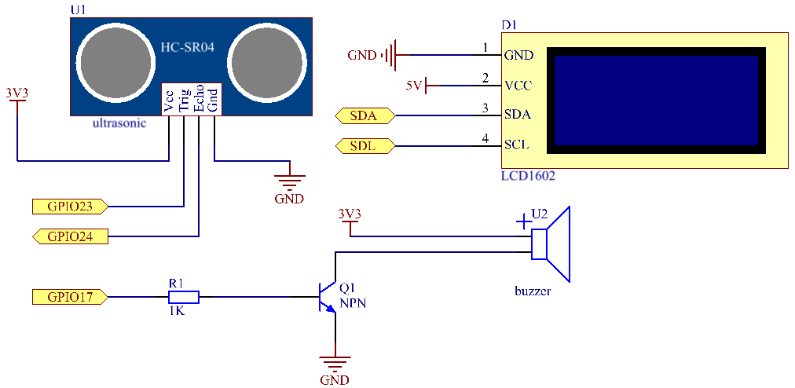

.. note::

    ¡Hola! Bienvenidos a la comunidad de entusiastas de SunFounder para Raspberry Pi, Arduino y ESP32 en Facebook. Sumérgete en el mundo de Raspberry Pi, Arduino y ESP32 junto con otros apasionados.

    **¿Por qué unirse?**

    - **Soporte de Expertos**: Soluciona problemas post-venta y desafíos técnicos con la ayuda de nuestra comunidad y equipo.
    - **Aprende y Comparte**: Intercambia consejos y tutoriales para mejorar tus habilidades.
    - **Avances Exclusivos**: Accede anticipadamente a anuncios de nuevos productos y adelantos.
    - **Descuentos Especiales**: Disfruta de descuentos exclusivos en nuestros productos más recientes.
    - **Promociones y Sorteos Festivos**: Participa en sorteos y promociones especiales en días festivos.

    👉 ¿Listo para explorar y crear con nosotros? Haz clic en [|link_sf_facebook|] y únete hoy.

3.1.3 Alarma de Reversa
===========================

Introducción
---------------

En este proyecto, usaremos una pantalla LCD, un zumbador y sensores 
ultrasónicos para crear un sistema de asistencia de reversa. Podemos 
colocarlo en un vehículo a control remoto para simular el proceso real 
de reversa al ingresar a un garaje.

Componentes
--------------

.. image:: img/list_Reversing_Alarm.png
    :align: center

Diagrama de Circuito
-----------------------

El sensor ultrasónico detecta la distancia entre él y el obstáculo, la cual 
se mostrará en el LCD en forma de código. Al mismo tiempo, el sensor ultrasónico 
emite una señal sonora de advertencia a diferentes frecuencias, según el valor 
de la distancia.

============ ======== ======== ===
T-Board Name physical wiringPi BCM
GPIO23       Pin 16   4        23
GPIO24       Pin 18   5        24
GPIO17       Pin 11   0        17
SDA1         Pin 3             
SCL1         Pin 5             
============ ======== ======== ===

Procedimientos Experimentales
--------------------------------

**Paso 1:** Construye el circuito.

.. image:: img/image242.png
    :width: 800
    :align: center

**Paso 2:** Cambia al directorio.

.. raw:: html

    <run></run>
 
.. code-block:: 
 
    cd ~/davinci-kit-for-raspberry-pi/c/3.1.3/
 
**Paso 3:** Compila.

.. raw:: html

   <run></run>

.. code-block:: 

    gcc 3.1.3_ReversingAlarm.c -lwiringPi

**Paso 4:** Ejecuta.

.. raw:: html

   <run></run>

.. code-block:: 

    sudo ./a.out

Al ejecutar el código, el módulo sensor ultrasónico detectará la distancia 
al obstáculo y luego mostrará la información en el LCD1602. Además, el 
zumbador emitirá un tono de advertencia cuya frecuencia cambiará según la distancia.

.. note::

    * Si aparece el error ``wiringPi.h: No such file or directory``, consulta :ref:`install_wiringpi`.
    * Si recibes el error ``Unable to open I2C device: No such file or directory``, debes habilitar I2C y revisar si el cableado es correcto en :ref:`i2c_config`.
    * Si el código y el cableado están correctos pero la pantalla LCD no muestra contenido, ajusta el potenciómetro en la parte trasera para aumentar el contraste.

**Código**

.. note::
    El siguiente código está incompleto. Para ver el código completo, usa el 
    comando ``nano 3.1.1_ReversingAlarm.c``.

.. code-block:: c

    #include <wiringPi.h>
    #include <stdio.h>
    #include <sys/time.h>
    #include <wiringPi.h>
    #include <wiringPiI2C.h>
    #include <string.h>

    #define Trig    4
    #define Echo    5
    #define Buzzer  0

    int LCDAddr = 0x27;
    int BLEN = 1;
    int fd;

    //Aquí está la función de LCD
    void write_word(int data){...}

    void send_command(int comm){...}

    void send_data(int data){...}

    void lcdInit(){...}

    void clear(){...}

    void write(int x, int y, char data[]){...}

    //Aquí está la función de Ultrasonido
    void ultraInit(void){...}

    float disMeasure(void){...}

    //Aquí está la función principal
    int main(void)
    {
        float dis;
        char result[10];
        if(wiringPiSetup() == -1){ 
            printf("setup wiringPi failed !");
            return 1;
        }

        pinMode(Buzzer,OUTPUT);
        fd = wiringPiI2CSetup(LCDAddr);
        lcdInit();
        ultraInit();

        clear();
        write(0, 0, "Ultrasonic Starting"); 
        write(1, 1, "By Sunfounder");   

        while(1){
            dis = disMeasure();
            printf("%.2f cm \n",dis);
            delay(100);
            digitalWrite(Buzzer,LOW);
            if (dis > 400){
                clear();
                write(0, 0, "Error");
                write(3, 1, "Out of range");    
                delay(500);
            }
            else
            {
                clear();
                write(0, 0, "Distance is");
                sprintf(result,"%.2f cm",dis);
                write(5, 1, result);

                if(dis>=50)
                {delay(500);}
                else if(dis<50 & dis>20) {
                    for(int i=0;i<2;i++){
                    digitalWrite(Buzzer,HIGH);
                    delay(50);
                    digitalWrite(Buzzer,LOW);
                    delay(200);
                    }
                }
                else if(dis<=20){
                    for(int i=0;i<5;i++){
                    digitalWrite(Buzzer,HIGH);
                    delay(50);
                    digitalWrite(Buzzer,LOW);
                    delay(50);
                    }
                }
            }   
        }

        return 0;
    }

**Explicación del Código**

.. code-block:: c

    pinMode(Buzzer,OUTPUT);
    fd = wiringPiI2CSetup(LCDAddr);
    lcdInit();
    ultraInit();

En este programa, aplicamos componentes previamente usados de manera conjunta: 
zumbador, LCD y ultrasonido. Se inicializan de la misma forma que se hizo 
anteriormente.

.. code-block:: c

    dis = disMeasure();
     printf("%.2f cm \n",dis);
    digitalWrite(Buzzer,LOW);
    if (dis > 400){
         write(0, 0, "Error");
         write(3, 1, "Out of range");    
    }
    else
    {
        write(0, 0, "Distance is");
        sprintf(result,"%.2f cm",dis);
        write(5, 1, result);
	}

Aquí obtenemos el valor del sensor ultrasónico y calculamos la distancia.

Si el valor de la distancia supera el rango a detectar, se mostrará un mensaje 
de error en el LCD. Si el valor de la distancia está dentro del rango, se 
mostrarán los resultados correspondientes.

.. code-block:: c

    sprintf(result,"%.2f cm",dis);

Dado que la salida del LCD solo soporta caracteres, y la variable dis almacena 
un valor de tipo float, usamos sprintf(). Esta función convierte el valor float 
a un carácter y lo guarda en la variable string result[]. %.2f indica que se 
mantendrán dos decimales.

.. code-block:: c

    if(dis>=50)
    {delay(500);}
    else if(dis<50 & dis>20) {
        for(int i=0;i<2;i++){
        digitalWrite(Buzzer,HIGH);
        delay(50);
        digitalWrite(Buzzer,LOW);
        delay(200);
        }
    }
    else if(dis<=20){
        for(int i=0;i<5;i++){
        digitalWrite(Buzzer,HIGH);
        delay(50);
        digitalWrite(Buzzer,LOW);
        delay(50);
        }
    }

Esta condición de evaluación se usa para controlar el sonido del zumbador. 
Según la distancia, se divide en tres casos, cada uno con una frecuencia de 
sonido distinta. Dado que el valor total del delay es de 500 ms, todos los 
casos proporcionan un intervalo de 500 ms para el sensor ultrasónico.
