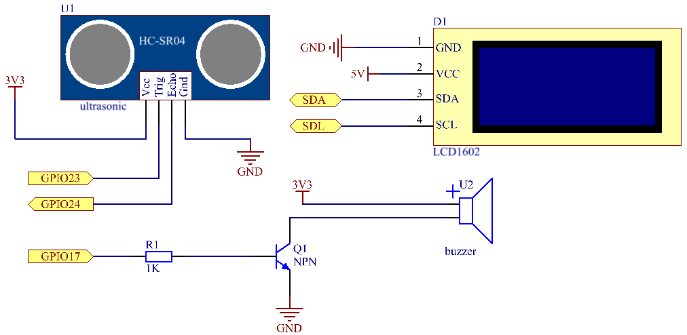

.. note::

    Hallo und willkommen in der SunFounder Raspberry Pi & Arduino & ESP32 Enthusiasten-Gemeinschaft auf Facebook! Tauchen Sie tiefer ein in die Welt von Raspberry Pi, Arduino und ESP32 mit anderen Enthusiasten.

    **Warum beitreten?**

    - **Expertenunterstützung**: Lösen Sie Nachverkaufsprobleme und technische Herausforderungen mit Hilfe unserer Gemeinschaft und unseres Teams.
    - **Lernen & Teilen**: Tauschen Sie Tipps und Anleitungen aus, um Ihre Fähigkeiten zu verbessern.
    - **Exklusive Vorschauen**: Erhalten Sie frühzeitigen Zugang zu neuen Produktankündigungen und exklusiven Einblicken.
    - **Spezialrabatte**: Genießen Sie exklusive Rabatte auf unsere neuesten Produkte.
    - **Festliche Aktionen und Gewinnspiele**: Nehmen Sie an Gewinnspielen und Feiertagsaktionen teil.

    👉 Sind Sie bereit, mit uns zu erkunden und zu erschaffen? Klicken Sie auf [|link_sf_facebook|] und treten Sie heute bei!

3.1.3 Alarm umkehren
==========================

Einführung
-------------

In diesem Projekt werden wir LCD-, Summer- und Ultraschallsensoren verwenden, um ein Rückwärtshilfesystem herzustellen. Wir können es auf das ferngesteuerte Fahrzeug setzen, um den tatsächlichen Vorgang des Rückwärtsfahrens des Autos in die Garage zu simulieren.

Komponenten
----------------

.. image:: ../img/list_Reversing_Alarm.png
    :align: center

Schematische Darstellung
---------------------------------------

Der Ultraschallsensor erkennt den Abstand zwischen sich und dem Hindernis, der in Form einer Kode auf dem LCD angezeigt wird. Gleichzeitig ließ der Ultraschallsensor den Summer einen sofortigen Ton unterschiedlicher Frequenz je nach Entfernungswert ausgeben.

============ ======== ======== ===
T-Karte Name physisch wiringPi BCM
GPIO23       Pin 16   4        23
GPIO24       Pin 18   5        24
GPIO17       Pin 11   0        17
SDA1         Pin 3             
SCL1         Pin 5             
============ ======== ======== ===

Experimentelle Verfahren
-------------------------------

Schritt 1: Bauen Sie die Schaltung auf.

.. image:: ../img/image242.png
    :width: 800
    :align: center

Schritt 2: Verzeichnis wechseln.

.. raw:: html

    <run></run>
 
.. code-block:: 
 
    cd /home/pi/davinci-kit-for-raspberry-pi/c/3.1.3/
 
Schritt 3: Kompilieren.

.. raw:: html

   <run></run>

.. code-block:: 

    gcc 3.1.3_ReversingAlarm.c -lwiringPi

Schritt 4: Ausführen.

.. raw:: html

   <run></run>

.. code-block:: 

    sudo ./a.out

Während die Kode ausgeführt wird, erkennt das Ultraschallsensormodul die Entfernung zum Hindernis und zeigt dann die Informationen zur Entfernung auf dem LCD1602 an. Außerdem gibt der Summer einen Warnton aus, dessen Frequenz sich mit der Entfernung ändert.

**Code**

.. note::
    Die folgenden der Kode sind unvollständig. Wenn Sie die vollständigen Kode überprüfen möchten, wird empfohlen, den Befehl ``nano 3.1.1_ReversingAlarm.c`` zu verwenden. 

.. code-block:: c

    #include <wiringPi.h>
    #include <stdio.h>
    #include <sys/time.h>
    #include <wiringPi.h>
    #include <wiringPiI2C.h>
    #include <string.h>

    #define Trig    4
    #define Echo    5
    #define Buzzer  0

    int LCDAddr = 0x27;
    int BLEN = 1;
    int fd;

    //here is the function of LCD
    void write_word(int data){...}

    void send_command(int comm){...}

    void send_data(int data){...}

    void lcdInit(){...}

    void clear(){...}

    void write(int x, int y, char data[]){...}

    //here is the function of Ultrasonic
    void ultraInit(void){...}

    float disMeasure(void){...}

    //here is the main function
    int main(void)
    {
        float dis;
        char result[10];
        if(wiringPiSetup() == -1){ 
            printf("setup wiringPi failed !");
            return 1;
        }

        pinMode(Buzzer,OUTPUT);
        fd = wiringPiI2CSetup(LCDAddr);
        lcdInit();
        ultraInit();

        clear();
        write(0, 0, "Ultrasonic Starting"); 
        write(1, 1, "By Sunfounder");   

        while(1){
            dis = disMeasure();
            printf("%.2f cm \n",dis);
            delay(100);
            digitalWrite(Buzzer,LOW);
            if (dis > 400){
                clear();
                write(0, 0, "Error");
                write(3, 1, "Out of range");    
                delay(500);
            }
            else
            {
                clear();
                write(0, 0, "Distance is");
                sprintf(result,"%.2f cm",dis);
                write(5, 1, result);

                if(dis>=50)
                {delay(500);}
                else if(dis<50 & dis>20) {
                    for(int i=0;i<2;i++){
                    digitalWrite(Buzzer,HIGH);
                    delay(50);
                    digitalWrite(Buzzer,LOW);
                    delay(200);
                    }
                }
                else if(dis<=20){
                    for(int i=0;i<5;i++){
                    digitalWrite(Buzzer,HIGH);
                    delay(50);
                    digitalWrite(Buzzer,LOW);
                    delay(50);
                    }
                }
            }   
        }

        return 0;
    }

**Code Erklärung**

.. code-block:: c

    pinMode(Buzzer,OUTPUT);
    fd = wiringPiI2CSetup(LCDAddr);
    lcdInit();
    ultraInit();

In diesem Programm wenden wir frühere Komponenten synthetisch an. 
Hier verwenden wir Summer, LCD und Ultraschall. 
Wir können sie auf die gleiche Weise wie zuvor initialisieren.

.. code-block:: c

    dis = disMeasure();
     printf("%.2f cm \n",dis);
    digitalWrite(Buzzer,LOW);
    if (dis > 400){
         write(0, 0, "Error");
         write(3, 1, "Out of range");    
    }
    else
    {
        write(0, 0, "Distance is");
        sprintf(result,"%.2f cm",dis);
        write(5, 1, result);
	}

Hier erhalten wir den Wert des Ultraschallsensors und die Entfernung durch Berechnung.

Wenn der Entfernungswert größer als der zu erkennende Bereichswert ist, wird eine Fehlermeldung auf dem LCD gedruckt. Wenn der Abstandswert innerhalb des Bereichs liegt, werden die entsprechenden Ergebnisse ausgegeben.

.. code-block:: c

    sprintf(result,"%.2f cm",dis);

Da der Ausgabemodus des LCD nur den Zeichentyp unterstützt und die Variable den Wert des Float-Typs nicht speichert, müssen wir ``sprintf()`` verwenden. 
Die Funktion konvertiert den Float-Typ-Wert in ein Zeichen und speichert ihn in der String-Variablen ``result[]`` . ``%.2f`` bedeutet, zwei Dezimalstellen beizubehalten.

.. code-block:: c

    if(dis>=50)
    {delay(500);}
    else if(dis<50 & dis>20) {
        for(int i=0;i<2;i++){
        digitalWrite(Buzzer,HIGH);
        delay(50);
        digitalWrite(Buzzer,LOW);
        delay(200);
        }
    }
    else if(dis<=20){
        for(int i=0;i<5;i++){
        digitalWrite(Buzzer,HIGH);
        delay(50);
        digitalWrite(Buzzer,LOW);
        delay(50);
        }
    }

Diese Beurteilungsbedingung wird verwendet, um das Geräusch des Summers zu steuern. Je nach Entfernungsunterschied kann es in drei Fälle unterteilt werden, in denen unterschiedliche Schallfrequenzen auftreten. Da der Gesamtwert der Verzögerung 500 beträgt, können alle Fälle ein Intervall von 500 ms für den Ultraschallsensor bereitstellen.

