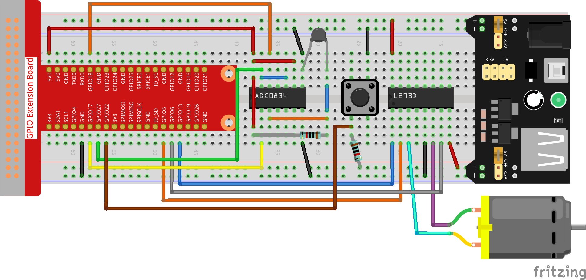

.. note::

    Bonjour et bienvenue dans la communauté des passionnés de SunFounder Raspberry Pi, Arduino et ESP32 sur Facebook ! Plongez dans l'univers de Raspberry Pi, Arduino et ESP32 avec d'autres passionnés.

    **Pourquoi nous rejoindre ?**

    - **Support d'experts** : Résolvez les problèmes après-vente et relevez vos défis techniques grâce à l'aide de notre communauté et de notre équipe.
    - **Apprenez et Partagez** : Échangez des astuces et des tutoriels pour perfectionner vos compétences.
    - **Aperçus exclusifs** : Bénéficiez d'un accès anticipé aux nouvelles annonces de produits et aux avant-premières.
    - **Réductions spéciales** : Profitez de réductions exclusives sur nos nouveaux produits.
    - **Promotions festives et concours** : Participez à des concours et à des promotions lors des fêtes.

    👉 Prêt à explorer et à créer avec nous ? Cliquez sur [|link_sf_facebook|] et rejoignez-nous dès aujourd'hui !

3.1.4 Ventilateur Intelligent
===============================

Introduction
--------------

Dans ce cours, nous allons utiliser des moteurs, des boutons et des thermistances pour créer un ventilateur intelligent, manuel et automatique, dont la vitesse du vent est réglable.

Composants
------------

.. image:: img/list_Smart_Fan.png
    :align: center

Schéma de câblage
--------------------

============ ======== ======== ===
T-Board Name physical wiringPi BCM
GPIO17       Pin 11   0        17
GPIO18       Pin 12   1        18
GPIO27       Pin 13   2        27
GPIO22       Pin 15   3        22
GPIO5        Pin 29   21       5
GPIO6        Pin 31   22       6
GPIO13       Pin 33   23       13
============ ======== ======== ===

.. image:: img/Schematic_three_one4.png
    :width: 500
    :align: center

Procédures expérimentales
-----------------------------

**Étape 1 :** Construisez le circuit.

.. note::
    Le module d'alimentation peut utiliser une pile de 9V avec le connecteur de pile 
    9V fourni dans le kit. Insérez le capuchon du cavalier du module d'alimentation 
    dans les bandes de bus 5V de la breadboard.

.. image:: img/image118.jpeg
   :alt: \_MG_2084
   :width: 2.80694in
   :height: 0.94375in
   :align: center

**Pour les utilisateurs du langage C**
^^^^^^^^^^^^^^^^^^^^^^^^^^^^^^^^^^^^^^^^^^^^^^

**Étape 2 :** Accédez au dossier du code.

.. raw:: html

   <run></run>

.. code-block:: 

    cd ~/davinci-kit-for-raspberry-pi/c/3.1.4/

**Étape 3 :** Compilez.

.. raw:: html

   <run></run>

.. code-block:: 

    gcc 3.1.4_SmartFan.c -lwiringPi -lm

**Étape 4 :** Exécutez le fichier exécutable ci-dessus.

.. raw:: html

   <run></run>

.. code-block:: 

    sudo ./a.out

Lorsque le code s'exécute, démarrez le ventilateur en appuyant sur le bouton. 
À chaque pression, le niveau de vitesse augmente ou diminue de 1. Il y a **5** 
niveaux de vitesse : **0~4**. Lorsqu'il est réglé sur le 4\ :sup:`ème` niveau de 
vitesse et que vous appuyez sur le bouton, le ventilateur s'arrête avec une vitesse 
de vent à **0**.

.. note::

    Si cela ne fonctionne pas après l'exécution, ou s'il y a un message d'erreur indiquant : « wiringPi.h : Aucun fichier ou répertoire de ce type », veuillez consulter :ref:`C code is not working?`.

Dès que la température augmente ou diminue de plus de 2℃, la vitesse se règle 
automatiquement d'un niveau plus rapide ou plus lent.

**Explication du Code**

.. code-block:: c

    int temperture(){
        unsigned char analogVal;
        double Vr, Rt, temp, cel, Fah;
        analogVal = get_ADC_Result(0);
        Vr = 5 * (double)(analogVal) / 255;
        Rt = 10000 * (double)(Vr) / (5 - (double)(Vr));
        temp = 1 / (((log(Rt/10000)) / 3950)+(1 / (273.15 + 25)));
        cel = temp - 273.15;
        Fah = cel * 1.8 +32;
        int t=cel;
        return t;
    }

La fonction `temperature()` convertit les valeurs de la thermistance lues par l'ADC0834 en valeurs de température. Pour plus de détails, consultez :ref:`2.2.2 Thermistor`.

.. code-block:: c

    int motor(int level){
        if(level==0){
            digitalWrite(MotorEnable,LOW);
            return 0;
        }
        if (level>=4){
            level =4;
        }
        digitalWrite(MotorEnable,HIGH);
        softPwmWrite(MotorPin1, level*25);
        return level;    
    }

Cette fonction contrôle la vitesse de rotation du moteur. La plage de niveaux 
**Level** est de **0 à 4** (le niveau **0** arrête le moteur). Chaque niveau 
correspond à un changement de **25%** de la vitesse du ventilateur.

.. code-block:: c

    int main(void)
    {
        setup();
        int currentState,lastState=0;
        int level = 0;
        int currentTemp,markTemp=0;
        while(1){
            currentState=digitalRead(BtnPin);
            currentTemp=temperture();
            if (currentTemp<=0){continue;}
            if (currentState==1&&lastState==0){
                level=(level+1)%5;
                markTemp=currentTemp;
                delay(500);
            }
            lastState=currentState;
            if (level!=0){
                if (currentTemp-markTemp<=-2){
                    level=level-1;
                    markTemp=currentTemp;
                }
                if (currentTemp-markTemp>=2){
                    level=level+1;
                    markTemp=currentTemp;
                }
            }
            level=motor(level);
        }
        return 0;
    }

La fonction **main()** contient l'ensemble du processus du programme comme suit :

1) Lire en continu l'état du bouton et la température actuelle.

2) À chaque pression, le niveau de vitesse (**level**) augmente de **+1** et la température est mise à jour. Le **Level** varie de **1 à 4**.

3) Lorsque le ventilateur fonctionne (niveau **différent de 0**), la température est surveillée. Une variation de **+2℃** ou plus entraîne une modification du niveau.

4) Le moteur ajuste la vitesse de rotation en fonction du **Level**.
