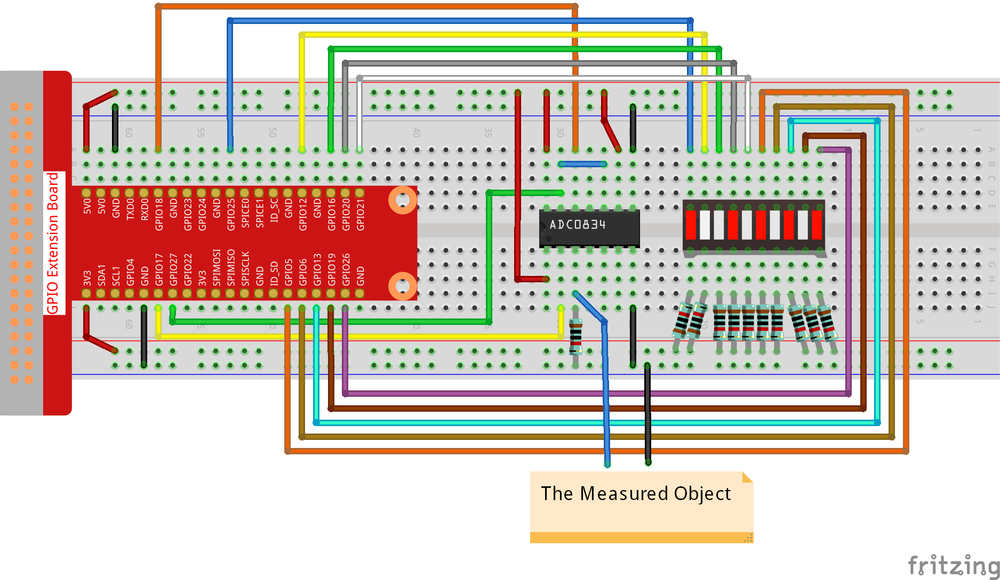

.. note::

    ¡Hola! Bienvenidos a la comunidad de entusiastas de SunFounder para Raspberry Pi, Arduino y ESP32 en Facebook. Sumérgete en el mundo de Raspberry Pi, Arduino y ESP32 junto con otros apasionados.

    **¿Por qué unirse?**

    - **Soporte de Expertos**: Soluciona problemas post-venta y desafíos técnicos con la ayuda de nuestra comunidad y equipo.
    - **Aprende y Comparte**: Intercambia consejos y tutoriales para mejorar tus habilidades.
    - **Avances Exclusivos**: Accede anticipadamente a anuncios de nuevos productos y adelantos.
    - **Descuentos Especiales**: Disfruta de descuentos exclusivos en nuestros productos más recientes.
    - **Promociones y Sorteos Festivos**: Participa en sorteos y promociones especiales en días festivos.

    👉 ¿Listo para explorar y crear con nosotros? Haz clic en [|link_sf_facebook|] y únete hoy.

3.1.5 Indicador de Batería
===============================

Introducción
--------------

En este curso, crearemos un dispositivo indicador de batería que pueda 
mostrar visualmente el nivel de batería en el LED Bargraph.

Componentes
-------------

.. image:: img/list_Battery_Indicator.png
    :align: center

Diagrama de Circuito
-----------------------

============ ======== ======== ===
T-Board Name physical wiringPi BCM
GPIO17       Pin 11   0        17
GPIO18       Pin 12   1        18
GPIO27       Pin 13   2        27
GPIO25       Pin 22   6        25
GPIO12       Pin 32   26       12
GPIO16       Pin 36   27       16
GPIO20       Pin 38   28       20
GPIO21       Pin 40   29       21
GPIO5        Pin 29   21       5
GPIO6        Pin 31   22       6
GPIO13       Pin 33   23       13
GPIO19       Pin 35   24       19
GPIO26       Pin 37   25       26
============ ======== ======== ===

.. image:: img/Schematic_three_one5.png
   :align: center

Procedimientos Experimentales
--------------------------------

**Paso 1:** Construye el circuito.

**Paso 2:** Ingresa en la carpeta del código.

.. raw:: html

   <run></run>

.. code-block:: 

    cd ~/davinci-kit-for-raspberry-pi/c/3.1.5/

**Paso 3:** Compila el código.

.. raw:: html

   <run></run>

.. code-block:: 

    gcc 3.1.5_BatteryIndicator.c -lwiringPi

**Paso 4:** Ejecuta el archivo ejecutable.

.. raw:: html

   <run></run>

.. code-block:: 

    sudo ./a.out

Después de ejecutar el programa, conecta un cable desde el pin 3 del 
ADC0834 y otro desde el GND, llevándolos a los dos polos de una batería 
respectivamente. Podrás ver el nivel de energía correspondiente en el LED
Bargraph, encendiéndose los LED que indican el nivel de carga (rango de medición: 0-5V).

.. note::

    Si no funciona tras ejecutarlo o aparece el mensaje de error: \"wiringPi.h: No such file or directory", consulta :ref:`C code is not working?`.

**Explicación del Código**

.. code-block:: c

    void LedBarGraph(int value){
        for(int i=0;i<10;i++){
            digitalWrite(pins[i],HIGH);
        }
        for(int i=0;i<value;i++){
            digitalWrite(pins[i],LOW);
        }
    }

Esta función controla el encendido o apagado de los 10 LEDs en el LED Bargraph. 
Primero, damos un nivel alto a estos 10 LEDs para apagarlos y luego determinamos 
cuántos LEDs se encienden al modificar el valor analógico recibido.

.. code-block:: c

    int main(void)
    {
        uchar analogVal;
        if(wiringPiSetup() == -1){ //si la inicialización falla, imprime mensaje en pantalla
            printf("setup wiringPi failed !");
            return 1;
        }
        pinMode(ADC_CS,  OUTPUT);
        pinMode(ADC_CLK, OUTPUT);
        for(int i=0;i<10;i++){       //establece los pines del LED como salida
            pinMode(pins[i], OUTPUT);
            digitalWrite(pins[i],HIGH);
        }
        while(1){
            analogVal = get_ADC_Result(0);
            LedBarGraph(analogVal/25);
            delay(100);
        }
        return 0;
    }

analogVal produce valores (**0-255**) que varían con el voltaje (**0-5V**); 
por ejemplo, si se detectan 3V en una batería, el valor correspondiente en el 
voltímetro es **152**.

Los **10** LEDs en el LED Bargraph se utilizan para mostrar las lecturas de 
**analogVal**. 255/10=25, por lo tanto, cada incremento de **25** en el valor 
analógico enciende un LED más; por ejemplo, si “analogVal=150” (aproximadamente 3V), 
se encenderán 6 LEDs.
