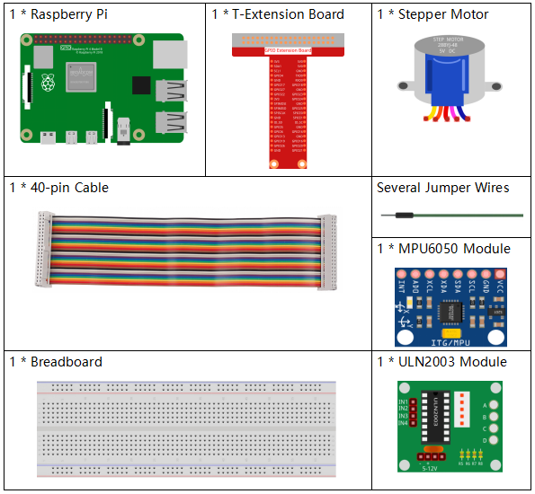

.. note::

    ¡Hola! Bienvenidos a la comunidad de entusiastas de SunFounder para Raspberry Pi, Arduino y ESP32 en Facebook. Sumérgete en el mundo de Raspberry Pi, Arduino y ESP32 junto con otros apasionados.

    **¿Por qué unirse?**

    - **Soporte de Expertos**: Soluciona problemas post-venta y desafíos técnicos con la ayuda de nuestra comunidad y equipo.
    - **Aprende y Comparte**: Intercambia consejos y tutoriales para mejorar tus habilidades.
    - **Avances Exclusivos**: Accede anticipadamente a anuncios de nuevos productos y adelantos.
    - **Descuentos Especiales**: Disfruta de descuentos exclusivos en nuestros productos más recientes.
    - **Promociones y Sorteos Festivos**: Participa en sorteos y promociones especiales en días festivos.

    👉 ¿Listo para explorar y crear con nosotros? Haz clic en [|link_sf_facebook|] y únete hoy.

3.1.6 Control de Movimiento
=============================

Introducción
--------------

En esta lección, crearemos un dispositivo simple de detección y control 
de movimiento. El MPU6050 se usa como sensor y el motor paso a paso como 
dispositivo controlado. Con el MPU6050 montado en un guante, podrás controlar 
el motor paso a paso girando tu muñeca.

Componentes
-------------

Diagrama de Circuito
-----------------------

============ ======== ======== ===
T-Board Name physical wiringPi BCM
GPIO18       Pin 12   1        18
GPIO23       Pin 16   4        23
GPIO24       Pin 18   5        24
GPIO25       Pin 22   6        25
SDA1         Pin 3             
SCL1         Pin 5             
============ ======== ======== ===

.. image:: img/Schematic_three_one6.png
   :align: center

Procedimientos Experimentales
-------------------------------

**Paso 1:** Construye el circuito.

.. image:: img/image251.png
   :alt: 3.1.6 Motion Control_bb
   :width: 800
   :align: center

**Paso 2**: Dirígete a la carpeta del código.

.. raw:: html

   <run></run>

.. code-block:: 

    cd ~/davinci-kit-for-raspberry-pi/c/3.1.6/

**Paso 3**: Compila el código.

.. raw:: html

   <run></run>

.. code-block:: 

    gcc 3.1.6_MotionControl.c -lwiringPi -lm

**Paso 4**: Ejecuta el archivo ejecutable.

.. raw:: html

   <run></run>

.. code-block:: 

    sudo ./a.out

Cuando se ejecuta el código, si el ángulo de inclinación de **mpu6050** en 
el eje `Y <https://cn.bing.com/dict/search?q=Y&FORM=BDVSP6&mkt=zh-cn>`__-`axis <https://cn.bing.com/dict/search?q=axis&FORM=BDVSP6&mkt=zh-cn>`__ es mayor a **45** °, el motor paso a paso rota en sentido 
antihorario; si es menor a **-45** °, el motor rota en sentido horario.

.. note::

    Si no funciona después de ejecutar el código, o aparece el mensaje de error: \"wiringPi.h: No such file or directory", consulta :ref:`C code is not working?`.

**Explicación del Código**

.. code-block:: c

    double mpu6050(){
        acclX = read_word_2c(0x3B);
        acclY = read_word_2c(0x3D);
        acclZ = read_word_2c(0x3F);
        acclX_scaled = acclX / 16384.0;
        acclY_scaled = acclY / 16384.0;
        acclZ_scaled = acclZ / 16384.0;
        double angle=get_y_rotation(acclX_scaled, acclY_scaled, acclZ_scaled);
        return angle;
    }

mpu6050 obtiene el ángulo de inclinación en la dirección del eje Y.

.. code-block:: c

    void rotary(char direction){
        if(direction == 'c'){
            for(int j=0;j<4;j++){
                for(int i=0;i<4;i++)
                    {digitalWrite(motorPin[i],0x99>>j & (0x08>>i));}
                delayMicroseconds(stepSpeed);
            }        
        }
        else if(direction =='a'){
            for(int j=0;j<4;j++){
                for(int i=0;i<4;i++)
                    {digitalWrite(motorPin[i],0x99<<j & (0x80>>i));}
                delayMicroseconds(stepSpeed);
            }   
        }
    }

Si la dirección **key** recibida es \'**c**\', el motor paso a paso rota 
en sentido horario; si la **key** es \'**a**\', el motor rota en sentido 
antihorario. Consulta :ref:`1.3.3 Motor Paso a Paso` para más detalles sobre 
el cálculo de la dirección de rotación del motor paso a paso.

.. code-block:: c

    int main()
    {
        setup();
        double angle;
        while(1) {
            angle = mpu6050();
            if (angle >=45){rotary('a');}
            else if (angle<=-45){rotary('c');}
        }
        return 0;
    }

El ángulo de inclinación en la dirección del eje Y se lee desde **mpu6050**. 
Si es mayor a **45** °, el motor paso a paso rota en sentido antihorario; 
si es menor a **-45** °, el motor rota en sentido horario.

