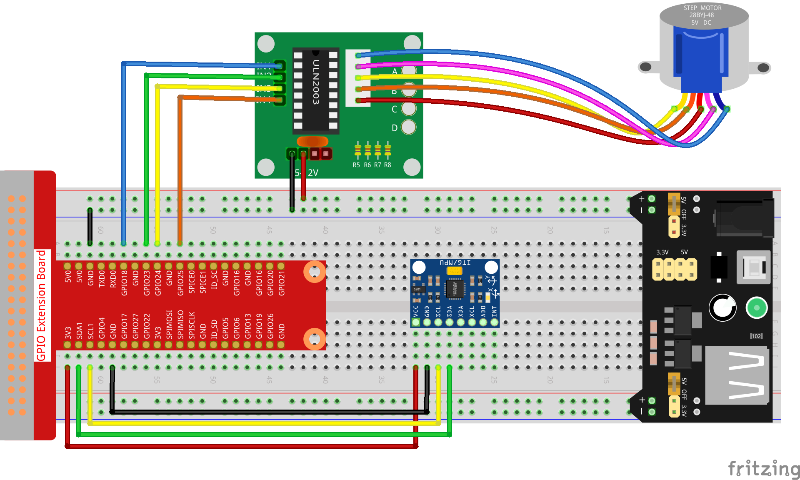

.. note::

    Hallo und willkommen in der SunFounder Raspberry Pi & Arduino & ESP32 Enthusiasten-Gemeinschaft auf Facebook! Tauchen Sie tiefer ein in die Welt von Raspberry Pi, Arduino und ESP32 mit anderen Enthusiasten.

    **Warum beitreten?**

    - **Expertenunterstützung**: Lösen Sie Nachverkaufsprobleme und technische Herausforderungen mit Hilfe unserer Gemeinschaft und unseres Teams.
    - **Lernen & Teilen**: Tauschen Sie Tipps und Anleitungen aus, um Ihre Fähigkeiten zu verbessern.
    - **Exklusive Vorschauen**: Erhalten Sie frühzeitigen Zugang zu neuen Produktankündigungen und exklusiven Einblicken.
    - **Spezialrabatte**: Genießen Sie exklusive Rabatte auf unsere neuesten Produkte.
    - **Festliche Aktionen und Gewinnspiele**: Nehmen Sie an Gewinnspielen und Feiertagsaktionen teil.

    👉 Sind Sie bereit, mit uns zu erkunden und zu erschaffen? Klicken Sie auf [|link_sf_facebook|] und treten Sie heute bei!

3.1.6 Bewegungssteuerung
==========================

Einführung
-----------------

In dieser Lektion werden wir ein einfaches Bewegungserfassungs- und Steuergerät herstellen. Die MPU6050 wird als Sensor und der Schrittmotor als gesteuertes Gerät verwendet. Mit der am Handschuh montierten MPU6050 können Sie den Schrittmotor durch Drehen Ihres Handgelenks steuern.

Komponenten
---------------

.. image:: ../img/list_Motion_Control.png
    :align: center

Schematische Darstellung
--------------------------

============ ======== ======== ===
T-Karte Name physisch wiringPi BCM
GPIO18       Pin 12   1        18
GPIO23       Pin 16   4        23
GPIO24       Pin 18   5        24
GPIO25       Pin 22   6        25
SDA1         Pin 3             
SCL1         Pin 5             
============ ======== ======== ===

.. image:: ../img/Schematic_three_one6.png
   :align: center

Experimentelle Verfahren
------------------------------

Schritt 1: Bauen Sie die Schaltung auf.

Schritt 2: Gehen Sie zum Ordner der Kode.

.. raw:: html

   <run></run>

.. code-block:: 

    cd /home/pi/davinci-kit-for-raspberry-pi/c/3.1.6/

Schritt 3: Kompilieren Sie die Kode.

.. raw:: html

   <run></run>

.. code-block:: 

    gcc 3.1.6_MotionControl.c -lwiringPi -lm

Schritt 4: Führen Sie die ausführbare Datei aus.

.. raw:: html

   <run></run>

.. code-block:: 

    sudo ./a.out

Wenn der Neigungswinkel von mpu6050 auf der Y-Achse größer als 45 ℃, ist, 
dreht sich der Schrittmotor während der Kode gegen den Uhrzeigersinn. 
Bei weniger als -45 ℃, dreht sich der Schrittmotor im Uhrzeigersinn.

**Code Erklärung**

.. code-block:: c

    double mpu6050(){
        acclX = read_word_2c(0x3B);
        acclY = read_word_2c(0x3D);
        acclZ = read_word_2c(0x3F);
        acclX_scaled = acclX / 16384.0;
        acclY_scaled = acclY / 16384.0;
        acclZ_scaled = acclZ / 16384.0;
        double angle=get_y_rotation(acclX_scaled, acclY_scaled, acclZ_scaled);
        return angle;
    }

mpu6050 erhält den Neigungswinkel in Richtung der Y-Achse.

.. code-block:: c

    void rotary(char direction){
        if(direction == 'c'){
            for(int j=0;j<4;j++){
                for(int i=0;i<4;i++)
                    {digitalWrite(motorPin[i],0x99>>j & (0x08>>i));}
                delayMicroseconds(stepSpeed);
            }        
        }
        else if(direction =='a'){
            for(int j=0;j<4;j++){
                for(int i=0;i<4;i++)
                    {digitalWrite(motorPin[i],0x99<<j & (0x80>>i));}
                delayMicroseconds(stepSpeed);
            }   
        }
    }

Wenn die empfangene Richtung Taste ‚c‘ ist, dreht sich der Schrittmotor im Uhrzeigersinn; wenn die Taste ‚a‘ ist, 
dreht der Motor gegen den Uhrzeigersinn. 
Siehe :ref:`py_step_motor`  für weitere Details zur Berechnung der Drehrichtung des Schrittmotors.

.. code-block:: c

    int main()
    {
        setup();
        double angle;
        while(1) {
            angle = mpu6050();
            if (angle >=45){rotary('a');}
            else if (angle<=-45){rotary('c');}
        }
        return 0;
    }

Der Neigungswinkel in Richtung der Y-Achse wird von mpu6050 abgelesen. 
Wenn er größer als 45 ℃, ist, dreht sich der Schrittmotor gegen den Uhrzeigersinn. 
Bei weniger als -45 ℃, dreht sich der Schrittmotor im Uhrzeigersinn.
