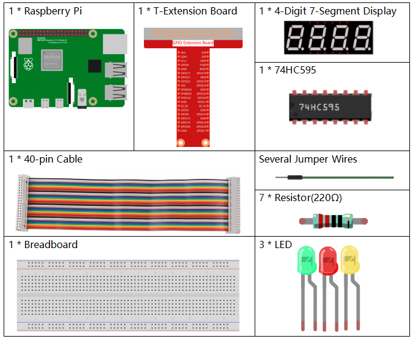

.. note::

    Ciao, benvenuto nella Community su Facebook per gli appassionati di SunFounder Raspberry Pi, Arduino e ESP32! Approfondisci le tue conoscenze su Raspberry Pi, Arduino ed ESP32 insieme ad altri appassionati.

    **Perché unirti a noi?**

    - **Supporto esperto**: Risolvi i problemi post-vendita e le sfide tecniche con l’aiuto della nostra community e del nostro team.
    - **Impara e Condividi**: Scambia consigli e tutorial per migliorare le tue competenze.
    - **Anteprime Esclusive**: Ottieni accesso anticipato agli annunci dei nuovi prodotti e anteprime esclusive.
    - **Sconti Speciali**: Approfitta di sconti esclusivi sui nostri prodotti più recenti.
    - **Promozioni e Giveaway Festivi**: Partecipa a concorsi e promozioni in occasione delle festività.

    👉 Pronto a esplorare e creare con noi? Clicca su [|link_sf_facebook|] e unisciti oggi stesso!

3.1.7 Semaforo
=================

Introduzione
--------------

In questo progetto, utilizzeremo LED di tre colori per simulare il cambio 
delle luci semaforiche, e un display a 4 cifre a 7 segmenti mostrerà il conto 
alla rovescia per ogni stato del semaforo.

Componenti
-------------

Schema di Collegamento
---------------------------

============ ======== ======== ===
T-Board Name physical wiringPi BCM
GPIO17       Pin 11   0        17
GPIO27       Pin 13   2        27
GPIO22       Pin 15   3        22
SPIMOSI      Pin 19   12       10
GPIO18       Pin 12   1        18
GPIO23       Pin 16   4        23
GPIO24       Pin 18   5        24
GPIO25       Pin 22   6        25
SPICE0       Pin 24   10       8
SPICE1       Pin 26   11       7
============ ======== ======== ===

.. image:: img/Schematic_three_one7.png
   :align: center

Procedure Sperimentali
--------------------------

**Passo 1:** Costruisci il circuito.

.. image:: img/image254.png
   :width: 800

**Passo 2:** Cambia directory.

.. raw:: html

   <run></run>

.. code-block:: 

    cd ~/davinci-kit-for-raspberry-pi/c/3.1.7/

**Passo 3:** Compila.

.. raw:: html

   <run></run>

.. code-block:: 

    gcc 3.1.7_TrafficLight.c -lwiringPi

**Passo 4:** Esegui.

.. raw:: html

   <run></run>

.. code-block:: 

    sudo ./a.out

Quando il codice è in esecuzione, i LED simuleranno il cambio dei colori 
del semaforo. Prima si accende il LED rosso per 60 secondi, poi il LED verde 
per 30 secondi, successivamente il LED giallo per 5 secondi. Dopo di che, 
il ciclo ricomincia con il LED rosso acceso per 60 secondi.

.. note::

    Se non funziona dopo l'esecuzione o compare un messaggio di errore: \"wiringPi.h: No such file or directory\", consulta :ref:`Il codice C non funziona?`.

**Spiegazione del Codice**

.. code-block:: c

    #define     SDI     5 
    #define     RCLK    4  
    #define     SRCLK    1   

    const int placePin[] = {12, 3, 2, 0};
    unsigned char number[] = {0xc0, 0xf9, 0xa4, 0xb0, 0x99, 0x92, 0x82, 0xf8, 0x80, 0x90};

    void pickDigit(int digit);
    void hc595_shift(int8_t data);
    void clearDisplay();
    void display();

Queste righe di codice permettono la visualizzazione dei numeri sul display 
a 4 cifre e 7 segmenti. Per maggiori dettagli, consulta :ref:`1.1.5 Display a 7 segmenti a 4 cifre`. 
In questo progetto, il display viene utilizzato per visualizzare il conto alla rovescia del semaforo.

.. code-block:: c

    const int ledPin[]={6,10,11};  

    int colorState = 0;

    void lightup()
    {
        for(int i=0;i<3;i++){
            digitalWrite(ledPin[i],HIGH);
        }
        digitalWrite(ledPin[colorState],LOW);    
    }

Questo codice accende e spegne i LED per simulare i colori del semaforo.

.. code-block:: c

    int greenLight = 30;
    int yellowLight = 5;
    int redLight = 60;
    int colorState = 0;
    char *lightColor[]={"Red","Green","Yellow"};
    int counter = 60;

    void timer(int  timer1){       //Timer function
        if(timer1 == SIGALRM){   
            counter --;         
            alarm(1); 
            if(counter == 0){
                if(colorState == 0) counter = greenLight;
                if(colorState == 1) counter = yellowLight;
                if(colorState == 2) counter = redLight;
                colorState = (colorState+1)%3; 
            }
            printf("counter : %d \t light color: %s \n",counter,lightColor[colorState]);
        }
    }

Il codice serve per attivare e disattivare il timer. Per maggiori dettagli, 
consulta :ref:`1.1.5 Display a 7 segmenti a 4 cifre`. Qui, quando il timer 
raggiunge lo zero, `colorState` cambia per passare al LED successivo e al 
timer viene assegnato un nuovo valore.

.. code-block:: c

    void loop()
    {
        while(1){
            display();
            lightup(); 
        }
    }

    int main(void)
    {
        //…
        signal(SIGALRM,timer);  
        alarm(1); 
        loop();
        return 0;
    }

Il timer viene avviato nella funzione main(). Nella funzione loop(), si 
utilizza un ciclo **while(1)** per chiamare continuamente le funzioni del 
display a 4 cifre e 7 segmenti e dei LED.

