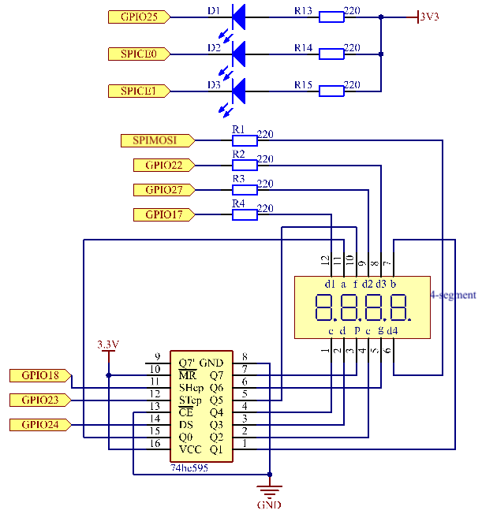
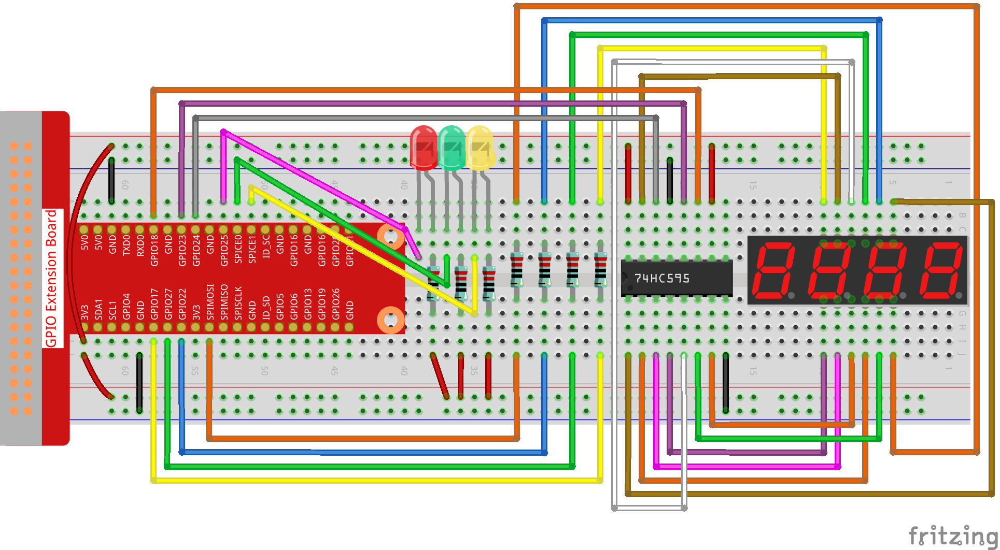

.. note::

    こんにちは、SunFounderのRaspberry Pi & Arduino & ESP32愛好家コミュニティへようこそ！Facebook上でRaspberry Pi、Arduino、ESP32についてもっと深く掘り下げ、他の愛好家と交流しましょう。

    **参加する理由は？**

    - **エキスパートサポート**：コミュニティやチームの助けを借りて、販売後の問題や技術的な課題を解決します。
    - **学び＆共有**：ヒントやチュートリアルを交換してスキルを向上させましょう。
    - **独占的なプレビュー**：新製品の発表や先行プレビューに早期アクセスしましょう。
    - **特別割引**：最新製品の独占割引をお楽しみください。
    - **祭りのプロモーションとギフト**：ギフトや祝日のプロモーションに参加しましょう。

    👉 私たちと一緒に探索し、創造する準備はできていますか？[|link_sf_facebook|]をクリックして今すぐ参加しましょう！

3.1.7 信号機
=============

前書き
---------------

このプロジェクトでは、3色のLEDを使用して交通信号の変化を実現し、
4桁の7セグメントディスプレイを使用して各交通状態のタイミングを表示する。

部品
------------

.. image:: ../img/list_Traffic_Light.png
    :align: center

回路図
--------------------

============ ======== ======== ===
T-Board Name physical wiringPi BCM
GPIO17       Pin 11   0        17
GPIO27       Pin 13   2        27
GPIO22       Pin 15   3        22
SPIMOSI      Pin 19   12       10
GPIO18       Pin 12   1        18
GPIO23       Pin 16   4        23
GPIO24       Pin 18   5        24
GPIO25       Pin 22   6        25
SPICE0       Pin 24   10       8
SPICE1       Pin 26   11       7
============ ======== ======== ===

実験手順
------------------------

ステップ1： 回路を作る。

ステップ2： ディレクトリを変更する。

.. raw:: html

   <run></run>

.. code-block:: 

    cd ~/davinci-kit-for-raspberry-pi/c/3.1.7/

ステップ3： コンパイルする。

.. raw:: html

   <run></run>

.. code-block:: 

    gcc 3.1.7_TrafficLight.c -lwiringPi

ステップ4： 実行する。

.. raw:: html

   <run></run>

.. code-block:: 

    sudo ./a.out

コードが実行されると、LEDは交通信号の色の変化をシミュレートする。
まず、赤色のLEDが60秒間点灯し、それから緑色のLEDが30秒間点灯し、最後に、黄色のLEDが5秒間点灯する。
その後、赤いLEDが60秒間再び点灯する。
このようにして、この一連のアクションは繰り返し実行される。

**コードの説明**

.. code-block:: c

    #define     SDI     5 
    #define     RCLK    4  
    #define     SRCLK    1   

    const int placePin[] = {12, 3, 2, 0};
    unsigned char number[] = {0xc0, 0xf9, 0xa4, 0xb0, 0x99, 0x92, 0x82, 0xf8, 0x80, 0x90};

    void pickDigit(int digit);
    void hc595_shift(int8_t data);
    void clearDisplay();
    void display();

これらのコードは、4桁7セグメントディスプレイの数値表示機能を実現するために使用されます。 
詳細については、ドキュメントの :ref:`py_4-dig` を参照してください。 
ここでは、コードを使用して信号時間のカウントダウンを表示します。

.. code-block:: c

    const int ledPin[]={6,10,11};  

    int colorState = 0;

    void lightup()
    {
        for(int i=0;i<3;i++){
            digitalWrite(ledPin[i],HIGH);
        }
        digitalWrite(ledPin[colorState],LOW);    
    }

コードはLEDのオンとオフを切り替えるために使用される。

.. code-block:: c

    int greenLight = 30;
    int yellowLight = 5;
    int redLight = 60;
    int colorState = 0;
    char *lightColor[]={"Red","Green","Yellow"};
    int counter = 60;

    void timer(int  timer1){       //Timer function
        if(timer1 == SIGALRM){   
            counter --;         
            alarm(1); 
            if(counter == 0){
                if(colorState == 0) counter = greenLight;
                if(colorState == 1) counter = yellowLight;
                if(colorState == 2) counter = redLight;
                colorState = (colorState+1)%3; 
            }
            printf("counter : %d \t light color: %s \n",counter,lightColor[colorState]);
        }
    }

コードは、タイマーのオンとオフを切り替えるために使用されます。 詳細については、 :ref:`py_4-dig` を参照してください。 ここで、タイマーがゼロに戻ると、 ``colorState`` が切り替えられてLEDが切り替わり、タイマーが新しい値に割り当てられます。

.. code-block:: c

    void loop()
    {
        while(1){
        display();
        lightup(); 
        }
    }

    int main(void)
    {
        //…
        signal(SIGALRM,timer);  
        alarm(1); 
        loop();
        return 0;
    }

タイマーは ``main()`` 関数で始まる。
``loop()`` 関数では、 ``while(1)`` loopを使用して、4桁7セグメントとLEDの関数を呼び出す。

