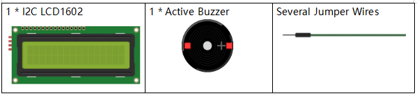
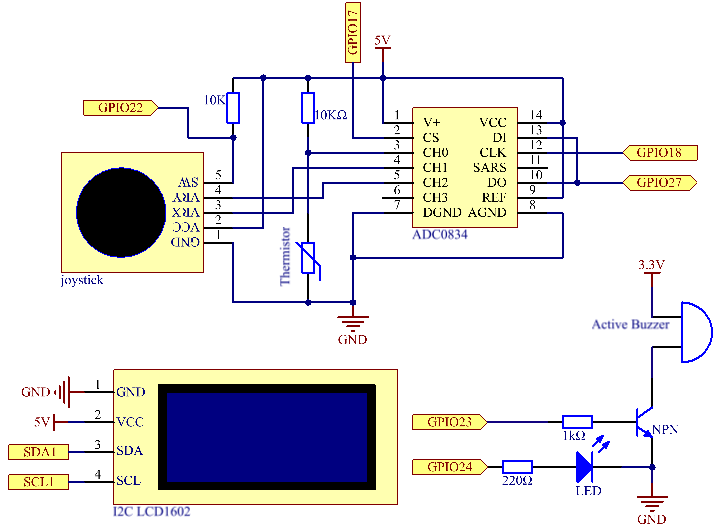
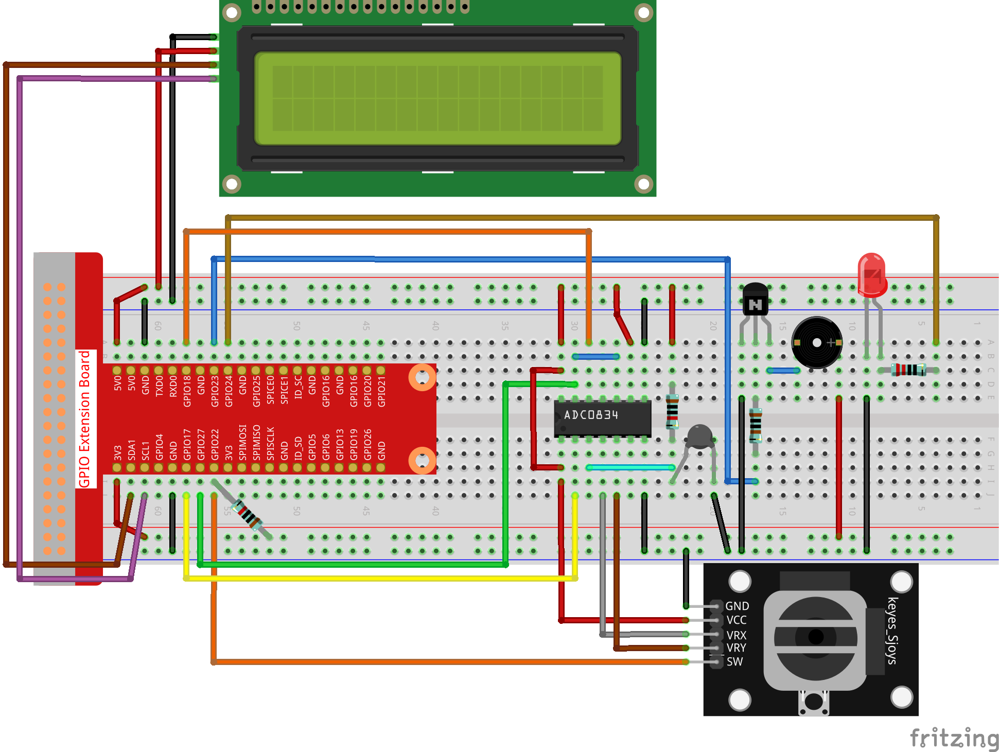

.. note::

    Ciao, benvenuto nella Community su Facebook per gli appassionati di SunFounder Raspberry Pi, Arduino e ESP32! Approfondisci le tue conoscenze su Raspberry Pi, Arduino ed ESP32 insieme ad altri appassionati.

    **Perché unirti a noi?**

    - **Supporto esperto**: Risolvi i problemi post-vendita e le sfide tecniche con l’aiuto della nostra community e del nostro team.
    - **Impara e Condividi**: Scambia consigli e tutorial per migliorare le tue competenze.
    - **Anteprime Esclusive**: Ottieni accesso anticipato agli annunci dei nuovi prodotti e anteprime esclusive.
    - **Sconti Speciali**: Approfitta di sconti esclusivi sui nostri prodotti più recenti.
    - **Promozioni e Giveaway Festivi**: Partecipa a concorsi e promozioni in occasione delle festività.

    👉 Pronto a esplorare e creare con noi? Clicca su [|link_sf_facebook|] e unisciti oggi stesso!

3.1.8 Monitor di Surriscaldamento
=================================

Introduzione
--------------

Potresti voler realizzare un dispositivo di monitoraggio della temperatura 
per rilevare il surriscaldamento in vari ambienti. Ad esempio, in fabbrica, 
per attivare un allarme e spegnere automaticamente la macchina in caso di 
surriscaldamento del circuito. In questa lezione, utilizzeremo un termistore, 
un joystick, un cicalino, un LED e un LCD per creare un dispositivo intelligente 
di monitoraggio della temperatura con soglia regolabile.

Componenti
-------------

.. image:: img/list_Overheat_Monitor.png
    :align: center

Schema di Collegamento
-------------------------

============ ======== ======== ===
T-Board Name physical wiringPi BCM
GPIO17       Pin 11   0        17
GPIO18       Pin 12   1        18
GPIO27       Pin 13   2        27
GPIO22       Pin15    3        22
GPIO23       Pin16    4        23
GPIO24       Pin18    5        24
SDA1         Pin 3             
SCL1         Pin 5             
============ ======== ======== ===

Procedure Sperimentali
----------------------

**Passo 1:** Costruisci il circuito.

**Passo 2:** Vai nella cartella del codice.

.. raw:: html

   <run></run>

.. code-block:: 

    cd ~/davinci-kit-for-raspberry-pi/c/3.1.8/

**Passo 3:** Compila il codice.

.. raw:: html

   <run></run>

.. code-block:: 

    gcc 3.1.8_OverheatMonitor.c -lwiringPi -lm

**Passo 4:** Esegui il file eseguibile.

.. raw:: html

   <run></run>

.. code-block:: 

    sudo ./a.out

Quando il codice è in esecuzione, la temperatura attuale e la soglia 
di alta temperatura (**40**°C) vengono visualizzate su **I2C LCD1602**. 
Se la temperatura attuale supera la soglia, il cicalino e il LED si 
accendono per avvisare.

.. note::

    Se non funziona dopo l'esecuzione o compare un messaggio di errore: \"wiringPi.h: No such file or directory\", consulta :ref:`Il codice C non funziona?`.

**Joystick**: il joystick serve per regolare la soglia di alta temperatura. 
Spostando il **Joystick** lungo gli assi X e Y si può aumentare o diminuire 
la soglia. Premere il **Joystick** una volta per reimpostare la soglia al 
valore iniziale.

**Spiegazione del Codice**

.. code-block:: c

    int get_joystick_value(){
        uchar x_val;
        uchar y_val;
        x_val = get_ADC_Result(1);
        y_val = get_ADC_Result(2);
        if (x_val > 200){
            return 1;
        }
        else if(x_val < 50){
            return -1;
        }
        else if(y_val > 200){
            return -10;
        }
        else if(y_val < 50){
            return 10;
        }
        else{
            return 0;
        }
    }

Questa funzione legge i valori di X e Y. Se **X>200**, restituisce "**1**"; 
**X<50**, restituisce "**-1**"; **y>200**, restituisce "**-10**"; e **y<50**, 
restituisce "**10**".

.. code-block:: c

    void upper_tem_setting(){
        write(0, 0, "Upper Adjust:");
        int change = get_joystick_value();
        upperTem = upperTem + change;
        char str[6];
        snprintf(str,3,"%d",upperTem);
    write(0,1,str);
    int len;
      len = strlen(str);
      write(len,1,"             ");
        delay(100);
    }

Questa funzione regola la soglia e la visualizza su **I2C LCD1602**.

.. code-block:: c

    double temperature(){
        unsigned char temp_value;
        double Vr, Rt, temp, cel, Fah;
        temp_value = get_ADC_Result(0);
        Vr = 5 * (double)(temp_value) / 255;
        Rt = 10000 * (double)(Vr) / (5 - (double)(Vr));
        temp = 1 / (((log(Rt/10000)) / 3950)+(1 / (273.15 + 25)));
        cel = temp - 273.15;
        Fah = cel * 1.8 +32;
        return cel;
    }

Legge il valore analogico di **CH0** (termistore) di **ADC0834** e lo 
converte in temperatura.

.. code-block:: c

    void monitoring_temp(){
        char str[6];
        double cel = temperature();
        snprintf(str,6,"%.2f",cel);
        write(0, 0, "Temp: ");
        write(6, 0, str);
        snprintf(str,3,"%d",upperTem);
        write(0, 1, "Upper: ");
        write(7, 1, str);
        delay(100);
        if(cel >= upperTem){
            digitalWrite(buzzPin, HIGH);
            digitalWrite(LedPin, HIGH);
        }
        else if(cel < upperTem){
            digitalWrite(buzzPin, LOW);
            digitalWrite(LedPin, LOW);
        }
    }

Quando il codice è in esecuzione, la temperatura attuale e la soglia 
di alta temperatura (**40**°C) vengono visualizzate su **I2C LCD1602**. 
Se la temperatura attuale supera la soglia, il cicalino e il LED si accendono 
per avvisare.

.. code-block:: c

    int main(void)
    {
        setup();
        int lastState =1;
        int stage=0;
        while (1)
        {
            int currentState = digitalRead(Joy_BtnPin);
            if(currentState==1 && lastState == 0){
                stage=(stage+1)%2;
                delay(100);
                lcd_clear();
            }
            lastState=currentState;
            if (stage==1){
                upper_tem_setting();
            }
            else{
                monitoring_temp();
            }
        }
        return 0;
    }

La funzione main() include l'intero processo del programma:

1) All’avvio del programma, il valore iniziale di **stage** è **0** e la 
temperatura attuale insieme alla soglia di alta temperatura (**40**°C) 
vengono visualizzate su **I2C LCD1602**. Se la temperatura supera la soglia, 
il cicalino e il LED si attivano per avvisare.

2) Premendo il Joystick, **stage** diventa **1**, consentendo di regolare la 
soglia di alta temperatura. Spostando il Joystick lungo gli assi X e Y si può 
aumentare o diminuire la soglia corrente. Premere nuovamente il Joystick per 
reimpostare la soglia al valore iniziale.

