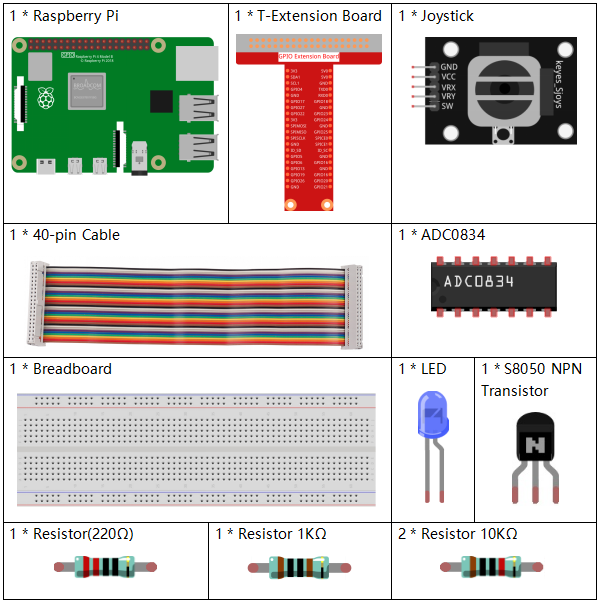

.. note::

    Hello, welcome to the SunFounder Raspberry Pi & Arduino & ESP32 Enthusiasts Community on Facebook! Dive deeper into Raspberry Pi, Arduino, and ESP32 with fellow enthusiasts.

    **Why Join?**

    - **Expert Support**: Solve post-sale issues and technical challenges with help from our community and team.
    - **Learn & Share**: Exchange tips and tutorials to enhance your skills.
    - **Exclusive Previews**: Get early access to new product announcements and sneak peeks.
    - **Special Discounts**: Enjoy exclusive discounts on our newest products.
    - **Festive Promotions and Giveaways**: Take part in giveaways and holiday promotions.

    👉 Ready to explore and create with us? Click [|link_sf_facebook|] and join today!

3.1.8 Overheat Monitor
========================

Introduction
-------------------

You may want to make an overheat monitoring device that applies to
various situations, ex., in the factory, if we want to have an alarm and
the timely automatic turning off of the machine when there is a circuit
overheating. In this lesson, we will use thermistor, joystick, buzzer,
LED and LCD to make an smart temperature monitoring device whose
threshold is adjustable.

Components
-----------------

.. image:: img/list_Overheat_Monitor2.png
    :align: center

Schematic Diagram
--------------------------

============ ======== ======== ===
T-Board Name physical wiringPi BCM
GPIO17       Pin 11   0        17
GPIO18       Pin 12   1        18
GPIO27       Pin 13   2        27
GPIO22       Pin15    3        22
GPIO23       Pin16    4        23
GPIO24       Pin18    5        24
SDA1         Pin 3             
SCL1         Pin 5             
============ ======== ======== ===

.. image:: img/Schematic_three_one8.png
   :width: 700
   :align: center

Experimental Procedures
-----------------------------

**Step 1:** Build the circuit.

.. image:: img/image258.png
   :alt: Overheat Monitor_bb
   :width: 800

**For C Language Users**
^^^^^^^^^^^^^^^^^^^^^^^^^^

**Step 2**: Go to the folder of the code.

.. raw:: html

   <run></run>

.. code-block:: 

    cd ~/davinci-kit-for-raspberry-pi/c/3.1.8/

**Step 3**: Compile the code.

.. raw:: html

   <run></run>

.. code-block:: 

    gcc 3.1.8_OverheatMonitor.c -lwiringPi -lm

**Step 4**: Run the executable file.

.. raw:: html

   <run></run>

.. code-block:: 

    sudo ./a.out

As the code runs, the current temperature and the high-temperature
threshold **40** are displayed on **I2C LCD1602**. If the current
temperature is larger than the threshold, the buzzer and LED are started
to alarm you.

.. note::

    If it does not work after running, or there is an error prompt: \"wiringPi.h: No such file or directory\", please refer to :ref:`C code is not working?`.

**Joystick** here is for your pressing to adjust the high-temperature
threshold. Toggling the **Joystick** in the direction of X-axis and
Y-axis can adjust (turn up or down) the current high-temperature
threshold. Press the **Joystick** once again to reset the threshold to
initial value.

**Code Explanation**

.. code-block:: c

    int get_joystick_value(){
        uchar x_val;
        uchar y_val;
        x_val = get_ADC_Result(1);
        y_val = get_ADC_Result(2);
        if (x_val > 200){
            return 1;
        }
        else if(x_val < 50){
            return -1;
        }
        else if(y_val > 200){
            return -10;
        }
        else if(y_val < 50){
            return 10;
        }
        else{
            return 0;
        }
    }

This function reads values of X and Y. If **X>200**, there will return
\"**1**\"; **X<50**, return \"**-1**\"; **y>200**, return
\"**-10**\", and **y<50**, return \"**10**\".

.. code-block:: c

    void upper_tem_setting(){
        write(0, 0, "Upper Adjust:");
        int change = get_joystick_value();
        upperTem = upperTem + change;
        char str[6];
        snprintf(str,3,"%d",upperTem);
    write(0,1,str);
    int len;
      len = strlen(str);
      write(len,1,"             ");
        delay(100);
    }

This function is for adjusting the threshold and displaying it on the
I2C LCD1602.

.. code-block:: c

    double temperature(){
        unsigned char temp_value;
        double Vr, Rt, temp, cel, Fah;
        temp_value = get_ADC_Result(0);
        Vr = 5 * (double)(temp_value) / 255;
        Rt = 10000 * (double)(Vr) / (5 - (double)(Vr));
        temp = 1 / (((log(Rt/10000)) / 3950)+(1 / (273.15 + 25)));
        cel = temp - 273.15;
        Fah = cel * 1.8 +32;
        return cel;
    }

Read the analog value of the **CH0** (thermistor) of **ADC0834** and
then convert it to temperature value.

.. code-block:: c

    void monitoring_temp(){
        char str[6];
        double cel = temperature();
        snprintf(str,6,"%.2f",cel);
        write(0, 0, "Temp: ");
        write(6, 0, str);
        snprintf(str,3,"%d",upperTem);
        write(0, 1, "Upper: ");
        write(7, 1, str);
        delay(100);
        if(cel >= upperTem){
            digitalWrite(buzzPin, HIGH);
            digitalWrite(LedPin, HIGH);
        }
        else if(cel < upperTem){
            digitalWrite(buzzPin, LOW);
            digitalWrite(LedPin, LOW);
        }
    }

As the code runs, the current temperature and the high-temperature
threshold **40** are displayed on **I2C LCD1602**. If the current
temperature is larger than the threshold, the buzzer and LED are started
to alarm you.

.. code-block:: c

    int main(void)
    {
        setup();
        int lastState =1;
        int stage=0;
        while (1)
        {
            int currentState = digitalRead(Joy_BtnPin);
            if(currentState==1 && lastState == 0){
                stage=(stage+1)%2;
                delay(100);
                lcd_clear();
            }
            lastState=currentState;
            if (stage==1){
                upper_tem_setting();
            }
            else{
                monitoring_temp();
            }
        }
        return 0;
    }

The function main() contains the whole program process as shown:

1) When the program starts, the initial value of **stage** is **0**, and
   the current temperature and the high-temperature threshold **40** are
   displayed on **I2C LCD1602**. If the current temperature is larger
   than the threshold, the buzzer and the LED are started to alarm you.

2) Press the Joystick, and **stage** will be **1** and you can adjust
   the high-temperature threshold. Toggling the Joystick in the
   direction of X-axis and Y-axis can adjust (turn up or down) the
   current threshold. Press the Joystick once again to reset the
   threshold to initial value.

**For Python Language Users**
^^^^^^^^^^^^^^^^^^^^^^^^^^^^^^

**Step 2**: Go to the folder of the code.

.. raw:: html

   <run></run>

.. code-block:: 

    cd ~/davinci-kit-for-raspberry-pi/python/

**Step 3**: Run the executable file.

.. raw:: html

   <run></run>

.. code-block:: 

    sudo python3 3.1.8_OverheatMonitor.py

As the code runs, the current temperature and the high-temperature
threshold **40** are displayed on **I2C LCD1602**. If the current
temperature is larger than the threshold, the buzzer and LED are started
to alarm you.

**Joystick** here is for your pressing to adjust the high-temperature
threshold. Toggling the **Joystick** in the direction of X-axis and
Y-axis can adjust (turn up or down) the current high-temperature
threshold. Press the **Joystick** once again to reset the threshold to
initial value.

**Code**

.. note::

    You can **Modify/Reset/Copy/Run/Stop** the code below. But before that, you need to go to  source code path like ``davinci-kit-for-raspberry-pi/python``. 
    
.. raw:: html

    <run></run>

.. code-block:: python

    import LCD1602
    import RPi.GPIO as GPIO
    import ADC0834
    import time
    import math

    Joy_BtnPin = 22
    buzzPin = 23
    ledPin = 24

    upperTem = 40

    def setup():
        ADC0834.setup()
        GPIO.setmode(GPIO.BCM)
        GPIO.setup(ledPin, GPIO.OUT, initial=GPIO.LOW)
        GPIO.setup(buzzPin, GPIO.OUT, initial=GPIO.LOW)
        GPIO.setup(Joy_BtnPin, GPIO.IN, pull_up_down=GPIO.PUD_UP)
        LCD1602.init(0x27, 1)

    def get_joystick_value():
        x_val = ADC0834.getResult(1)
        y_val = ADC0834.getResult(2)
        if(x_val > 200):
            return 1
        elif(x_val < 50):
            return -1
        elif(y_val > 200):
            return -10
        elif(y_val < 50):
            return 10
        else:
            return 0

    def upper_tem_setting():
        global upperTem
        LCD1602.write(0, 0, 'Upper Adjust: ')
        change = int(get_joystick_value())
        upperTem = upperTem + change
        strUpperTem = str(upperTem)
        LCD1602.write(0, 1, strUpperTem)
        LCD1602.write(len(strUpperTem),1, '              ')
        time.sleep(0.1)

    def temperature():
        analogVal = ADC0834.getResult()
        Vr = 5 * float(analogVal) / 255
        Rt = 10000 * Vr / (5 - Vr)
        temp = 1/(((math.log(Rt / 10000)) / 3950) + (1 / (273.15+25)))
        Cel = temp - 273.15
        Fah = Cel * 1.8 + 32
        return round(Cel,2)

    def monitoring_temp():
        global upperTem
        Cel=temperature()
        LCD1602.write(0, 0, 'Temp: ')
        LCD1602.write(0, 1, 'Upper: ')
        LCD1602.write(6, 0, str(Cel))
        LCD1602.write(7, 1, str(upperTem))
        time.sleep(0.1)
        if Cel >= upperTem:
            GPIO.output(buzzPin, GPIO.HIGH)
            GPIO.output(ledPin, GPIO.HIGH)
        else:
            GPIO.output(buzzPin, GPIO.LOW)
            GPIO.output(ledPin, GPIO.LOW)       

    def loop():
        lastState=1
        stage=0
        while True:
            currentState=GPIO.input(Joy_BtnPin)
            if currentState==1 and lastState ==0:
                stage=(stage+1)%2
                time.sleep(0.1)    
                LCD1602.clear()
            lastState=currentState
            if stage == 1:
                upper_tem_setting()
            else:
                monitoring_temp()
        
    def destroy():
        LCD1602.clear() 
        ADC0834.destroy()
        GPIO.cleanup()

    if __name__ == '__main__':     # Program start from here
        try:
            setup()
            while True:
                loop()
        except KeyboardInterrupt:   # When 'Ctrl+C' is pressed, the program destroy() will be executed.
            destroy()

**Code Explanation**

.. code-block:: python

    def get_joystick_value():
        x_val = ADC0834.getResult(1)
        y_val = ADC0834.getResult(2)
        if(x_val > 200):
            return 1
        elif(x_val < 50):
            return -1
        elif(y_val > 200):
            return -10
        elif(y_val < 50):
            return 10
        else:
            return 0

This function reads values of X and Y. If **X>200**, there will return
\"**1**\"; **X<50**, return \"**-1**\"; **y>200**, return
\"**-10**\", and **y<50**, return \"**10**\".

.. code-block:: python

    def upper_tem_setting():
        global upperTem
        LCD1602.write(0, 0, 'Upper Adjust: ')
        change = int(get_joystick_value())
        upperTem = upperTem + change
    LCD1602.write(0, 1, str(upperTem))
    LCD1602.write(len(strUpperTem),1, '              ')
        time.sleep(0.1)

This function is for adjusting the threshold and displaying it on the
I2C LCD1602.

.. code-block:: python

    def temperature():
        analogVal = ADC0834.getResult()
        Vr = 5 * float(analogVal) / 255
        Rt = 10000 * Vr / (5 - Vr)
        temp = 1/(((math.log(Rt / 10000)) / 3950) + (1 / (273.15+25)))
        Cel = temp - 273.15
        Fah = Cel * 1.8 + 32
        return round(Cel,2)

Read the analog value of the **CH0** (thermistor) of **ADC0834** and
then convert it to temperature value.

.. code-block:: python

    def monitoring_temp():
        global upperTem
        Cel=temperature()
        LCD1602.write(0, 0, 'Temp: ')
        LCD1602.write(0, 1, 'Upper: ')
        LCD1602.write(6, 0, str(Cel))
        LCD1602.write(7, 1, str(upperTem))
        time.sleep(0.1)
        if Cel >= upperTem:
            GPIO.output(buzzPin, GPIO.HIGH)
            GPIO.output(ledPin, GPIO.HIGH)
        else:
            GPIO.output(buzzPin, GPIO.LOW)
            GPIO.output(ledPin, GPIO.LOW)

As the code runs, the current temperature and the high-temperature
threshold **40** are displayed on **I2C LCD1602**. If the current
temperature is larger than the threshold, the buzzer and LED are started
to alarm you.

.. code-block:: python

    def loop():
        lastState=1
        stage=0
        while True:
            currentState=GPIO.input(Joy_BtnPin)
            if currentState==1 and lastState ==0:
                stage=(stage+1)%2
                time.sleep(0.1)    
                LCD1602.clear()
            lastState=currentState
            if stage == 1:
                upper_tem_setting()
            else:
                monitoring_temp()

The function main() contains the whole program process as shown:

1) When the program starts, the initial value of **stage** is **0**, and
   the current temperature and the high-temperature threshold **40** are
   displayed on **I2C LCD1602**. If the current temperature is larger
   than the threshold, the buzzer and the LED are started to alarm you.

2) Press the Joystick, and **stage** will be **1** and you can adjust
   the high-temperature threshold. Toggling the Joystick in the
   direction of X-axis and Y-axis can adjust (turn up or down) the
   current high-temperature threshold. Press the Joystick once again to
   reset the threshold to initial value.

Phenomenon Picture
-------------------------

.. image:: img/image259.jpeg
   :align: center