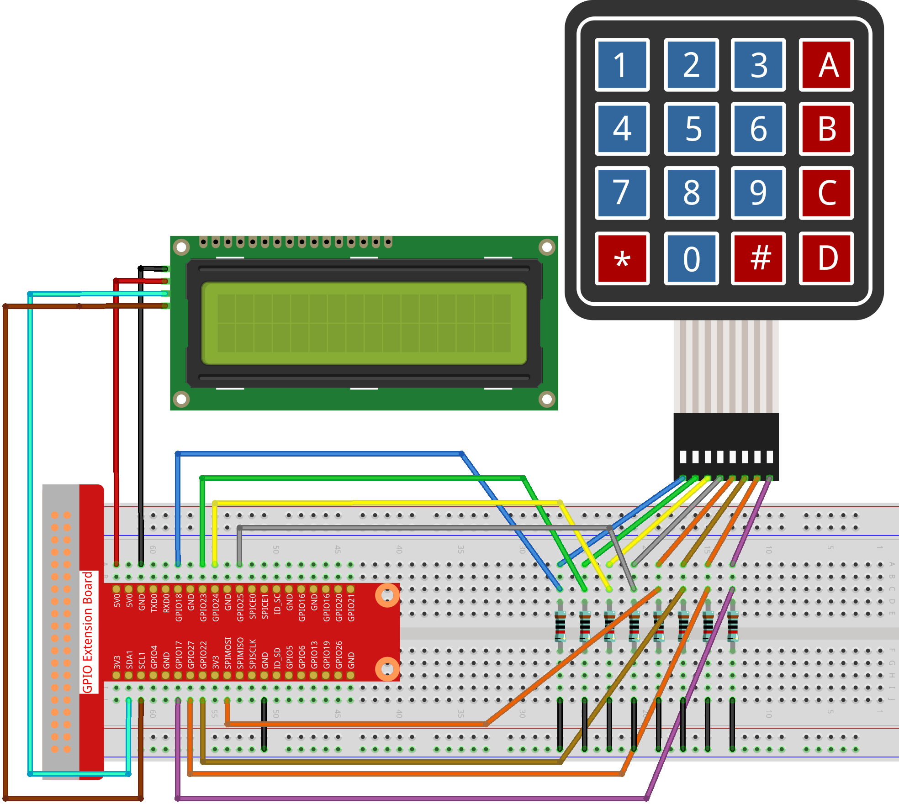

.. note::

    Hallo und willkommen in der SunFounder Raspberry Pi & Arduino & ESP32 Enthusiasten-Gemeinschaft auf Facebook! Tauchen Sie tiefer ein in die Welt von Raspberry Pi, Arduino und ESP32 mit anderen Enthusiasten.

    **Warum beitreten?**

    - **Expertenunterstützung**: Lösen Sie Nachverkaufsprobleme und technische Herausforderungen mit Hilfe unserer Gemeinschaft und unseres Teams.
    - **Lernen & Teilen**: Tauschen Sie Tipps und Anleitungen aus, um Ihre Fähigkeiten zu verbessern.
    - **Exklusive Vorschauen**: Erhalten Sie frühzeitigen Zugang zu neuen Produktankündigungen und exklusiven Einblicken.
    - **Spezialrabatte**: Genießen Sie exklusive Rabatte auf unsere neuesten Produkte.
    - **Festliche Aktionen und Gewinnspiele**: Nehmen Sie an Gewinnspielen und Feiertagsaktionen teil.

    👉 Sind Sie bereit, mit uns zu erkunden und zu erschaffen? Klicken Sie auf [|link_sf_facebook|] und treten Sie heute bei!

3.1.9 Passwortsperre
======================

Einführung
-------------

In diesem Projekt werden wir eine Tastatur und ein LCD verwenden, um ein Nummerschloss herzustellen. Auf dem LCD wird eine entsprechende Aufforderung angezeigt, Ihr Passwort auf der Tastatur einzugeben. Wenn das Passwort korrekt eingegeben wurde, wird „Richtig“ angezeigt.

Auf der Grundlage dieses Projekts können wir zusätzliche elektronische Komponenten wie Summer, LED usw. hinzufügen, um verschiedene experimentelle Phänomene für die Passworteingabe hinzuzufügen.

Komponenten
--------------

.. image:: ../img/list_Password_Lock.png
    :align: center

Schematische Darstellung
------------------------------

============ ======== ======== ===
T-Karte Name physisch wiringPi BCM
GPIO18       Pin 12   1        18
GPIO23       Pin 16   4        23
GPIO24       Pin 18   5        24
GPIO25       Pin 22   6        25
GPIO17       Pin 11   0        17
GPIO27       Pin 13   2        27
GPIO22       Pin 15   3        22
SPIMOSI      Pin 19   12       10
SDA1         Pin 3             
SCL1         Pin 5             
============ ======== ======== ===

.. image:: ../img/Schematic_three_one9.png
   :align: center

Experimentelle Verfahren
-------------------------

Schritt 1: Bauen Sie die Schaltung auf.

Schritt 2: Verzeichnis wechseln.

.. raw:: html

   <run></run>

.. code-block:: 

    cd ~/davinci-kit-for-raspberry-pi/c/3.1.9/

Schritt 3: Kompilieren.

.. raw:: html

   <run></run>

.. code-block::

    gcc 3.1.9_PasswordLock.cpp -lwiringPi

Schritt 4: Ausführen.

.. raw:: html

   <run></run>

.. code-block::

    sudo ./a.out

Nachdem der Kode ausgeführt wurde, wird die Tastatur über die Tastatur eingegeben. Wenn auf dem LCD1602 die Meldung „RICHTIG“ angezeigt wird, 
ist das Kennwort nicht falsch. Andernfalls wird „FALSCHER SCHLÜSSEL“ angezeigt.

**Code Erklärung**

.. code-block:: c

    #define ROWS  4 
    #define COLS  4
    #define BUTTON_NUM (ROWS * COLS)
    #define LENS  4

    unsigned char KEYS[BUTTON_NUM] {  
    '1','2','3','A',
    '4','5','6','B',
    '7','8','9','C',
    '*','0','#','D'};

    char password[LENS]={'1','9','8','4'};

Hier definieren wir die Länge des Kennworts LENS, 
des Schlüssel-Array-Tastenschlüssel-Arrays KEYS und des Arrays, 
in dem das richtige Kennwort gespeichert ist.

.. code-block:: c

    void keyRead(unsigned char* result);
    bool keyCompare(unsigned char* a, unsigned char* b);
    void keyCopy(unsigned char* a, unsigned char* b);
    void keyPrint(unsigned char* a);
    void keyClear(unsigned char* a);
    int keyIndexOf(const char value);

Es gibt eine Deklaration der Unterfunktionen des Matrix-Tastaturcodes, 
siehe :ref:`py_keypad`  dieses Dokuments für weitere Details.

.. code-block:: c

    void write_word(int data);
    void send_command(int comm);
    void send_data(int data);
    void lcdInit();
    void clear();
    void write(int x, int y, char const data[]);

Es gibt eine Deklaration der Unterfunktionen des LCD1062-Codes, siehe
:ref:`py_lcd`  dieses Dokuments für weitere Details.

.. code-block:: c

    while(1){
            keyRead(pressed_keys);
            bool comp = keyCompare(pressed_keys, last_key_pressed);
            ...
                    testword[keyIndex]=pressed_keys[0];
                    keyIndex++;
                    if(keyIndex==LENS){
                        if(check()==0){
                            clear();
                            write(3, 0, "WRONG KEY!");
                            write(0, 1, "please try again");
                            }
                    ...

Lesen Sie den Schlüsselwert und speichern Sie ihn im Testarray-Testwort. 
Wenn die Anzahl der gespeicherten Schlüsselwerte mehr als 4 beträgt, 
wird die Richtigkeit des Kennworts automatisch überprüft und die Überprüfungsergebnisse werden auf der LCD-Oberfläche angezeigt.

.. code-block:: c

    int check(){
        for(int i=0;i<LENS;i++){
            if(password[i]!=testword[i])
            {return 0;}
        }
        return 1;
    }

Überprüfen Sie die Richtigkeit des Passworts. Geben Sie 1 zurück, wenn das Passwort korrekt eingegeben wurde, und 0, wenn nicht.
