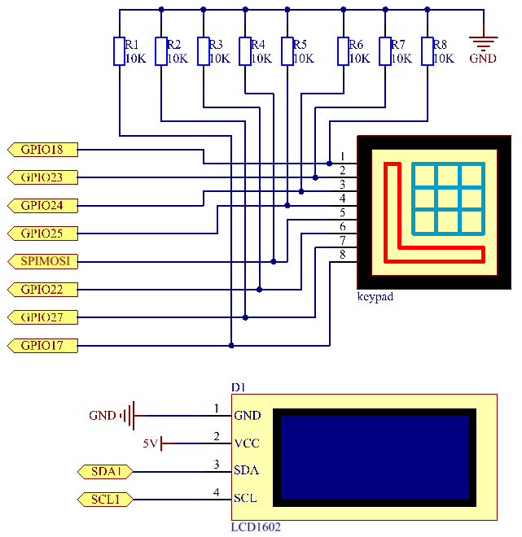

.. note::

    Ciao, benvenuto nella Community su Facebook per gli appassionati di SunFounder Raspberry Pi, Arduino e ESP32! Approfondisci le tue conoscenze su Raspberry Pi, Arduino ed ESP32 insieme ad altri appassionati.

    **Perché unirti a noi?**

    - **Supporto esperto**: Risolvi i problemi post-vendita e le sfide tecniche con l’aiuto della nostra community e del nostro team.
    - **Impara e Condividi**: Scambia consigli e tutorial per migliorare le tue competenze.
    - **Anteprime Esclusive**: Ottieni accesso anticipato agli annunci dei nuovi prodotti e anteprime esclusive.
    - **Sconti Speciali**: Approfitta di sconti esclusivi sui nostri prodotti più recenti.
    - **Promozioni e Giveaway Festivi**: Partecipa a concorsi e promozioni in occasione delle festività.

    👉 Pronto a esplorare e creare con noi? Clicca su [|link_sf_facebook|] e unisciti oggi stesso!

3.1.9 Serratura a Codice
============================

Introduzione
---------------

In questo progetto, utilizzeremo una tastiera e un LCD per realizzare 
una serratura a combinazione. L’LCD mostrerà un messaggio che invita a 
inserire la password sulla tastiera. Se la password è corretta, verrà 
visualizzato \"CORRETTO\".

Su questa base, possiamo aggiungere componenti elettronici come cicalini 
o LED per ottenere diversi segnali visivi o sonori in base alla correttezza 
della password.

Componenti
------------

.. image:: img/list_Password_Lock.png
    :align: center

Schema di Collegamento
-------------------------

============ ======== ======== ===
T-Board Name physical wiringPi BCM
GPIO18       Pin 12   1        18
GPIO23       Pin 16   4        23
GPIO24       Pin 18   5        24
GPIO25       Pin 22   6        25
GPIO17       Pin 11   0        17
GPIO27       Pin 13   2        27
GPIO22       Pin 15   3        22
SPIMOSI      Pin 19   12       10
SDA1         Pin 3             
SCL1         Pin 5             
============ ======== ======== ===

Procedure Sperimentali
-------------------------

**Passo 1:** Costruisci il circuito.

.. image:: img/image262.png
   :width: 800

**Passo 2**: Cambia directory.

.. raw:: html

   <run></run>

.. code-block:: 

    cd ~/davinci-kit-for-raspberry-pi/c/3.1.9/

**Passo 3**: Compila.

.. raw:: html

   <run></run>

.. code-block::

    gcc 3.1.9_PasswordLock.cpp -lwiringPi

**Passo 4:** Esegui.

.. raw:: html

   <run></run>

.. code-block::

    sudo ./a.out

Quando il codice è in esecuzione, si utilizza la tastiera per inserire 
la password. Se appare \"CORRETTO\" su LCD1602, la password è corretta; 
altrimenti, comparirà \"CHIAVE ERRATA\".

.. note::

    Se non funziona dopo l'esecuzione o compare un messaggio di errore: \"wiringPi.h: No such file or directory\", consulta :ref:`Il codice C non funziona?`.

**Spiegazione del Codice**

.. code-block:: c

    #define ROWS  4 
    #define COLS  4
    #define BUTTON_NUM (ROWS * COLS)
    #define LENS  4

    unsigned char KEYS[BUTTON_NUM] {  
    '1','2','3','A',
    '4','5','6','B',
    '7','8','9','C',
    '*','0','#','D'};

    char password[LENS]={'1','9','8','4'};

Qui definiamo la lunghezza della password `LENS`, l’array `KEYS` 
per i valori dei tasti della tastiera e l’array `password` che 
contiene la password corretta.

.. code-block:: c

    void keyRead(unsigned char* result);
    bool keyCompare(unsigned char* a, unsigned char* b);
    void keyCopy(unsigned char* a, unsigned char* b);
    void keyPrint(unsigned char* a);
    void keyClear(unsigned char* a);
    int keyIndexOf(const char value);

Dichiarazione delle sottofunzioni per la gestione della tastiera a matrice. 
Per ulteriori dettagli, consulta :ref:`2.1.5 Tastierino` di questo documento.

.. code-block:: c

    void write_word(int data);
    void send_command(int comm);
    void send_data(int data);
    void lcdInit();
    void clear();
    void write(int x, int y, char const data[]);

Dichiarazione delle sottofunzioni per il codice LCD1602. Per maggiori 
dettagli, consulta :ref:`1.1.7 LCD1602 I2C` di questo documento.

.. code-block:: c

    while(1){
            keyRead(pressed_keys);
            bool comp = keyCompare(pressed_keys, last_key_pressed);
            ...
                    testword[keyIndex]=pressed_keys[0];
                    keyIndex++;
                    if(keyIndex==LENS){
                        if(check()==0){
                            clear();
                            write(3, 0, "WRONG KEY!");
                            write(0, 1, "please try again");
                            }
                    ...

Legge il valore del tasto e lo memorizza nell'array `testword`. 
Se sono stati memorizzati più di 4 valori, il codice verifica 
automaticamente la correttezza della password e mostra il risultato 
sul display LCD.

.. code-block:: c

    int check(){
        for(int i=0;i<LENS;i++){
            if(password[i]!=testword[i])
            {return 0;}
        }
        return 1;
    }

Verifica la correttezza della password. Se la password è corretta, 
restituisce 1; altrimenti, restituisce 0.

