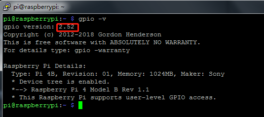

.. note::

    こんにちは、SunFounderのRaspberry Pi & Arduino & ESP32愛好家コミュニティへようこそ！Facebook上でRaspberry Pi、Arduino、ESP32についてもっと深く掘り下げ、他の愛好家と交流しましょう。

    **参加する理由は？**

    - **エキスパートサポート**：コミュニティやチームの助けを借りて、販売後の問題や技術的な課題を解決します。
    - **学び＆共有**：ヒントやチュートリアルを交換してスキルを向上させましょう。
    - **独占的なプレビュー**：新製品の発表や先行プレビューに早期アクセスしましょう。
    - **特別割引**：最新製品の独占割引をお楽しみください。
    - **祭りのプロモーションとギフト**：ギフトや祝日のプロモーションに参加しましょう。

    👉 私たちと一緒に探索し、創造する準備はできていますか？[|link_sf_facebook|]をクリックして今すぐ参加しましょう！

.. _install_wiringpi:

WiringPiのインストールと確認
=======================================

``wiringPi`` は、Raspberry Piに適用されるC言語のGPIOライブラリです。これはGNU Lv3に準拠しています。wiringPiの関数はArduinoのwiringシステムの関数に似ています。これにより、Arduinoに慣れているユーザーがwiringPiをより簡単に使用できます。

``wiringPi`` には、Raspberry Piのさまざまなインターフェイスを制御できる多くのGPIOコマンドが含まれています。

以下のコマンドを実行して、 ``wiringPi`` ライブラリをインストールしてください。

.. raw:: html

   <run></run>

.. code-block::

    sudo apt-get update
    git clone https://github.com/WiringPi/WiringPi
    cd WiringPi 
    ./build

wiringPiライブラリが正常にインストールされたかどうかは、次の指示に従って確認できます。

.. raw:: html

   <run></run>

.. code-block::

    gpio -v

次のコマンドでGPIOを確認します:

.. raw:: html

   <run></run>

.. code-block::

    gpio readall

.. image:: ../img/image31.png

wiringPiの詳細については、 `WiringPi <https://github.com/WiringPi/WiringPi>`_ を参照してください。

