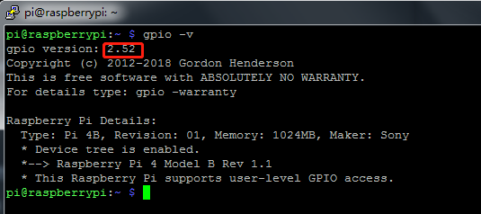

.. note::

    ¡Hola! Bienvenidos a la comunidad de entusiastas de SunFounder para Raspberry Pi, Arduino y ESP32 en Facebook. Sumérgete en el mundo de Raspberry Pi, Arduino y ESP32 junto con otros apasionados.

    **¿Por qué unirse?**

    - **Soporte de Expertos**: Soluciona problemas post-venta y desafíos técnicos con la ayuda de nuestra comunidad y equipo.
    - **Aprende y Comparte**: Intercambia consejos y tutoriales para mejorar tus habilidades.
    - **Avances Exclusivos**: Accede anticipadamente a anuncios de nuevos productos y adelantos.
    - **Descuentos Especiales**: Disfruta de descuentos exclusivos en nuestros productos más recientes.
    - **Promociones y Sorteos Festivos**: Participa en sorteos y promociones especiales en días festivos.

    👉 ¿Listo para explorar y crear con nosotros? Haz clic en [|link_sf_facebook|] y únete hoy.

.. _install_wiringpi:

Instalar y Verificar WiringPi
-------------------------------------

``wiringPi`` es una biblioteca de GPIO en lenguaje C aplicada a la Raspberry Pi. Cumple con la licencia GUN Lv3. Las funciones en wiringPi son similares a las del sistema de cableado de Arduino. Permiten a los usuarios familiarizados con Arduino usar wiringPi más fácilmente.

``wiringPi`` incluye muchos comandos GPIO que te permiten controlar todo tipo de interfaces en la Raspberry Pi.

Por favor, ejecuta el siguiente comando para instalar la biblioteca ``wiringPi``.

.. raw:: html

   <run></run>

.. code-block::

    sudo apt-get update
    git clone https://github.com/WiringPi/WiringPi
    cd WiringPi 
    ./build

Puedes probar si la biblioteca wiringPi se ha instalado correctamente con la siguiente instrucción.

.. raw:: html

    <run></run>

.. code-block::

    gpio -v

Verifica el GPIO con el siguiente comando:

.. raw:: html

    <run></run>

.. code-block:: 

    gpio readall

.. image:: img/image31.png

Para más detalles sobre wiringPi, puedes consultar `WiringPi <https://github.com/WiringPi/WiringPi>`_.
