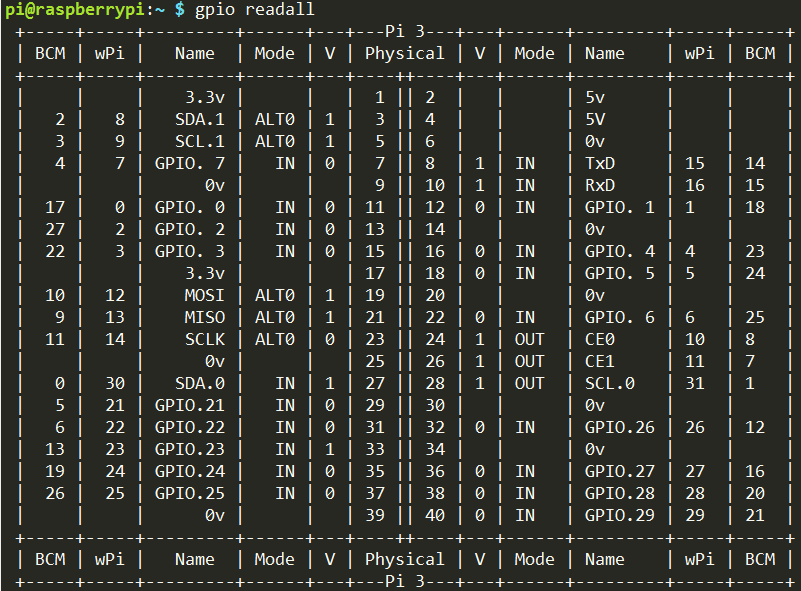

.. note::

    Ciao, benvenuto nella SunFounder Raspberry Pi & Arduino & ESP32 Enthusiasts Community su Facebook! Approfondisci Raspberry Pi, Arduino ed ESP32 insieme ad altri appassionati.

    **Perché unirti?**

    - **Supporto esperto**: Risolvi i problemi post-vendita e le sfide tecniche con l'aiuto della nostra community e del nostro team.
    - **Impara e condividi**: Scambia suggerimenti e tutorial per migliorare le tue competenze.
    - **Anteprime esclusive**: Ottieni accesso anticipato agli annunci di nuovi prodotti e alle anteprime.
    - **Sconti speciali**: Goditi sconti esclusivi sui nostri prodotti più recenti.
    - **Promozioni festive e omaggi**: Partecipa a concorsi e promozioni festive.

    👉 Pronto a esplorare e creare con noi? Clicca su [|link_sf_facebook|] e unisciti oggi!

.. _install_wiringpi:

Installazione e verifica di WiringPi
=======================================

``wiringPi`` è una libreria GPIO in linguaggio C applicata al Raspberry Pi. 
È conforme alla licenza GNU Lv3. Le funzioni in wiringPi sono simili a quelle 
del sistema wiring di Arduino, rendendo più facile per gli utenti abituati ad 
Arduino utilizzare wiringPi.

``wiringPi`` include molti comandi GPIO che ti permettono di controllare tutti 
i tipi di interfacce su Raspberry Pi.

Esegui il seguente comando per installare la libreria ``wiringPi``:

.. raw:: html

   <run></run>

.. code-block::

    sudo apt-get update
    git clone https://github.com/WiringPi/WiringPi
    cd WiringPi 
    ./build

Puoi verificare se la libreria wiringPi è stata installata correttamente con il 
seguente comando.

.. raw:: html

   <run></run>

.. code-block::

    gpio -v

.. image:: ../img/image30.png

Controlla il GPIO con il seguente comando:

.. raw:: html

   <run></run>

.. code-block::

    gpio readall

Per ulteriori dettagli su wiringPi, puoi consultare `WiringPi <https://github.com/WiringPi/WiringPi>`_.
