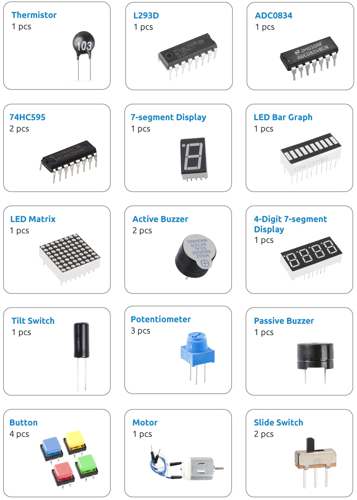
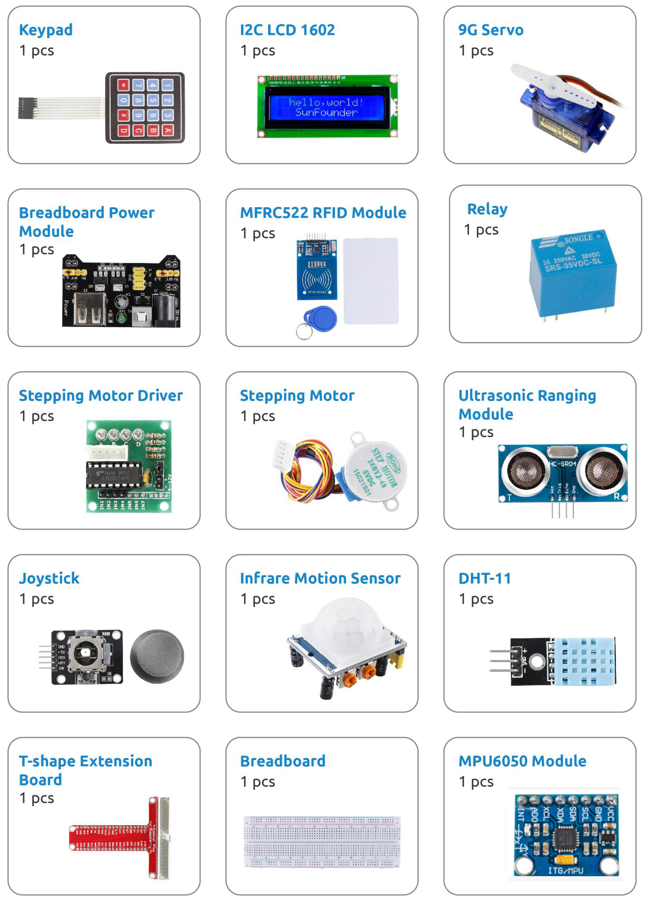
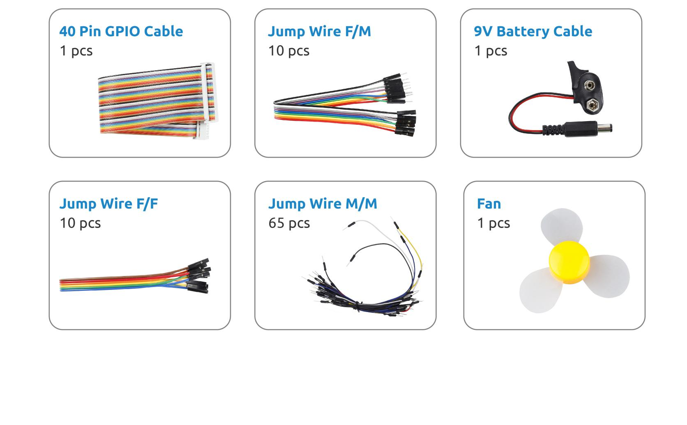

.. note:: 

    Ciao, benvenuto nella Community di appassionati di SunFounder Raspberry Pi & Arduino & ESP32 su Facebook! Scopri di più su Raspberry Pi, Arduino ed ESP32 insieme ad altri appassionati.

    **Perché unirsi a noi?**

    - **Supporto da esperti**: Risolvi problemi post-vendita e sfide tecniche con l'aiuto della nostra community e del nostro team.
    - **Impara e condividi**: Scambia consigli e tutorial per migliorare le tue competenze.
    - **Anteprime esclusive**: Ottieni un accesso anticipato agli annunci di nuovi prodotti e alle anteprime.
    - **Sconti speciali**: Approfitta di sconti esclusivi sui nostri prodotti più recenti.
    - **Promozioni e omaggi**: Partecipa a promozioni speciali e omaggi durante le festività.

    👉 Sei pronto a esplorare e creare con noi? Clicca su [|link_sf_facebook|] e unisciti oggi!

Elenco dei Componenti
=========================

Dopo aver aperto la confezione, verifica che la quantità dei componenti corrisponda alla descrizione del prodotto e che tutti i componenti siano in buone condizioni.

.. image:: img/image4.jpeg

