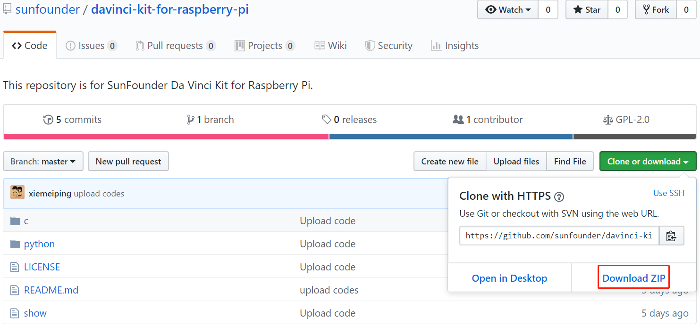

Download the Code
=================

Before you download the code, please note that the example code is
**ONLY** test on Raspberry Pi OS. We provide two methods for download:

**Method 1: Use git clone (Recommended)**

Log into Raspberry Pi and then change directory to ``/home/pi``.

.. raw:: html

   <run></run>
   
.. code-block::

   cd /home/pi/

.. note::

   cd to change to the intended directory from the current path. Informally, here is to go to the path ``/home/pi/``.

Clone the repository from GitHub.

.. raw:: html

   <run></run>
   
.. code-block::

   git clone https://github.com/sunfounder/davinci-kit-for-raspberry-pi.git

**Method 2: Download the code.**

Download the source code from github: https://github.com/sunfounder/davinci-kit-for-raspberry-pi

