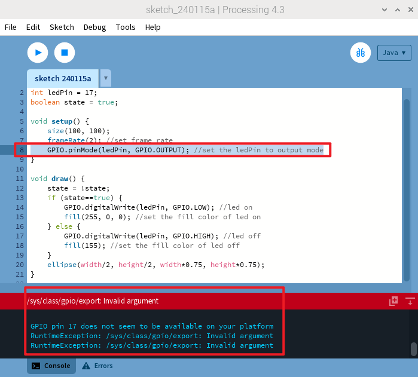
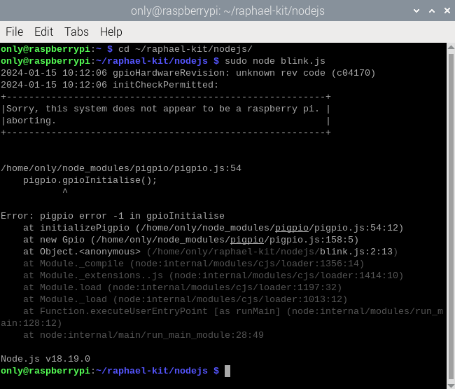

.. note::

    Hello, welcome to the SunFounder Raspberry Pi & Arduino & ESP32 Enthusiasts Community on Facebook! Dive deeper into Raspberry Pi, Arduino, and ESP32 with fellow enthusiasts.

    **Why Join?**

    - **Expert Support**: Solve post-sale issues and technical challenges with help from our community and team.
    - **Learn & Share**: Exchange tips and tutorials to enhance your skills.
    - **Exclusive Previews**: Get early access to new product announcements and sneak peeks.
    - **Special Discounts**: Enjoy exclusive discounts on our newest products.
    - **Festive Promotions and Giveaways**: Take part in giveaways and holiday promotions.

    👉 Ready to explore and create with us? Click [|link_sf_facebook|] and join today!

For Pi 5
============================

The release of the Raspberry Pi 5 has brought us a more powerful model, but it also introduced some changes, 
most notably to the GPIO.Although it retains its standard 40-pin interface, functionality has shifted due to 
its connection with the newly integrated RP1 southbridge chip. This custom RP1 chip now handles peripherals 
on the Pi 5 and has resulted in various compatibility concerns.Currently, only the GPIO Zero library, maintained 
officially by the Raspberry Pi organization, is fully compatible. We have developed a series of courses 
specifically focused on this library.

.. toctree::
    :maxdepth: 1
    
    python_pi5/play_with_python_pi5

For compatibility issues with other programming languages, please see the detailed information below:

**Processing**

When using Processing 4 on Raspberry Pi 5, GPIO programming encounters challenges. Errors such as "Invalid argument" and "GPIO pin 17 seems to be unavailable on your platform" arise during the execution of GPIO-related code (as depicted in the accompanying image). For further details, visit: https://github.com/benfry/processing4/issues/807

**Node.js**

Node.js utilizes the pigpio library, which, as of now, does not support Raspberry Pi 5. For more insights, visit: https://github.com/joan2937/pigpio/issues/589

**Scratch**

.. note::
 
    * Version 3.30.8 of Scratch 3 is now compatible with the Raspberry Pi 5. 
    * We are also in the process of updating our courses to be compatible with the Raspberry Pi 5. Please wait for these updates.

On a 64-bit system, the importation of the Raspberry Pi GPIO library faces issues, leading to unresponsiveness. For more information, visit: https://github.com/raspberrypi/bookworm-feedback/issues/91.