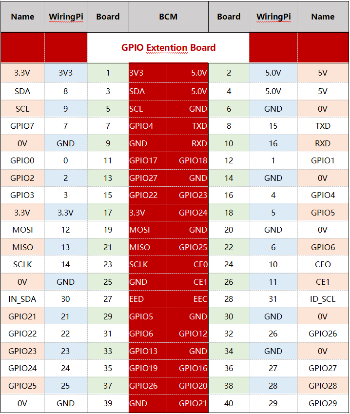

GPIO拡張ボード
====================

コマンドの学習を開始する前に、最初にRaspberry Piのピンについて詳しく知る必要がある。これは、その後の研究の鍵となる。

GPIO拡張ボードによってRaspberry Piのピンをブレッドボードに簡単に引き出して、頻繁に挿入または引き抜きによるGPIOの損傷を防止できる。これは、Raspberry PiモデルB +、世代2モデルBおよび世代3、4モデルBに適用する40ピンGPIO拡張ボードとGPIOケーブルである。

.. image:: media/image32.png
    :align: center

**ピン番号**

Raspberry Piのピンには、命名方法が三つあり、つまり、wiringPi、BCM、およびボードである。

これらの命名方法の中で、40ピンGPIO拡張ボードは命名方法BCMを使用している。ただし、I2CポートやSPIポートなどの一部の特別なピンでは、付属の名前を使用する。

次の表は、WiringPi、ボード、およびGPIO拡張ボード上の各ピンの固有の命名方法を示している。たとえば、GPIO17の場合、ボードの命名方法によると11で、wiringPiの命名方法によると0で、固有の命名方法によるとGPIO0である。

.. note::

    1）C言語では、使用されている命名方法はWiringPiである。

    2）Python言語では、適用される命名方法はBoardとBCMであり、関数GPIO.setmode()を使用してそれらを設定します。

