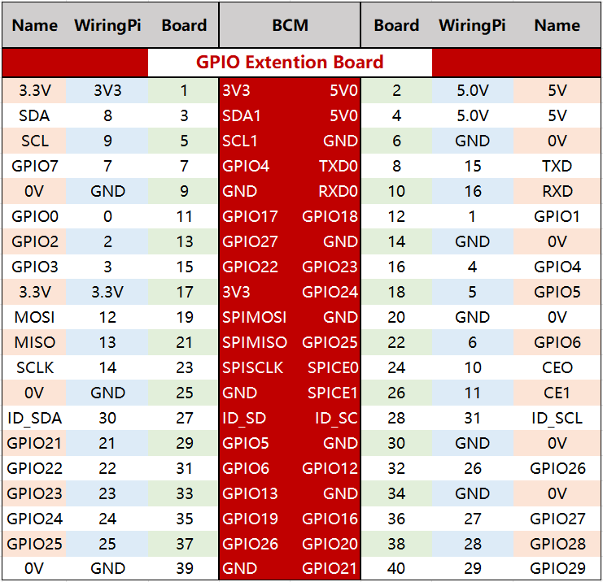

.. note::

    Bonjour, bienvenue dans la communauté SunFounder Raspberry Pi & Arduino & ESP32 Enthusiasts sur Facebook ! Plongez plus profondément dans l'univers de Raspberry Pi, Arduino et ESP32 avec d'autres passionnés.

    **Pourquoi nous rejoindre ?**

    - **Support d'experts** : Résolvez les problèmes après-vente et les défis techniques grâce à l'aide de notre communauté et de notre équipe.
    - **Apprendre & Partager** : Échangez des astuces et des tutoriels pour améliorer vos compétences.
    - **Aperçus exclusifs** : Accédez en avant-première aux annonces de nouveaux produits et aux aperçus exclusifs.
    - **Remises spéciales** : Profitez de réductions exclusives sur nos nouveaux produits.
    - **Promotions festives et cadeaux** : Participez à des concours et promotions pendant les fêtes.

    👉 Prêt à explorer et créer avec nous ? Cliquez sur [|link_sf_facebook|] et rejoignez-nous dès aujourd'hui !

Carte d'extension GPIO
==============================

Avant de commencer à apprendre les commandes, il est essentiel de mieux connaître 
les broches du Raspberry Pi, ce qui est la clé pour les études ultérieures.

Grâce à la carte d'extension GPIO, nous pouvons facilement connecter les broches du 
Raspberry Pi à une breadboard, évitant ainsi les dommages au GPIO causés par des 
branchements et débranchements fréquents. Voici notre carte d'extension GPIO à 40 
broches et le câble GPIO pour les modèles Raspberry Pi B+, 2 modèle B et 3, 4 modèle B.

.. image:: img/image32.png
    :align: center

**Numérotation des broches**

Les broches du Raspberry Pi peuvent être nommées de trois manières : wiringPi, BCM et Board.

Parmi ces méthodes de nommage, la carte d'extension GPIO à 40 broches utilise la méthode de nommage BCM. Cependant, pour certaines broches spéciales, telles que les ports I2C et SPI, elles conservent leur propre nom spécifique.

Le tableau suivant montre les méthodes de nommage WiringPi, Board et le nom intrinsèque de chaque broche sur la carte d'extension GPIO. Par exemple, pour le GPIO17, le nom en méthode Board est 11, en méthode WiringPi c'est 0, et son nom intrinsèque est GPIO0.

.. note::

    1) En langage C, la méthode de nommage utilisée est WiringPi.
    
    2) En langage Python, les méthodes de nommage appliquées sont Board et BCM, et la fonction GPIO.setmode() est utilisée pour les définir.

