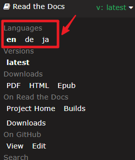

SunFounder Da Vinci Kit for Raspberry Pi
===========================================

Da Vinci Kit is a basic kit suitable to intelligent beginners who have
project schedule. It contains 26 commonly used input and output
components and modules and a number of basic electronic devices (such as
resistors, capacitors) which can provide powerful assistance in your
programming learning.

In the light of the kit, you can learn some basic knowledge on Raspberry
Pi, including the installation method of Raspberry Pi, knowledge of Bash
shell and GPIO. Having understood these knowledge, you can start
programming.

If you have no knowledge background of hardware, this document about the
Kit provides you with 30 lessons for reference and learning, including
26 basic I/o lessons and 4 simple practical examples. It should be noted
that the arrangement of these courses is not based on the degree of
difficulty, but on the functions in practice. You can find corresponding
courses in accordance with your needs. In other words, even if you
haven't finished reading the entire course or mastered the use of the
components mentioned, this document will play an important role in
guiding you to complete practical projects in the future.

We are looking forward to your projects and hope that you can share your
achievements or creation on our forum while reading this document.

If you have any questions, please send an email to service@sunfounder.com and we will respond as soon as possible.

**About the display language**

This document is available in other languages as well. To switch the display language, kindly click on the Read the Docs icon located in the lower left corner of the page.

**Contents**

.. toctree::
    :maxdepth: 2

    About this Kit <self>
    component_list
    preparation/preparation
    1_output
    2_input
    3_extension
    iot/4_iot_projects
    nodejs/play_with_nodejs
    processing/play_with_processing
    scratch/play_with_scratch
    appendix/appendix
    faq
    thank-learning

Copyright Notice
--------------------------

All contents including but not limited to texts, images, and code in this manual are owned by the SunFounder Company. You should only use it for personal study,investigation, enjoyment, or other non-commercial or nonprofit purposes, under therelated regulations and copyrights laws, without infringing the legal rights of the author and relevant right holders. For any individual or organization that uses these for commercial profit without permission, the Company reserves the right to take legal action.
