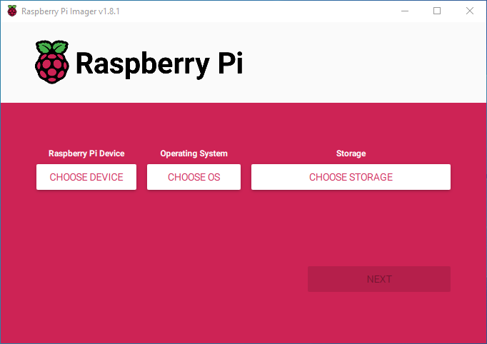
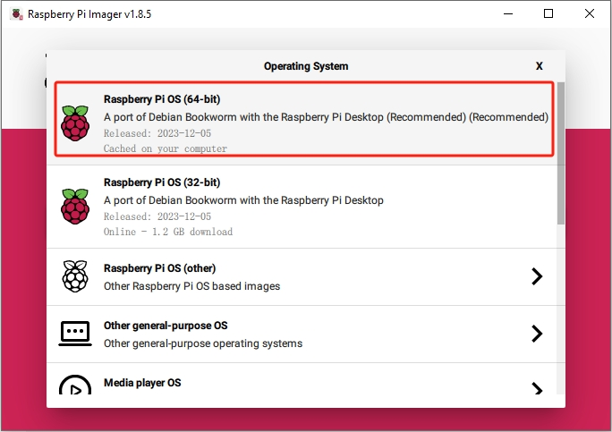
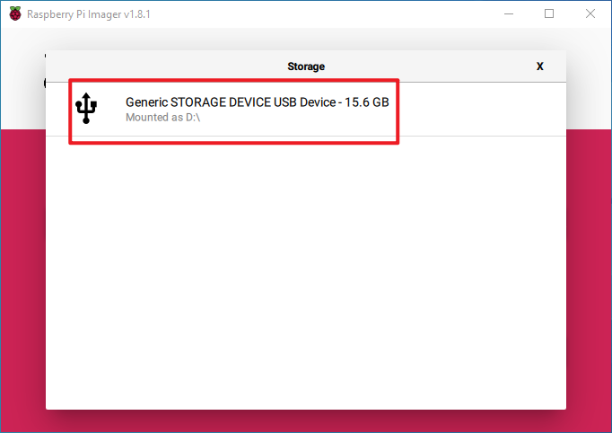
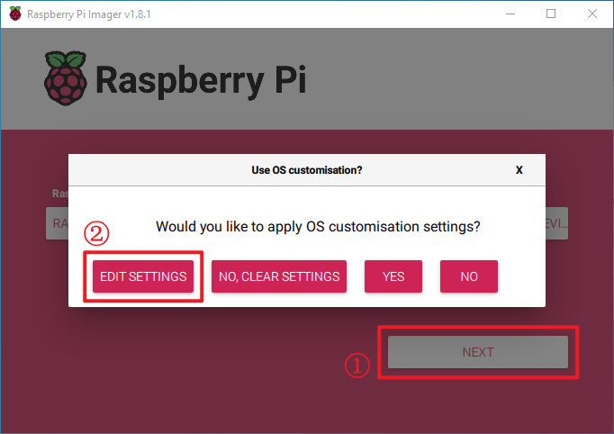
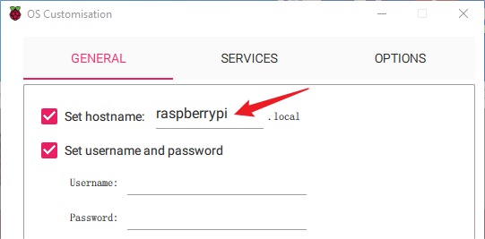
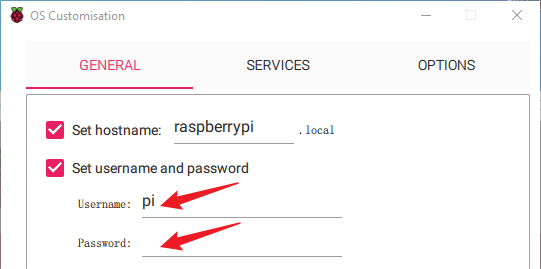
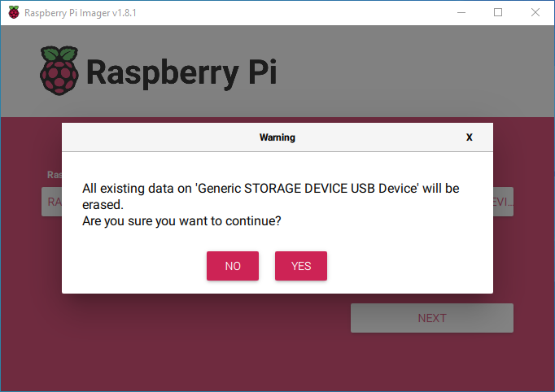

.. note::

    こんにちは、SunFounderのRaspberry Pi & Arduino & ESP32愛好家コミュニティへようこそ！Facebook上でRaspberry Pi、Arduino、ESP32についてもっと深く掘り下げ、他の愛好家と交流しましょう。

    **参加する理由は？**

    - **エキスパートサポート**：コミュニティやチームの助けを借りて、販売後の問題や技術的な課題を解決します。
    - **学び＆共有**：ヒントやチュートリアルを交換してスキルを向上させましょう。
    - **独占的なプレビュー**：新製品の発表や先行プレビューに早期アクセスしましょう。
    - **特別割引**：最新製品の独占割引をお楽しみください。
    - **祭りのプロモーションとギフト**：ギフトや祝日のプロモーションに参加しましょう。

    👉 私たちと一緒に探索し、創造する準備はできていますか？[|link_sf_facebook|]をクリックして今すぐ参加しましょう！

.. _install_os:

OSのインストール（共通）
========================================

**ステップ 1**

Raspberry Piチームは、Mac OS、Ubuntu 18.04、Windowsと互換性のあるユーザーフレンドリーなグラフィカルSDカードライティングツールを提供しています。これは、OSイメージを自動的にダウンロードし、SDカードにインストールするため、多くのユーザーにとって最も便利なオプションです。

ダウンロードページを訪れてください： https://www.raspberrypi.org/software/ 。お使いのオペレーティングシステム用の **Raspberry Pi Imager** を選択してください。ダウンロード後、開いてインストールを開始します。

.. image:: img/image2.png
    :align: center

.. raw:: html

     

**ステップ 2**

インストーラーを起動すると、OSからセキュリティ警告が表示されることがあります。例えば、Windowsではこのメッセージが表示されるかもしれません：

これに遭遇した場合は、 **More info** を選択し、その後 **Run anyway** を選択します。画面の指示に従ってRaspberry Pi Imagerをインストールしてください。

.. image:: img/image3.png
    :align: center

.. raw:: html

     

**ステップ 3**

Imagerをインストールした後、 **Raspberry Pi Imager** のアイコンをクリックするか、 ``rpi-imager`` を実行してアプリケーションを開きます。

.. raw:: html

     

**ステップ 4**

**Choose device** をクリックし、リストからRaspberry Piモデルを選択します。

.. image:: img/image5.png
    :align: center

.. raw:: html

     

**ステップ 5**

次に、 **Choose OS** をクリックし、インストールするオペレーティングシステムを選択します。

.. raw:: html

     

**ステップ 6**

外部または内蔵のSDカードリーダーを使用して、好みのストレージ媒体（例えば、microSDカード）に接続します。その後、ストレージを選択をクリックし、ストレージデバイスを選択します。

.. note:: 

    * 複数のデバイスが接続されている場合は、正しいストレージデバイスを選択してください。デバイスは、しばしばそのサイズで識別できます。不確かな場合は他のデバイスを切断してください。

.. raw:: html

     

**ステップ 7**

**NEXT** ボタンを押して **EDIT SETTINGS** を選択し、OSカスタマイズページにアクセスします。

.. raw:: html

     

**ステップ 8**

**hostname** を設定します。

.. note::
        * ホスト名オプションは、Raspberry PiがmDNSを使用してネットワークにブロードキャストするホスト名を定義します。Raspberry Piをネットワークに接続すると、ネットワーク上の他のデバイスが ``<hostname>.local`` または ``<hostname>.lan`` を使用してコンピュータと通信できます。

.. raw:: html

     

Raspberry Piの管理者アカウントの **username** と **password** を設定します。

.. note::
        * Raspberry Piにはデフォルトのパスワードがないため、独自のパスワードを作成することが不可欠です。ユーザー名もカスタマイズ可能です。

.. raw:: html

     

ネットワークの **SSID** と **password** を入力してワイヤレスLANを設定します。

.. note::

    ``Wireless LAN country`` をあなたの国の二文字の `ISO/IEC alpha2コード <https://en.wikipedia.org/wiki/ISO_3166-1_alpha-2#Officially_assigned_code_elements>`_ に設定します。

.. image:: img/image11.png
    :align: center

.. raw:: html

     

**ステップ 9**

**SERVICES** をクリックしてSSHを有効にし、パスワードベースのログインを選択します。次に **Save** をクリックします。

.. image:: img/image12.png
    :align: center

.. raw:: html

     

**ステップ 10**

**Yes** ボタンをクリックします。

.. image:: img/image13.png
    :align: center

.. raw:: html

     

**ステップ 11**

SDカードにファイルが含まれている場合は、永久的な損失を避けるためにバックアップを検討してください。バックアップが不要な場合は、 **Yes** をクリックします。

.. raw:: html

     

**ステップ 12**

書き込みプロセスの完了は、待機後に以下のウィンドウによって示されます。

.. image:: img/image15.png
    :align: center

.. raw:: html

     

