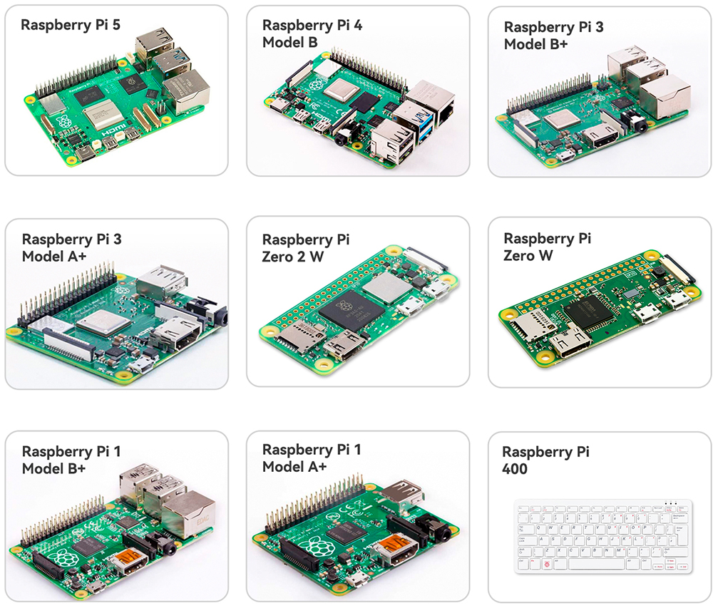

.. note::

    Hello, welcome to the SunFounder Raspberry Pi & Arduino & ESP32 Enthusiasts Community on Facebook! Dive deeper into Raspberry Pi, Arduino, and ESP32 with fellow enthusiasts.

    **Why Join?**

    - **Expert Support**: Solve post-sale issues and technical challenges with help from our community and team.
    - **Learn & Share**: Exchange tips and tutorials to enhance your skills.
    - **Exclusive Previews**: Get early access to new product announcements and sneak peeks.
    - **Special Discounts**: Enjoy exclusive discounts on our newest products.
    - **Festive Promotions and Giveaways**: Take part in giveaways and holiday promotions.

    👉 Ready to explore and create with us? Click [|link_sf_facebook|] and join today!

What Do We Need?
========================

Required Components
-----------------------

**Raspberry Pi**

The Raspberry Pi is a low cost, credit-card sized computer that plugs
into a computer monitor or TV, and uses a standard keyboard and mouse.
It is a capable little device that enables people of all ages to explore
computing, and to learn how to program in languages like Scratch and
Python.

**Power Adapter**

To connect to a power socket, the Raspberry Pi has a micro USB port (the
same found on many mobile phones). You will need a power supply which
provides at least 2.5 amps.

**Micro SD Card**

Your Raspberry Pi needs an Micro SD card to store all its files and the
Raspberry Pi OS. You will need a micro SD card with a capacity of at
least 8 GB.

Optional Components
-------------------------

**Screen**

To view the desktop environment of Raspberry Pi, you need to use the
screen that can be a TV screen or a computer monitor. If the screen has
built-in speakers, the Pi plays sounds via them.

**Mouse & Keyboard**

When you use a screen , a USB keyboard and a USB mouse are also needed.

**HDMI**

The Raspberry Pi has a HDMI output port that is compatible with the HDMI
ports of most modern TV and computer monitors. If your screen has only
DVI or VGA ports, you will need to use the appropriate conversion line.

**Case**

You can put the Raspberry Pi in a case; by this means, you can protect
your device.

