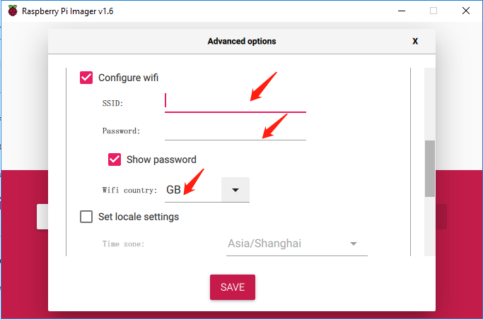
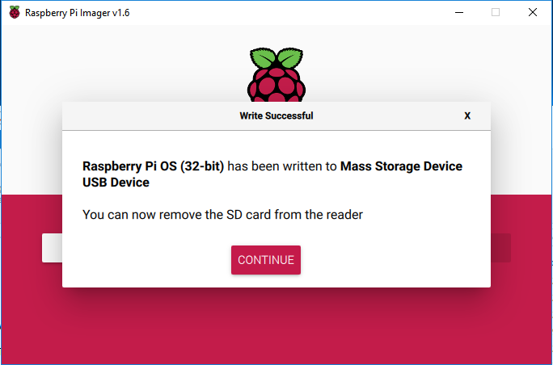

Installing the OS
=======================

**Required Components**

================== ======================
Any Raspberry Pi   1 \* Personal Computer
1 \* Micro SD card 
================== ======================

**Step 1**

Raspberry Pi have developed a graphical SD card writing tool that works
on Mac OS, Ubuntu 18.04 and Windows, and is the easiest option for most
users as it will download the image and install it automatically to the
SD card.

Visit the download page: https://www.raspberrypi.org/software/. Click on
the link for the Raspberry Pi Imager that matches your operating system,
when the download finishes, click it to launch the installer.

.. image:: media/image11.png
    :align: center

**Step 2**

When you launch the installer, your operating system may try to block
you from running it. For example, on Windows I receive the following
message:

If this pops up, click on **More info** and then **Run anyway**, then
follow the instructions to install the Raspberry Pi Imager.

.. image:: media/image12.png
    :align: center

**Step 3**

Insert your SD card into the computer or laptop SD card slot.

**Step 4**

In the Raspberry Pi Imager, select the OS that you want to install and
the SD card you would like to install it on.

.. image:: media/image13.png
    :align: center

.. note:: 

    1) You will need to be connected to the internet the first time.

    2) That OS will then be stored for future offline use(lastdownload.cache, C:/Users/yourname/AppData/Local/Raspberry Pi/Imager/cache). So the next time you open the software, it will have the display "Released: date, cached on your computer".

**Step 5**

Select the SD card you are using.

.. image:: media/image14.png
    :align: center

**Step 6**

Press **Ctrl+Shift+X** to open the **Advanced options** page to enable
SSH and configure wifi, these 2 items must be set, the others depend on
your choice . You can choose to always use this image customization
options.

.. image:: media/image15.png
    :align: center

Then scroll down to complete the wifi configuration and click **SAVE**.

.. note::

    **wifi country** should be set the two-letter `ISO/IEC alpha2
    code <https://en.wikipedia.org/wiki/ISO_3166-1_alpha-2#Officially_assigned_code_elements>`__ for
    the country in which you are using your Raspberry Pi, please refer to
    the following link: https://en.wikipedia.org/wiki/ISO_3166-1_alpha-2#Officially_assigned_code_elements

**Step 7**

Click the **WRITE** button.

.. image:: media/image17.png
    :align: center

**Step 8**

If your SD card currently has any files on it, you may wish to back up
these files first to prevent you from permanently losing them. If there
is no file to be backed up, click **Yes**.

.. image:: media/image18.png
    :align: center

**Step 9**

After waiting for a period of time, the following window will appear to
represent the completion of writing.

