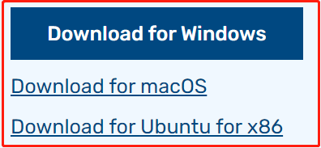
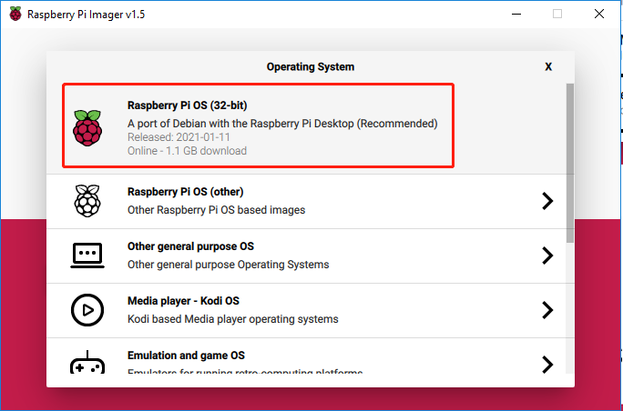
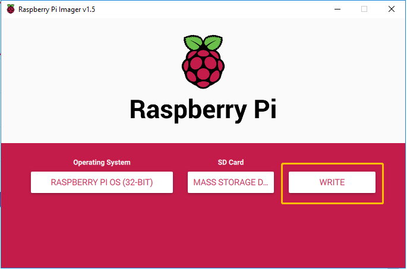

.. note::

    Hallo und willkommen in der SunFounder Raspberry Pi & Arduino & ESP32 Enthusiasten-Gemeinschaft auf Facebook! Tauchen Sie tiefer ein in die Welt von Raspberry Pi, Arduino und ESP32 mit anderen Enthusiasten.

    **Warum beitreten?**

    - **Expertenunterstützung**: Lösen Sie Nachverkaufsprobleme und technische Herausforderungen mit Hilfe unserer Gemeinschaft und unseres Teams.
    - **Lernen & Teilen**: Tauschen Sie Tipps und Anleitungen aus, um Ihre Fähigkeiten zu verbessern.
    - **Exklusive Vorschauen**: Erhalten Sie frühzeitigen Zugang zu neuen Produktankündigungen und exklusiven Einblicken.
    - **Spezialrabatte**: Genießen Sie exklusive Rabatte auf unsere neuesten Produkte.
    - **Festliche Aktionen und Gewinnspiele**: Nehmen Sie an Gewinnspielen und Feiertagsaktionen teil.

    👉 Sind Sie bereit, mit uns zu erkunden und zu erschaffen? Klicken Sie auf [|link_sf_facebook|] und treten Sie heute bei!

.. _install_os:

Installieren des Betriebssystems
================================

**Erforderliche Komponenten**

================== ======================
Raspberry Pi       1 \* Personal Computer
1 * Micro SD Karte 
================== ======================

**Schritt 1**

Raspberry Pi haben ein grafisches SD-Karten-Schreibtool entwickelt, das auf Mac OS, Ubuntu 18.04 und Windows funktioniert und ist die einfachste Option für die meisten Benutzer, da es das Bild herunterladen und automatisch auf der SD-Karte installieren wird.

Besuchen Sie die Download-Seite: https://www.raspberrypi.org/software/. Klicken Sie auf den Link für den Raspberry Pi Imager, der Ihrem Betriebssystem entspricht. Wenn der Download abgeschlossen ist, klicken Sie darauf und das Installationsprogramm startet.

**Schritt 2**

Wenn Sie das Installationsprogramm starten, wird Ihr Betriebssystem möglicherweise versuchen, die Ausführung zu verhindern. Unter Windows erhalte ich beispielsweise die folgende Meldung:

Wenn dies angezeigt wird, klicken Sie auf **More info** und **Run anyway** , befolgen Sie dann die Anweisungen, um den Raspberry Pi Imager zu installieren.

.. image:: media/image12.png
    :align: center

**Schritt 3**

Legen Sie Ihre SD-Karte in den SD-Kartensteckplatz des Computers oder Laptops ein.

**Schritt 4**

Wählen Sie im Raspberry Pi Imager das Betriebssystem aus, das Sie installieren möchten, und die SD-Karte, auf der Sie es installieren möchten.

.. note:: 

    1. Sie müssen zum ersten Mal mit dem Internet verbunden sein.

    2. Dieses Betriebssystem wird dann für die zukünftige Offline-Nutzung gespeichert (lastdownload.cache, C:/Users/yourname/AppData/Local/Raspberry Pi/Imager/cache).Wenn Sie die Software das nächste Mal öffnen, wird die Anzeige „Freigegeben: Datum, auf Ihrem Computer zwischengespeichert“ angezeigt.

**Schritt 5**

Wählen Sie die momentan verwendete SD-Karte aus.

.. image:: media/image14.png
    :align: center

**Schritt 6**

Drücken Sie **Ctrl+Shift+X**, um die Seite **Erweiterte Optionen** zu öffnen, um SSH zu aktivieren und WLAN zu konfigurieren. 
Diese beiden Elemente müssen festgelegt werden und die anderen hängen von Ihrer Wahl ab. Sie können diese Bildanpassungsoptionen immer verwenden.

.. image:: media/image15.png
    :align: center

Scrollen Sie dann nach unten, um die WLAN-Konfiguration abzuschließen, und klicken Sie auf **SPEICHERN**.

.. note::

    **Wlan-Land** sollte der zweistellige `ISO/IEC alpha2 kode <https://en.wikipedia.org/wiki/ISO_3166-1_alpha-2#Officially_assigned_code_elements>`_ eingestellt werden.
    
.. image:: media/image16.png
    :align: center

**Schritt 7**

Klicken Sie auf die Schaltfläche **SCHREIBEN**.

**Schritt 8**

Wenn auf Ihrer SD-Karte derzeit Dateien gespeichert sind, bitte speichern Sie diese möglicherweise zuerst, um zu verhindern, 
dass Sie sie dauerhaft verlieren. Wenn keine zu sichernde Datei vorhanden ist, klicken Sie auf **Ja**.

.. image:: media/image18.png
    :align: center

**Schritt 9**

Nach einer gewissen Wartezeit wird das folgende Fenster angezeigt und stellt den Abschluss des Schreibens dar.

.. image:: media/image19.png
    :align: center