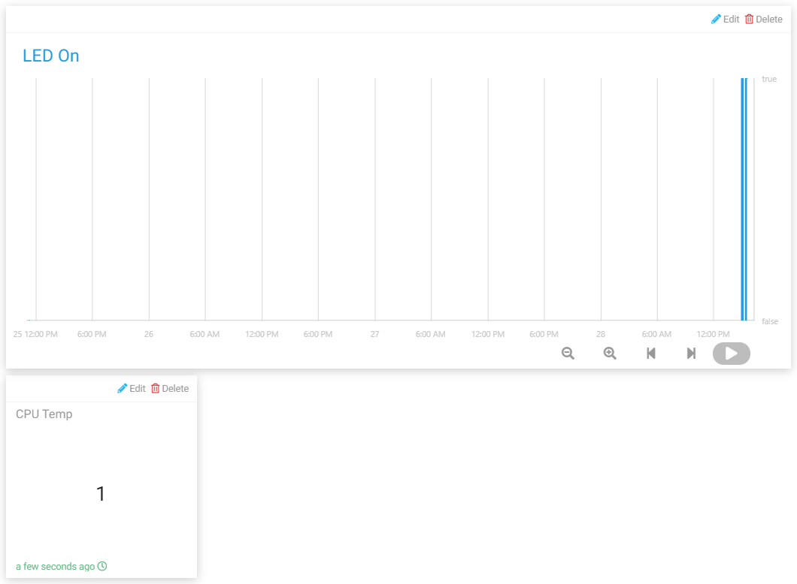

.. note::

    Ciao, benvenuto nella SunFounder Raspberry Pi & Arduino & ESP32 Enthusiasts Community su Facebook! Approfondisci la tua conoscenza di Raspberry Pi, Arduino e ESP32 insieme ad altri appassionati.

    **Perché unirsi a noi?**

    - **Supporto di esperti**: Risolvi problemi post-vendita e sfide tecniche con l'aiuto della nostra community e del nostro team.
    - **Impara e condividi**: Scambia consigli e tutorial per migliorare le tue competenze.
    - **Anteprime esclusive**: Accedi in anteprima agli annunci dei nuovi prodotti.
    - **Sconti speciali**: Goditi sconti esclusivi sui nostri prodotti più recenti.
    - **Promozioni festive e omaggi**: Partecipa a omaggi e promozioni festive.

    👉 Pronto per esplorare e creare con noi? Clicca [|link_sf_facebook|] e unisciti subito!

Sistema di Presenze
=======================

In questo progetto utilizziamo il modulo RFID MFRC522 e Cloud4RPi per creare un sistema che consente di visualizzare le informazioni di presenza su Cloud4RPi o aprire il file .csv locale per visualizzare i record di presenza.

A causa del ritardo nella trasmissione dei dati di rete, il progetto consente di timbrare solo quando il LED verde è acceso e di caricare i dati quando il LED rosso è acceso.

Procedura Sperimentale
--------------------------

Costruisci il circuito.

.. image:: img/rfid1.png
	:align: center

Apri il codice.

.. raw:: html

   <run></run>

.. code-block:: 

    cd ~/cloud4rpi-raspberrypi-python
    sudo nano attendance_system.py

Trova la riga seguente e inserisci il token del dispositivo corretto.

.. code-block:: python

    DEVICE_TOKEN = '__YOUR_DEVICE_TOKEN__'

Esegui il codice.

.. raw:: html

   <run></run>

.. code-block:: 

    sudo python3 attendance_system.py

Vai a Cloud4RPi, aggiungi un nuovo pannello di controllo chiamato **project5** e aggiungi 2 widget (widget di testo e grafico) tramite il pulsante **Add widget**.

Una volta aggiunti, è possibile visualizzare i record di presenze per diversi periodi di tempo sul widget Grafico (quando il valore di LED ON è True, significa che qualcuno ha registrato la presenza) e visualizzare il numero di persone presenti sul widget Testo.

Puoi anche trovare il file ``.csv`` con la data nel percorso ``~/cloud4rpi-raspberrypi-python``.

.. image:: img/rfid3.png
	:align: center

Aprilo con il seguente comando.

.. raw:: html

   <run></run>

.. code-block:: 

    sudo nano attendance_sheet.2021.06.28.csv

In questo modo, puoi leggere i record di timbratura di diversi periodi di tempo. A sinistra è riportato l'ID dei diversi moduli RFID MFRC522, mentre a destra è riportato il tempo di timbratura.

.. note::
	
    Se il nome della persona è stato scritto nel modulo RFID MFRC522 in anticipo, sostituisci l'ID con il testo nel codice (come verrà menzionato successivamente nella spiegazione del codice), in modo che il foglio di presenze registri il nome di ciascuna persona anziché l'ID della scheda.

Spiegazione del Codice
--------------------------

.. code-block:: python

    RedPin = 13
    GreenPin = 11

    GPIO.setmode(GPIO.BOARD)
    GPIO.setup(RedPin, GPIO.OUT, initial=GPIO.HIGH)
    GPIO.setup(GreenPin, GPIO.OUT, initial=GPIO.HIGH)

Imposta 2 LED come output e imposta il valore iniziale su alto.

.. code-block:: python

    def get_time():
		time.time()
		year = str(time.strftime('%Y',time.localtime(time.time())))
		month = str(time.strftime('%m',time.localtime(time.time())))
		day = str(time.strftime('%d',time.localtime(time.time())))
		hour = str(time.strftime('%H',time.localtime(time.time())))
		minute = str(time.strftime('%M',time.localtime(time.time())))
		second = str(time.strftime('%S',time.localtime(time.time())))
		present_time = year + '.' + month + '.' + day + '.' + hour + '.' + minute + '.' + second
		present_date = year + '.' + month + '.' + day
		return present_date, present_time

Usa la funzione ``get_time()`` per ottenere il timestamp corrente e restituisce due valori. Dove ``present_date`` è accurato al giorno e ``present_time`` è accurato al secondo.

.. code-block:: python

    attendance = False
	GPIO.output(GreenPin, GPIO.LOW)
	GPIO.output(RedPin, GPIO.HIGH)
	print("Reading...Please place the card...")
	id, text = reader.read()
	print("ID: %s\nText: %s" % (id,text))
	GPIO.output(RedPin, GPIO.LOW)
	GPIO.output(GreenPin, GPIO.HIGH)

Inizialmente, impostiamo ``attendance`` su False, il che significa che nessuno ha registrato la presenza.

Poi imposta GreenPin su livello basso per accenderlo e RedPin su livello alto per mantenerlo spento, indicando che il sistema di presenze è attualmente funzionante.

Quando qualcuno timbra, verranno stampate le informazioni id e testo della scheda. Se il LED rosso è acceso e il LED verde è spento, significa che la timbratura è avvenuta con successo e il risultato è stato inviato a Cloud4RPi.

Durante questo periodo, il sistema di presenze è in stato di attesa fino all'inizio del ciclo successivo (la luce verde è accesa).

.. code-block:: python

    if not id in attendance_list:
		attendance = True
		attendance_list.append(id)
		present_date, present_time = get_time()
		attendance_statistics[id] = present_time
		with open('attendance_sheet.' + present_date + '.csv', 'w') as f:
			[f.write('{0}  {1}\n'.format(key, value)) for key, value in attendance_statistics.items()]

Innanzitutto, determina se l'id è duplicato in ``attendance_list`` tramite un'istruzione if; se non lo è, significa che la timbratura è valida e inserisce le informazioni dell'id in ``attendance_list``. Poi otteniamo il timestamp corrente e usiamo l'id come chiave del dizionario ``attendance_statistics`` e ``present_time`` come valore della chiave corrispondente. In questo modo, il dizionario ``attendance_statistics`` memorizza l'orario di timbratura dell'id corrente.

Infine scriviamo il dizionario ``attendance_statistics`` in un file .csv e denominiamo il file ``'attendance_sheet.'' + present_date + '.csv'``, così da archiviare il foglio presenze in ordine temporale.

.. note::

    Se hai scritto il nome della persona nel modulo RFID MFRC522, sostituisci l'``id`` con il ``testo`` e il foglio presenze registrerà il nome della persona.

.. code-block:: python

    def get_num():
		return len(attendance_list)

Restituisce la lunghezza di ``attendance_list``, ossia il numero di persone presenti.
