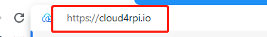
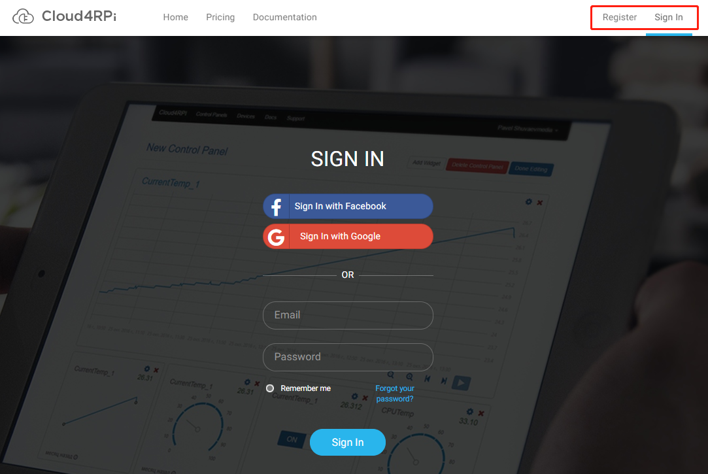
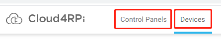
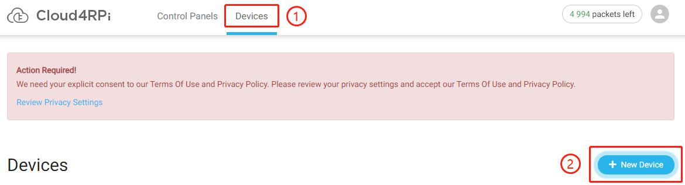
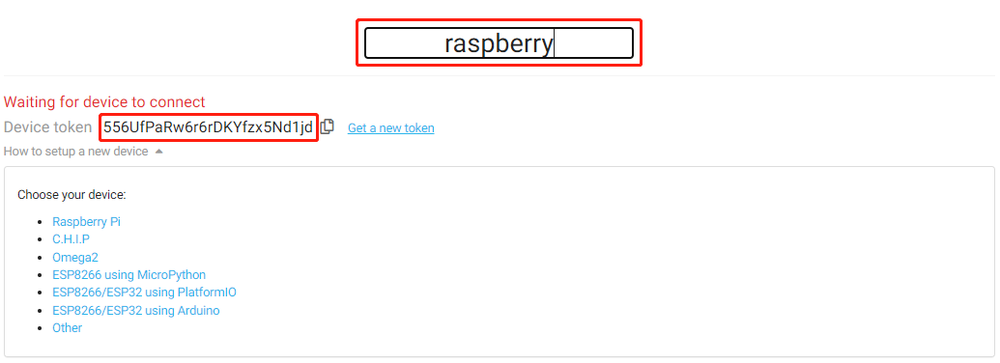
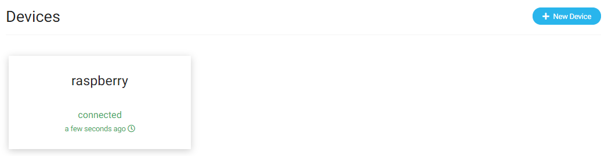
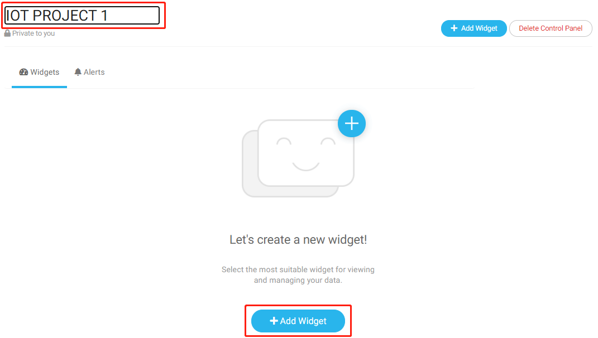
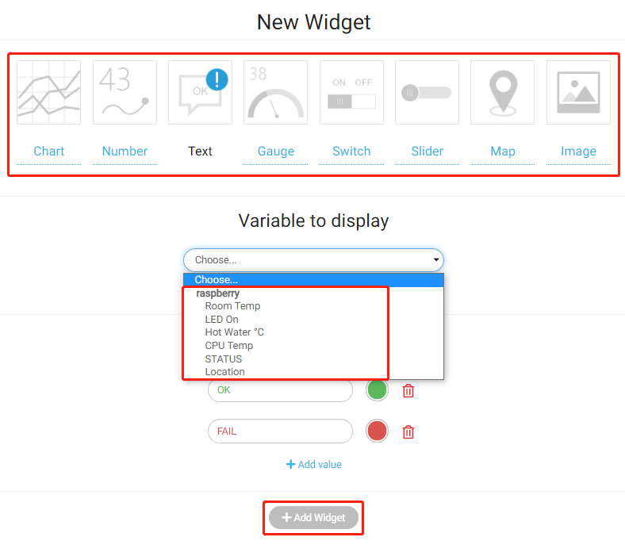
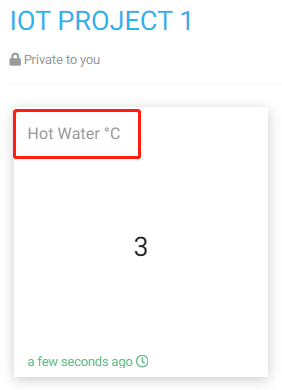

.. note::

    Bonjour, bienvenue dans la communauté des passionnés de SunFounder Raspberry Pi & Arduino & ESP32 sur Facebook ! Plongez au cœur de l'univers du Raspberry Pi, Arduino et ESP32 avec d'autres amateurs.

    **Pourquoi nous rejoindre ?**

    - **Support d'experts** : Résolvez les problèmes après-vente et les défis techniques grâce à l'aide de notre communauté et de notre équipe.
    - **Apprendre et Partager** : Échangez des conseils et des tutoriels pour améliorer vos compétences.
    - **Aperçus exclusifs** : Accédez en avant-première aux annonces de nouveaux produits.
    - **Réductions spéciales** : Bénéficiez de réductions exclusives sur nos derniers produits.
    - **Promotions et cadeaux festifs** : Participez à des concours et des promotions lors des fêtes.

    👉 Prêt à explorer et créer avec nous ? Cliquez sur [|link_sf_facebook|] et rejoignez-nous dès aujourd'hui !

Quick Guide on Cloud4RPi
============================

Installer Cloud4RPi sur votre Raspberry Pi 
---------------------------------------------

Il est conseillé de mettre à jour votre système avant l'installation.

.. raw:: html

   <run></run>

.. code-block:: 

    sudo apt update && sudo apt upgrade -y

Installez/mettre à jour les paquets requis.

.. raw:: html

   <run></run>

.. code-block:: 

    sudo apt install git python3 python3-pip -y

Installez Cloud4RPi avec la commande suivante :

.. raw:: html

   <run></run>

.. code-block:: 

    sudo pip3 install cloud4rpi

.. note::

  Ce tutoriel propose la méthode d'installation pour Python 3.0 et versions ultérieures. Pour les versions inférieures de Python, les commandes pourraient devoir être modifiées.

Se connecter à Cloud4RPi depuis votre ordinateur
----------------------------------------------------

Ouvrez le navigateur Chromium et saisissez ce lien : https://cloud4rpi.io.

Avant de l'utiliser, vous devez vous enregistrer et vous connecter à votre compte Cloud4RPi.

Une fois connecté, vous verrez deux boutons en haut de Cloud4RPi : **Devices** pour afficher les connexions de périphériques et **Control Panels** pour afficher les informations envoyées ou reçues depuis le Raspberry Pi.

Connecter votre Raspberry Pi à Cloud4RPi
--------------------------------------------

Après vous être connecté, cliquez sur l'option **Devices**, puis sur **New Device**.

Donnez un nom à votre nouveau périphérique et copiez le **Device Token** actuel dans le presse-papier.

Ouvrez le terminal de votre Raspberry Pi et téléchargez les exemples de test fournis par Cloud4RPi.

.. raw:: html

   <run></run>

.. code-block:: 

  cd /home/pi
  git clone https://github.com/cloud4rpi/cloud4rpi-raspberrypi-python.git

Utilisez un éditeur de texte comme Nano pour modifier le contenu du fichier ``control.py``.

.. raw:: html

   <run></run>

.. code-block:: 

  cd cloud4rpi-raspberrypi-python
  sudo nano control.py

Trouvez la ligne de code suivante.

.. code-block:: python

  DEVICE_TOKEN = '__YOUR_DEVICE_TOKEN__'

Remplacez ``__YOUR_DEVICE_TOKEN__`` par le **Device Token** que vous avez copié depuis Cloud4RPi. Appuyez sur ``Ctrl + X`` pour enregistrer la modification.

.. code-block:: python

  DEVICE_TOKEN = '556UfPaRw6r6rDKYfzx5Nd1jd'

Exécutez le fichier d'exemple ``control.py``.

.. raw:: html

   <run></run>

.. code-block:: 

  sudo python3 control.py

Retournez sur la page du serveur Cloud4RPi. Si votre Raspberry Pi est connecté à Cloud4RPi, les informations de périphérique s'afficheront en vert.

Utilisation des tableaux de bord Cloud4RPi
----------------------------------------------

Le tableau de bord sur le serveur Cloud4RPi propose de nombreux widgets utiles pour les applications IoT. Ces widgets peuvent être utilisés pour contrôler les composants ou afficher les données des capteurs.

Après être entré dans **Control Panels**, cliquez sur le bouton **New Control Panel**.

.. note::

  Veillez toujours à exécuter le fichier ``control.py`` avant d'utiliser le panneau de contrôle.

.. image:: img/cloud7.png
  :align: center

Entrez un nom pour le panneau de contrôle, puis cliquez sur le bouton **Add Widget**.

Avant de cliquer à nouveau sur le bouton **Add Widget**, sélectionnez le widget approprié et la variable à afficher.

Par exemple, nous sélectionnons le widget **Text** puis choisissons **Hot Water °C**, afin de pouvoir l'afficher sur le panneau de contrôle récemment créé.

.. note::

  Nous introduirons ces données affichées plus en détail dans le chapitre :ref:`Learn More about control.py.
