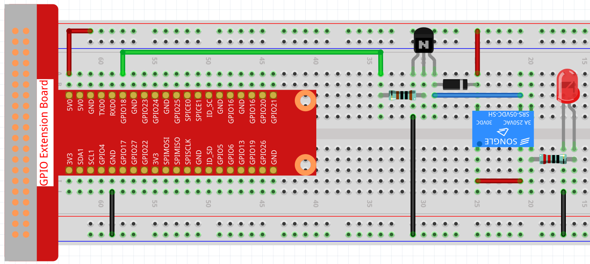
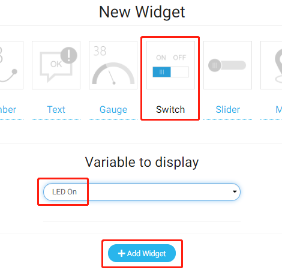
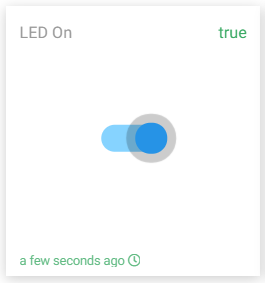

.. note::

    Hello, welcome to the SunFounder Raspberry Pi & Arduino & ESP32 Enthusiasts Community on Facebook! Dive deeper into Raspberry Pi, Arduino, and ESP32 with fellow enthusiasts.

    **Why Join?**

    - **Expert Support**: Solve post-sale issues and technical challenges with help from our community and team.
    - **Learn & Share**: Exchange tips and tutorials to enhance your skills.
    - **Exclusive Previews**: Get early access to new product announcements and sneak peeks.
    - **Special Discounts**: Enjoy exclusive discounts on our newest products.
    - **Festive Promotions and Giveaways**: Take part in giveaways and holiday promotions.

    👉 Ready to explore and create with us? Click [|link_sf_facebook|] and join today!

Remote Switch
=================

In this project, we will learn to use Cloud4RPi's Switch to control the relay, thereby controlling the relay's load-LED. You can also change the load of the relay to household appliances, but with safety in mind.

Experimental Procedures
-------------------------

Build the circuit.

Open the code.

.. raw:: html

   <run></run>

.. code-block:: 

    cd ~/cloud4rpi-raspberrypi-python
    sudo nano remote_switch.py

Find the line below and fill in the correct device token.

.. code-block:: python

    DEVICE_TOKEN = '__YOUR_DEVICE_TOKEN__'

Run the code.

.. raw:: html

   <run></run>

.. code-block:: 

    sudo python3 remote_switch.py

Go to Cloud4RPi, add a new Control Panel named project2, and click **Add Widget** to add a **Switch** widget.

Once added, you can use the Switch widget to control the relay.

Code Explanation
----------------------

.. code-block:: python

    RELAY_PIN = 18

Relay connected to GPIO18 of the T-expansion board.

.. code-block:: python

    GPIO.setmode(GPIO.BCM)
    GPIO.setup(RELAY_PIN, GPIO.OUT)

Set to BCM nomenclature and set ``RELAY_PIN`` to output.

.. code-block:: python

    def relay_control(value=None):
        GPIO.output(RELAY_PIN, value)
        return GPIO.input(RELAY_PIN)

This function controls the relay according to the ``value`` and returns the current level of the relay.

.. note::

    Since the relay works at high level, the relay closes when the switch state is True and opens when the switch state is False.

.. code-block:: python

    variables = {
        'LED On': {
            'type': 'bool',
            'value': False,
            'bind': relay_control
        },
    }

By setting the value of the ``'value'`` key, we can set the initial value of the Switch widget, then always read the value of the ``'value'`` key and send the current level of ``RELAY_PIN`` (the value returned by the function ``relay_control()``) to Cloud4RPi.

