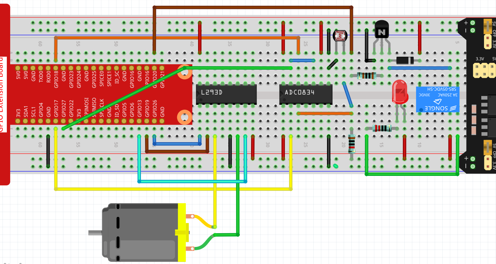

.. note::

    Ciao, benvenuto nella SunFounder Raspberry Pi & Arduino & ESP32 Enthusiasts Community su Facebook! Approfondisci le tue conoscenze su Raspberry Pi, Arduino ed ESP32 insieme ad altri appassionati.

    **Perché Unirsi?**

    - **Supporto Esperto**: Risolvi problemi post-vendita e sfide tecniche con l'aiuto della nostra community e del nostro team.
    - **Impara e Condividi**: Scambia suggerimenti e tutorial per migliorare le tue competenze.
    - **Anteprime Esclusive**: Accedi in anteprima agli annunci dei nuovi prodotti.
    - **Sconti Speciali**: Approfitta di sconti esclusivi sui nostri nuovi prodotti.
    - **Promozioni Festive e Omaggi**: Partecipa a omaggi e promozioni speciali per le festività.

    👉 Pronto a esplorare e creare con noi? Clicca su [|link_sf_facebook|] e unisciti subito!

Tende Intelligenti
=====================

In questo progetto, simuleremo uno scenario in cui le tende si aprono o chiudono automaticamente in base alla luminosità della stanza.
Quando il fotoresistore rileva che la luminosità della stanza è troppo elevata, il Raspberry Pi azionerà il motore per chiudere le tende; se invece la luminosità è troppo bassa, le tende verranno aperte.

È inoltre possibile visualizzare il cambiamento della luminosità interna tramite un widget di testo su Cloud4RPi, o controllare la lampada con un widget interruttore (per motivi di sicurezza elettrica, in questo esperimento si usa un LED al posto di una lampada).

Procedura Sperimentale
-------------------------

Costruisci il circuito.

Apri il codice.

.. raw:: html

   <run></run>

.. code-block:: 

    cd ~/cloud4rpi-raspberrypi-python
    sudo nano smart_curtain.py

Trova la riga sottostante e inserisci il corretto dispositivo token.

.. code-block:: python

    DEVICE_TOKEN = '__YOUR_DEVICE_TOKEN__'

Esegui il codice.

.. raw:: html

   <run></run>

.. code-block:: 

    sudo python3 smart_curtain.py

Vai su Cloud4RPi, aggiungi un nuovo pannello di controllo chiamato **project4** e aggiungi 3 widget (Switch, Text e Chart) tramite il pulsante **Add Widget**.

.. image:: img/window2.png
    :align: center

Una volta aggiunti, puoi utilizzare il widget Switch per controllare il LED; il valore del fotoresistore nel widget di testo verrà aggiornato ogni minuto. Quando il valore è >100, il motore ruota in senso orario per 5 secondi; se il valore è inferiore a 20, il motore ruota in senso antiorario per 5 secondi.
Puoi osservare i cambiamenti nel tempo attraverso il widget Chart.

Spiegazione del Codice
--------------------------

.. code-block:: python

    def getValue():
        analogVal = ADC0834.getResult()
        if analogVal > 100:
            move.clockwise()
            sleep(5)
            move.stop()
        elif analogVal < 20:
            move.contrarotate()
            sleep(5)
            move.stop()
        return analogVal

Legge il valore del canale CH0 (collegato al fotoresistore) dell'ADC0834. Se il valore è >100, il motore ruota in senso orario per 5 secondi. Se il valore è inferiore a 20, il motore ruota in senso antiorario per 5 secondi.

.. code-block:: python

    'CPU Temp': {
        'type': 'numeric',
        'bind': getValue
    },

Passa ``getValue()`` come funzione di callback alla chiave ``'bind'``, in modo che il valore della luminosità (il valore di ritorno della funzione ``getValue()``) possa essere inviato al widget di testo.

