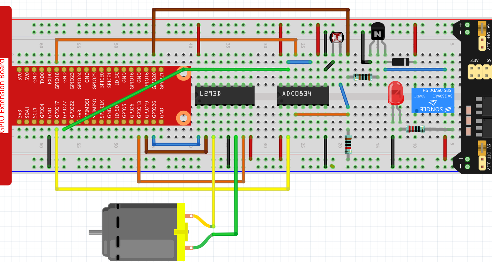

.. note::

    ¡Hola! Bienvenido a la Comunidad de Entusiastas de SunFounder para Raspberry Pi, Arduino y ESP32 en Facebook. Sumérgete en el apasionante mundo de Raspberry Pi, Arduino y ESP32 junto a otros entusiastas.

    **¿Por qué unirte?**

    - **Soporte Experto**: Resuelve problemas postventa y desafíos técnicos con la ayuda de nuestra comunidad y equipo.
    - **Aprende y Comparte**: Intercambia consejos y tutoriales para mejorar tus habilidades.
    - **Avances Exclusivos**: Obtén acceso anticipado a nuevos anuncios de productos y adelantos exclusivos.
    - **Descuentos Especiales**: Disfruta de descuentos exclusivos en nuestros productos más recientes.
    - **Promociones Festivas y Sorteos**: Participa en sorteos y promociones especiales de temporada.

    👉 ¿Listo para explorar y crear con nosotros? Haz clic en [|link_sf_facebook|] y únete hoy mismo.

Cortina Inteligente
======================

En este proyecto, simularemos un escenario donde las cortinas se abren o cierran automáticamente según la luminosidad de la habitación. 

Cuando el fotorresistor detecta que la luminosidad es muy alta, el Raspberry Pi activará el motor para cerrar las cortinas; cuando detecta que la habitación está demasiado oscura, las cortinas se abrirán.

También puedes ver el cambio de luminosidad de la habitación a través del widget de texto en Cloud4RPi o controlar la lámpara con el widget de Interruptor (por seguridad, este experimento usa un LED en lugar de una lámpara).

Procedimiento Experimental
-----------------------------

Construye el circuito.

Abre el código.

.. raw:: html

   <run></run>

.. code-block:: 

    cd ~/cloud4rpi-raspberrypi-python
    sudo nano smart_curtain.py

Encuentra la línea a continuación y completa con el token del dispositivo correcto.

.. code-block:: python

    DEVICE_TOKEN = '__YOUR_DEVICE_TOKEN__'

Ejecuta el código.

.. raw:: html

   <run></run>
 
.. code-block:: 

    sudo python3 smart_curtain.py

Accede a Cloud4RPi, agrega un nuevo panel de control llamado **project4** y añade 3 widgets (Interruptor, Texto y Gráfica) mediante el botón **Add Widget**.

.. image:: img/window2.png
    :align: center

Una vez añadidos, puedes usar el widget Interruptor para controlar el LED; 
el valor del fotorresistor en el widget de Texto se actualizará cada minuto. 
Cuando el valor es >100, el motor rota en sentido horario por 5 segundos; 
si el valor es <20, el motor rota en sentido antihorario por 5 segundos. 
Puedes ver los cambios en el tiempo en el widget de Gráfica.

Explicación del Código
-------------------------

.. code-block:: python

    def getValue():
        analogVal = ADC0834.getResult()
        if analogVal > 100:
            move.clockwise()
            sleep(5)
            move.stop()
        elif analogVal < 20:
            move.contrarotate()
            sleep(5)
            move.stop()
        return analogVal

Lee el valor del canal CH0 (conectado al fotorresistor) del ADC0834. Si el valor es >100, el motor rota en sentido horario durante 5 segundos. Si el valor es <20, el motor rota en sentido antihorario durante 5 segundos.

.. code-block:: python

    'CPU Temp': {
        'type': 'numeric',
        'bind': getValue
    },

Pasa ``getValue()`` a la clave ``'bind'`` como una función de devolución para que el valor de luminosidad (el valor devuelto por la función ``getValue()``) se envíe al widget de Texto.

