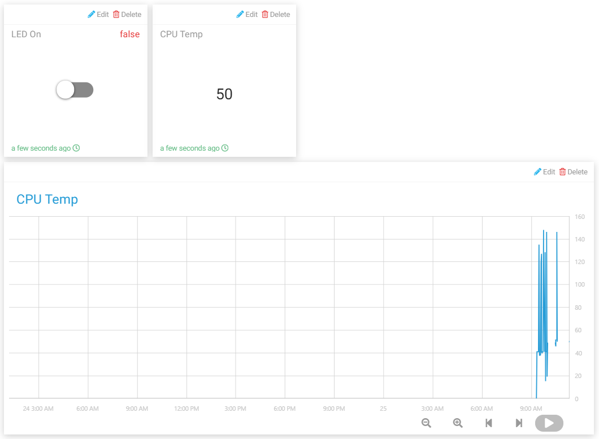

Smart Curtain
=================

In this project, we will simulate a scenario where the curtains are automatically opened or closed according to the brightness of the room.
When the photoresistor detects that the room brightness is too bright, Raspberry Pi will drive the motor to close the curtain; when the room brightness is too dark, the curtain will be opened.

Also you can view the indoor brightness change through text widget on Cloud4RPi, or control the lamp with Switch widget (for electricity safety, this experiment uses LED instead).

Experimental Procedures
-------------------------

Build the circuit.

.. image:: img/window1.png
    :align: center

Open the code.

.. code-block:: shell

    cd /home/pi/cloud4rpi-raspberrypi-python
    sudo nano smart_curtain.py

Find the line below and fill in the correct device token.

.. code-block:: python

    DEVICE_TOKEN = '__YOUR_DEVICE_TOKEN__'

Run the code.

.. code-block:: shell

    sudo python3 smart_curtain.py

Go to Cloud4RPi, add a new control panel named **project4** and add 3 widgets (Switch, Text and Chart widgets) via the **Add Widget** button.

Once added, you can use the Switch widget to control the LED. The brightness value detected by the photoresistor will be displayed on the Text widget and the Chart widget will show the change over time.

Code Explanation
----------------------

.. code-block:: python

    def getValue():
        analogVal = ADC0834.getResult()
        if analogVal > 100:
            move.clockwise()
            sleep(5)
            move.stop()
        elif analogVal < 20:
            move.contrarotate()
            sleep(5)
            move.stop()
        return analogVal

Read the value of channel CH0 (with photoresistor connected) of the ADC0834. If the value is >100, the motor rotates clockwise for 5 seconds. If the value is less than 20, the motor rotates counterclockwise for 5 seconds.

.. code-block:: python

    'CPU Temp': {
            'type': 'numeric',
            'bind': getValue
        },

Pass ``getValue()`` into the \'bind\' key as a callback function, so that the brightness value (the return value of the ``getValue()`` function) can be sent to the Text widget.
