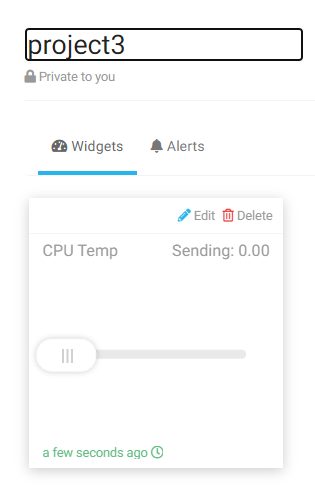

.. note::

    Bonjour, bienvenue dans la communauté SunFounder Raspberry Pi & Arduino & ESP32 sur Facebook ! Plongez dans l’univers du Raspberry Pi, Arduino et ESP32 avec d’autres passionnés.

    **Pourquoi nous rejoindre ?**

    - **Support d'experts** : Résolvez vos problèmes après-vente et surmontez vos défis techniques avec l’aide de notre communauté et de notre équipe.
    - **Apprendre & Partager** : Échangez des conseils et des tutoriels pour perfectionner vos compétences.
    - **Aperçus exclusifs** : Accédez en avant-première aux annonces de nouveaux produits et à des démonstrations exclusives.
    - **Réductions spéciales** : Profitez de remises exclusives sur nos derniers produits.
    - **Promotions et cadeaux festifs** : Participez à des concours et des promotions durant les périodes festives.

    👉 Prêt à explorer et créer avec nous ? Cliquez sur [|link_sf_facebook|] et rejoignez-nous dès aujourd'hui !

Lumière Intelligente
=======================

Dans ce projet, nous allons apprendre à contrôler la luminosité d'une LED en utilisant le widget curseur de Cloud4RPi.

Procédures expérimentales
----------------------------

Construisez le circuit.

.. image:: img/led1.png
  :align: center

Ouvrez le fichier de code.

.. raw:: html

   <run></run>

.. code-block:: 

    cd ~/cloud4rpi-raspberrypi-python
    sudo nano smart_light.py

Trouvez la ligne ci-dessous et complétez-la avec le bon token de l'appareil.

.. code-block:: python

    DEVICE_TOKEN = '__YOUR_DEVICE_TOKEN__'

Exécutez le code.

.. raw:: html

   <run></run>

.. code-block:: 

    sudo python3 smart_light.py

Accédez à Cloud4RPi, ajoutez un nouveau panneau de contrôle nommé **project3**, et cliquez sur **Add Widget** pour ajouter un widget de type **Slider**.

Une fois ajouté, vous pouvez utiliser le widget curseur pour contrôler la luminosité de la LED.

.. image:: img/led3.png
    :align: center

Explication du code
-----------------------

.. code-block:: python

    led_val = GPIO.PWM(LED_PIN, 2000)
    led_val.start(0)

Appelez la fonction ``GPIO.PWM()`` pour définir ``LED_PIN`` comme une broche PWM et définissez la fréquence de la broche PWM à 2000Hz. Ensuite, utilisez la fonction ``start()`` pour définir le cycle de travail initial à 0.

.. code-block:: python

    led_val.ChangeDutyCycle(value)

La valeur envoyée par le widget curseur au Raspberry Pi est utilisée comme cycle de travail PWM pour ajuster la luminosité de la LED.

.. code-block:: python

    variables = {
        'CPU Temp': {
            'type': 'numeric',
            'value': 0,
            'bind': led_control
        },
    }

En définissant la valeur de la clé ``'value'``, nous pouvons définir la valeur initiale du widget curseur, puis lire en continu la valeur de la clé ``'value'`` et envoyer le niveau actuel de ``LED_PIN`` (la valeur retournée par la fonction ``led_control``) à Cloud4RPi.

