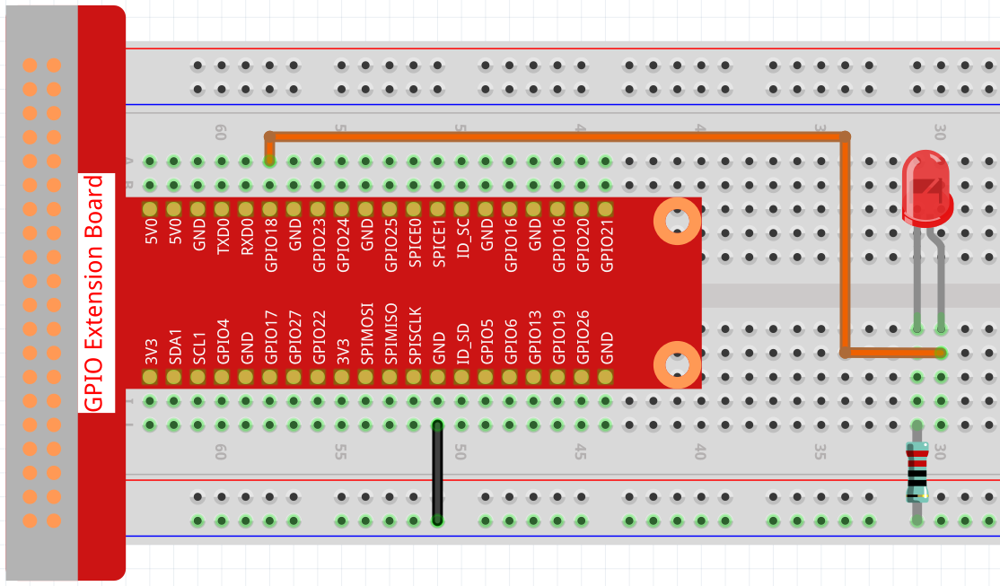
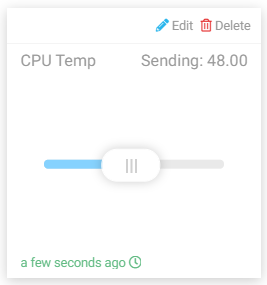

.. note::

    Ciao, benvenuto nella SunFounder Raspberry Pi & Arduino & ESP32 Enthusiasts Community su Facebook! Approfondisci le tue conoscenze su Raspberry Pi, Arduino ed ESP32 insieme ad altri appassionati.

    **Perché Unirsi?**

    - **Supporto Esperto**: Risolvi problemi post-vendita e sfide tecniche con l'aiuto della nostra community e del nostro team.
    - **Impara e Condividi**: Scambia suggerimenti e tutorial per migliorare le tue competenze.
    - **Anteprime Esclusive**: Accedi in anteprima agli annunci dei nuovi prodotti.
    - **Sconti Speciali**: Approfitta di sconti esclusivi sui nostri nuovi prodotti.
    - **Promozioni Festive e Omaggi**: Partecipa a omaggi e promozioni speciali per le festività.

    👉 Pronto a esplorare e creare con noi? Clicca su [|link_sf_facebook|] e unisciti subito!

Luce Intelligente
=================

In questo progetto, impareremo a controllare la luminosità di un LED con il widget Slider di Cloud4RPi.

Procedura Sperimentale
-------------------------

Costruisci il circuito.

Apri il codice.

.. raw:: html

   <run></run>

.. code-block:: 

    cd ~/cloud4rpi-raspberrypi-python
    sudo nano smart_light.py

Trova la riga sottostante e inserisci il corretto dispositivo token.

.. code-block:: python

    DEVICE_TOKEN = '__YOUR_DEVICE_TOKEN__'

Esegui il codice.

.. raw:: html

   <run></run>

.. code-block:: 

    sudo python3 smart_light.py

Vai su Cloud4RPi, aggiungi un nuovo pannello di controllo chiamato project3 e clicca su **Add Widget** per aggiungere un widget **Slider**.

.. image:: img/led2.png
    :align: center

Una volta aggiunto, puoi usare il widget Slider per controllare la luminosità del LED.

Spiegazione del Codice
--------------------------

.. code-block:: python

    led_val = GPIO.PWM(LED_PIN, 2000)
    led_val.start(0)

Richiama la funzione ``GPIO.PWM()`` per definire ``LED_PIN`` come pin PWM e imposta la frequenza del pin PWM a 2000Hz, poi usa la funzione ``start()`` per impostare il ciclo di lavoro iniziale a 0.

.. code-block:: python

    led_val.ChangeDutyCycle(value)

Il valore inviato dal widget Slider al Raspberry Pi viene utilizzato come ciclo di lavoro PWM per modificare la luminosità del LED.

.. code-block:: python

    variables = {
        'CPU Temp': {
            'type': 'numeric',
            'value': 0,
            'bind': led_control
        },
    }

Impostando il valore della chiave ``'value'``, possiamo definire il valore iniziale del widget Slider, quindi leggere costantemente il valore della chiave ``'value'`` e inviare il livello corrente di ``LED_PIN`` (il valore restituito dalla funzione ``led_control``) a Cloud4RPi.
