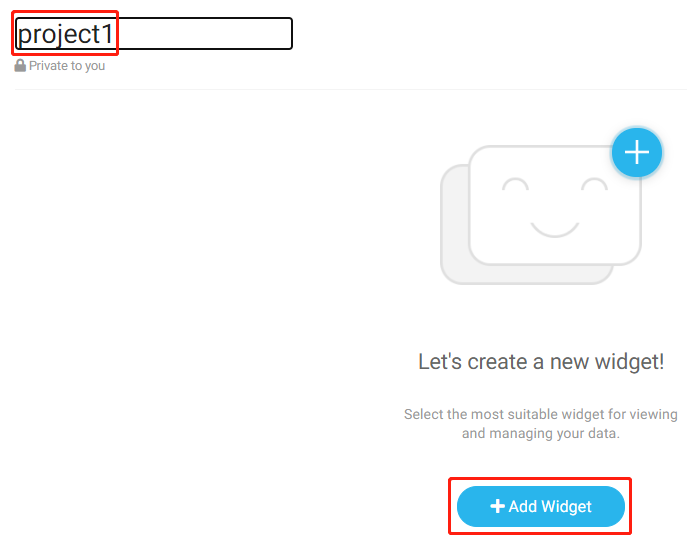
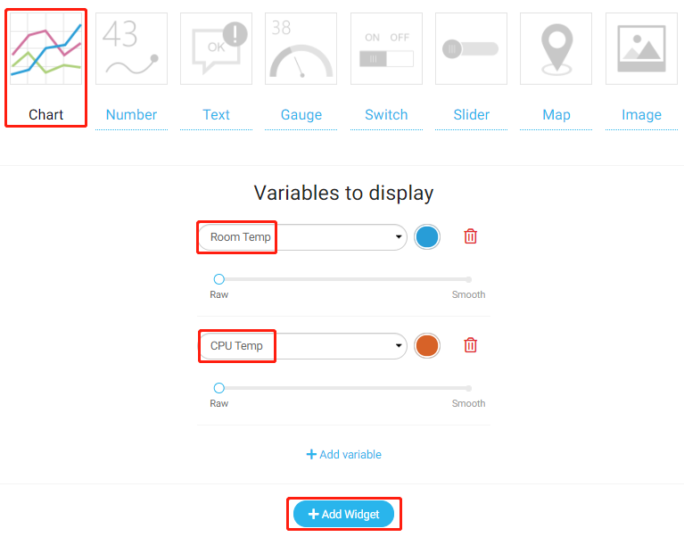
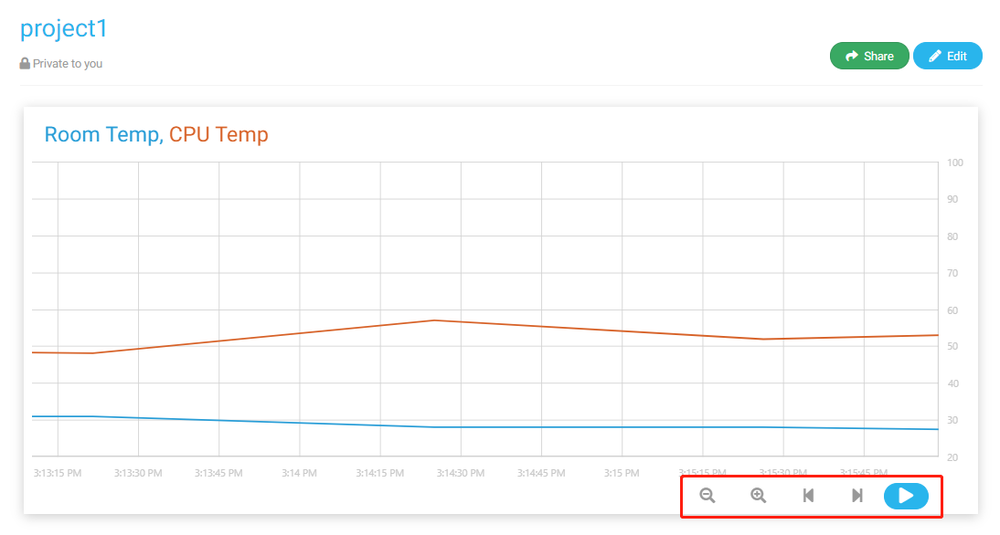

.. note::

    ¡Hola! Bienvenido a la Comunidad de Entusiastas de SunFounder para Raspberry Pi, Arduino y ESP32 en Facebook. Sumérgete en el apasionante mundo de Raspberry Pi, Arduino y ESP32 junto a otros entusiastas.

    **¿Por qué unirte?**

    - **Soporte Experto**: Resuelve problemas postventa y desafíos técnicos con la ayuda de nuestra comunidad y equipo.
    - **Aprende y Comparte**: Intercambia consejos y tutoriales para mejorar tus habilidades.
    - **Avances Exclusivos**: Obtén acceso anticipado a nuevos anuncios de productos y adelantos exclusivos.
    - **Descuentos Especiales**: Disfruta de descuentos exclusivos en nuestros productos más recientes.
    - **Promociones Festivas y Sorteos**: Participa en sorteos y promociones especiales de temporada.

    👉 ¿Listo para explorar y crear con nosotros? Haz clic en [|link_sf_facebook|] y únete hoy mismo.

Adquisición de Temperatura y Humedad
=========================================

En este proyecto, utilizaremos el DHT11 para leer la temperatura y la humedad del entorno, y luego las mostraremos en Cloud4RPi.

Procedimiento Experimental
-----------------------------

Construye el circuito.

.. image:: img/tem4.png
  :align: center

Abre el código.

.. raw:: html

   <run></run>

.. code-block:: 

    cd ~/cloud4rpi-raspberrypi-python
    sudo nano temperature_and_humidity_acquisition.py

Encuentra la línea a continuación y completa con el token del dispositivo correcto.

.. code-block:: python

    DEVICE_TOKEN = '__YOUR_DEVICE_TOKEN__'

Ejecuta el código.

.. raw:: html

   <run></run>

.. code-block:: 

    sudo python3 temperature_and_humidity_acquisition.py

Accede a Cloud4RPi, agrega un nuevo panel de control llamado project1, y haz clic en **Add Widget**.

Selecciona un widget **Chart** con ambas variables **Room Temp** y **CPU Temp** para mostrar.

Una vez añadido, podrás ver las curvas de temperatura (Room Temp) y humedad (CPU Temp) a lo largo del tiempo, y puedes ajustar la ventana de visualización haciendo clic en las opciones en la parte inferior derecha.

Explicación del Código
------------------------

.. code-block:: python

    dht11 = DHT11.DHT11(17)

Instancia un objeto dht11.

.. code-block:: python

    def getTem():
        result = dht11.get_result()
        while True:
            if result:
                break
            else:
                result = dht11.get_result()
        return result[1]

La temperatura (``result[1]``) se obtiene con esta función, la cual no se interrumpe hasta que la lectura sea exitosa.

.. code-block:: python

    def getHum():
    result = dht11.get_result()
    while True:
        if result:
            break
        else:
            result = dht11.get_result()
    return result[0]

La humedad (``result[0]``) se obtiene con esta función, y la función no se interrumpe hasta que la lectura sea exitosa.

.. code-block:: python

    variables = {
        'Room Temp': {
            'type': 'numeric',
            'bind': getTem
        },
        'CPU Temp': {
            'type': 'numeric',
            'bind': getHum
        },
    }

La temperatura se almacena en el ``'bind'`` de la clave ``'Room Temp'``, y la humedad en el ``'bind'`` de la clave ``'CPU Temp'``. Cuando Cloud4RPi recibe el diccionario ``variables``, lo convierte en un objeto JavaScript reconocible en la página web.

