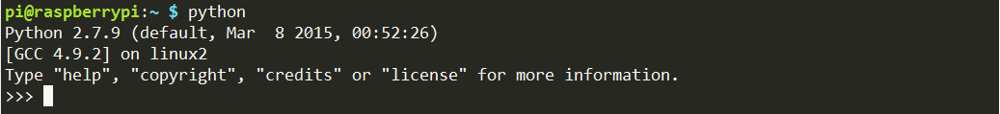

.. note::

    ¡Hola! Bienvenido a la comunidad de entusiastas de SunFounder para Raspberry Pi, Arduino y ESP32 en Facebook. Únete a otros apasionados y profundiza en el mundo de Raspberry Pi, Arduino y ESP32.

    **¿Por qué unirte?**

    - **Soporte Experto**: Resuelve problemas posventa y supera desafíos técnicos con el apoyo de nuestra comunidad y equipo.
    - **Aprende y Comparte**: Intercambia consejos y tutoriales para mejorar tus habilidades.
    - **Acceso Exclusivo**: Obtén acceso anticipado a anuncios de nuevos productos y adelantos especiales.
    - **Descuentos Especiales**: Disfruta de descuentos exclusivos en nuestros productos más recientes.
    - **Promociones Festivas y Sorteos**: Participa en sorteos y promociones durante las festividades.

    👉 ¿Listo para explorar y crear con nosotros? Haz clic en [|link_sf_facebook|] y únete hoy.

Bibliotecas
==============

En la programación con Raspberry Pi se utilizan dos bibliotecas importantes: 
wiringPi y RPi.GPIO. El sistema operativo Raspberry Pi OS las instala por 
defecto, por lo que puedes utilizarlas directamente.

RPi.GPIO
-------------

Si eres usuario de Python, puedes programar los GPIO usando la API 
proporcionada por RPi.GPIO.

RPi.GPIO es un módulo para controlar los canales GPIO de Raspberry Pi. 
Este paquete proporciona una clase para gestionar los GPIO en una Raspberry Pi. 
Para ejemplos y documentación, visita: http://sourceforge.net/p/raspberry-gpio-python/wiki/Home/.

Para verificar si RPi.GPIO está instalado, ingresa el siguiente comando en Python:

.. raw:: html

    <run></run>

.. code-block:: 

    python

En la consola de Python, escribe "import RPi.GPIO". Si no aparece ningún error, 
significa que RPi.GPIO está instalado correctamente.

.. raw:: html

    <run></run>

.. code-block::

    import RPi.GPIO

.. image:: img/image28.png

Para salir de la consola de Python, escribe:

.. raw:: html

    <run></run>

.. code-block:: 

    exit()

.. image:: img/image29.png

.. _install_wiringpi:

Instalar y Verificar wiringPi
-------------------------------------

``wiringPi`` es una biblioteca de GPIO en lenguaje C diseñada para la 
Raspberry Pi, que cumple con la licencia GUN Lv3. Las funciones de wiringPi 
son similares a las del sistema wiring de Arduino, lo cual facilita su uso a 
los usuarios familiarizados con Arduino.

``wiringPi`` incluye numerosos comandos de GPIO que te permiten controlar todo 
tipo de interfaces en Raspberry Pi.

Ejecuta el siguiente comando para instalar la biblioteca ``wiringPi``:

.. raw:: html

   <run></run>

.. code-block::

    sudo apt-get update
    git clone https://github.com/WiringPi/WiringPi
    cd WiringPi 
    ./build

Puedes verificar si la biblioteca wiringPi se instaló correctamente con el 
siguiente comando:

.. raw:: html

    <run></run>

.. code-block::

    gpio -v

.. image:: img/image30.png

Para revisar el estado de los GPIO, utiliza el siguiente comando:

.. raw:: html

    <run></run>

.. code-block:: 

    gpio readall

.. image:: img/image31.png

Para más detalles sobre wiringPi, puedes consultar `WiringPi <https://github.com/WiringPi/WiringPi>`_.
