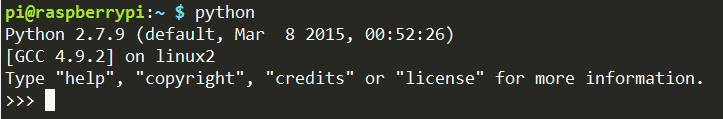
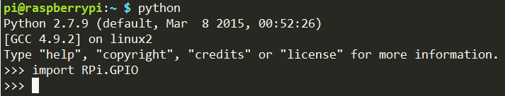
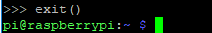
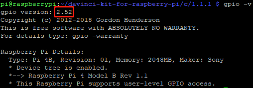

Bibliotheken
==============

Bei der Programmierung mit Raspberry Pi werden zwei wichtige Bibliotheken verwendet: 
WiringPi und RPi.GPIO. Das Raspberry Pi OS installiert sie standardmäßig, Sie können sie direkt verwenden.

RPi.GPIO
------------

Wenn Sie ein Python-Benutzer sind, können Sie GPIOs mit der von RPi.GPIO bereitgestellten API programmieren.

RPi.GPIO ist ein Modul zur Steuerung von Raspberry Pi GPIO-Kanälen. 
Dieses Paket enthält eine Klasse zur Steuerung des GPIO einer Raspberry Pi. 
Beispiele und Dokumente finden Sie unter http://sourceforge.net/p/raspberry-gpio-python/wiki/Home/

Beim Testen ob RPi.GPIO installiert ist oder nicht, geben Sie bitte Python ein:

.. raw:: html

    <run></run>

.. code-block:: 

    python

Geben Sie in Python CLI ``import RPi.GPIO`` ein. Wenn kein Fehler stellt, bedeutet, RPi.GPIO ist installiert.

.. raw:: html

    <run></run>

.. code-block::

    import RPi.GPIO

Wenn Sie die Python-CLI beenden möchten, geben Sie ein:

.. raw:: html

    <run></run>

.. code-block:: 

    exit()

.. _install_wiringpi:

Installieren und überprüfen Sie das WiringPi
-------------------------------------------------

``wiringPi`` ist eine GPIO-Bibliothek in C, die auf den Raspberry Pi angewendet wird. Es entspricht GUN Lv3. Die Funktionen in wiringPi ähneln denen im Verdrahtungssystem von Arduino. Sie ermöglichen den mit Arduino vertrauten Benutzern, wiringPi einfacher zu verwenden.

``wiringPi`` enthält viele GPIO-Befehle, mit denen Sie alle Arten von Schnittstellen auf dem Raspberry Pi steuern können.

Bitte führen Sie den folgenden Befehl aus, um die ``wiringPi``-Bibliothek zu installieren.

.. raw:: html

   <run></run>

.. code-block::

    sudo apt-get update
    git clone https://github.com/WiringPi/WiringPi
    cd WiringPi 
    ./build

Sie können anhand der folgenden Anleitung testen, ob die wiringPi-Bibliothek erfolgreich installiert wurde oder nicht.

.. raw:: html

    <run></run>

.. code-block::

    gpio -v

Überprüfen Sie den GPIO mit dem folgenden Befehl:

.. raw:: html

    <run></run>

.. code-block:: 

    gpio readall

.. image:: media/image31.png

Weitere Einzelheiten zu WiringPi finden Sie unter `WiringPi <https://github.com/WiringPi/WiringPi>`_.

