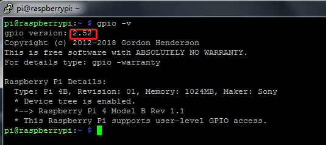

.. note:: 

    Ciao, benvenuto nella Community di appassionati di SunFounder Raspberry Pi & Arduino & ESP32 su Facebook! Approfondisci le tue conoscenze su Raspberry Pi, Arduino ed ESP32 insieme ad altri appassionati.

    **Perché unirsi a noi?**

    - **Supporto da esperti**: Risolvi problemi post-vendita e sfide tecniche con l'aiuto della nostra community e del nostro team.
    - **Impara e condividi**: Scambia consigli e tutorial per migliorare le tue competenze.
    - **Anteprime esclusive**: Ottieni un accesso anticipato agli annunci di nuovi prodotti e alle anteprime.
    - **Sconti speciali**: Approfitta di sconti esclusivi sui nostri prodotti più recenti.
    - **Promozioni e omaggi**: Partecipa a promozioni speciali e omaggi durante le festività.

    👉 Sei pronto a esplorare e creare con noi? Clicca su [|link_sf_facebook|] e unisciti oggi!

Librerie
============

Per programmare con il Raspberry Pi vengono utilizzate due importanti librerie: 
wiringPi e RPi.GPIO. Il sistema operativo Raspberry Pi OS le installa di default, 
quindi puoi usarle direttamente.

RPi.GPIO
------------

Se utilizzi Python, puoi programmare i GPIO con l'API fornita da RPi.GPIO.

RPi.GPIO è un modulo per controllare i canali GPIO del Raspberry Pi. Questo 
pacchetto offre una classe per controllare il GPIO su Raspberry Pi. Per esempi 
e documentazione, visita: http://sourceforge.net/p/raspberry-gpio-python/wiki/Home/.

Per verificare se RPi.GPIO è installato, inserisci il comando python:

.. raw:: html

    <run></run>

.. code-block:: 

    python

.. image:: img/image27.png

Nella CLI di Python, digita "import RPi.GPIO". Se non appare nessun errore, 
significa che RPi.GPIO è installato.

.. raw:: html

    <run></run>

.. code-block::

    import RPi.GPIO

.. image:: img/image28.png

Per uscire dalla CLI di Python, digita:

.. raw:: html

    <run></run>

.. code-block:: 

    exit()

.. image:: img/image29.png

.. _install_wiringpi:

Installazione e Verifica di WiringPi
---------------------------------------

``wiringPi`` è una libreria GPIO per il linguaggio C applicata al 
Raspberry Pi, conforme alla licenza GNU Lv3. Le funzioni in wiringPi 
sono simili a quelle del sistema di wiring di Arduino, facilitando 
l'uso della libreria agli utenti già esperti di Arduino.

``wiringPi`` include numerosi comandi GPIO che permettono di controllare 
tutti i tipi di interfacce del Raspberry Pi.

Esegui i seguenti comandi per installare la libreria ``wiringPi``.

.. raw:: html

   <run></run>

.. code-block::

    sudo apt-get update
    git clone https://github.com/WiringPi/WiringPi
    cd WiringPi 
    ./build

Puoi verificare se la libreria wiringPi è stata installata correttamente 
con il seguente comando:

.. raw:: html

    <run></run>

.. code-block::

    gpio -v

Controlla i GPIO con il comando seguente:

.. raw:: html

    <run></run>

.. code-block:: 

    gpio readall

.. image:: img/image31.png

Per maggiori dettagli su wiringPi, consulta `WiringPi <https://github.com/WiringPi/WiringPi>`_.
