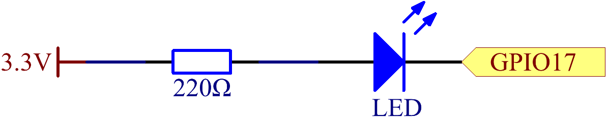

.. note::

    Hallo, willkommen in der SunFounder Raspberry Pi & Arduino & ESP32 Enthusiasten-Community auf Facebook! Tauchen Sie tiefer in Raspberry Pi, Arduino und ESP32 mit anderen Enthusiasten ein.

    **Warum beitreten?**

    - **Expertenunterstützung**: Lösen Sie nach dem Kauf auftretende Probleme und technische Herausforderungen mit Hilfe unserer Community und unseres Teams.
    - **Lernen & Teilen**: Tauschen Sie Tipps und Tutorials aus, um Ihre Fähigkeiten zu verbessern.
    - **Exklusive Vorschauen**: Erhalten Sie frühzeitigen Zugang zu neuen Produktankündigungen und Vorschauen.
    - **Spezielle Rabatte**: Genießen Sie exklusive Rabatte auf unsere neuesten Produkte.
    - **Festliche Aktionen und Gewinnspiele**: Nehmen Sie an Gewinnspielen und festlichen Aktionen teil.

    👉 Bereit, mit uns zu entdecken und zu kreieren? Klicken Sie auf [|link_sf_facebook|] und treten Sie noch heute bei!

1.1.1 Blinkende LED
=========================

Einführung
-----------------

In diesem Projekt lernen wir, wie man eine blinkende LED durch Programmierung herstellt.
Durch Ihre Einstellungen kann Ihre LED eine Reihe von interessanten
Phänomenen erzeugen. Also, los geht's.

Komponenten
------------------

.. image:: img/blinking_led_list.png
    :width: 800
    :align: center

Schaltplan
---------------------

In diesem Experiment verbinden Sie einen 220Ω Widerstand mit der Anode (dem langen Bein
der LED), dann den Widerstand mit 3,3 V und die Kathode (das
kurze Bein) der LED mit GPIO17 des Raspberry Pi. Um eine LED einzuschalten,
müssen wir GPIO17 auf niedriges (0V) Niveau setzen. Dies können wir
durch Programmierung erreichen.

Experimentelle Vorgehensweise
-----------------------------

**Schritt 1:** Bauen Sie die Schaltung auf.

.. image:: img/image49.png
    :width: 800
    :align: center

**Schritt 2:** Gehen Sie zum Ordner des Codes.

.. raw:: html

   <run></run>

.. code-block::

   cd ~/davinci-kit-for-raspberry-pi/nodejs/

.. note::
    Wechseln Sie mit ``cd`` in das Verzeichnis des Codes in diesem Experiment.

**Schritt 3:** Führen Sie den Code aus

.. raw:: html

   <run></run>

.. code-block::

   sudo node blink.js

.. note::
    Hier bedeutet sudo - superuser do, und python, dass die Datei mit Python ausgeführt wird.

Nach dem Ausführen des Codes sehen Sie, wie die LED blinkt.

**Schritt 4:** Wenn Sie die Datei blink.js bearbeiten möchten,
drücken Sie ``Ctrl + C`` um die Ausführung des Codes zu stoppen. Geben Sie dann den folgenden
Befehl ein, um blink.js zu öffnen:

.. raw:: html

   <run></run>

.. code-block::

   nano blink.js

.. note::
    nano ist ein Texteditor-Tool. Der Befehl wird verwendet, um die
    Code-Datei blink.js mit diesem Tool zu öffnen.

Drücken Sie ``Ctrl+X`` um den Editor zu verlassen. Wenn Sie den Code geändert haben, werden Sie
gefragt, ob die Änderungen gespeichert werden sollen oder nicht. Geben Sie ``Y`` (speichern)
oder ``N`` (nicht speichern) ein.

Drücken Sie dann ``Enter`` um den Editor zu verlassen. Geben Sie erneut nano blink.js ein, um
die Wirkung der Änderungen zu sehen.

**Code**

Der folgende Code zeigt das Programm:

.. code-block:: js

   const Gpio = require('pigpio').Gpio;
   const led = new Gpio(17,{mode: Gpio.OUTPUT});

   var led_state = 0;

   function blink_led(){
      led.digitalWrite(led_state);
      led_state = !led_state;
   }

   setInterval(blink_led,300);

Alternativ können Sie den Code als spezifischeres js-Pfeilfunktion schreiben:

.. code-block:: js

   const Gpio = require('pigpio').Gpio;
   const led = new Gpio(17,{mode: Gpio.OUTPUT});

   var led_state = 0;

   setInterval(() => {
      led.digitalWrite(led_state);
      led_state = !led_state;
   }, 300);

**Code Erklärung**

.. code-block:: js

   const Gpio = require('pigpio').Gpio;

Importieren Sie den Gpio-Konstruktor aus dem pigpio-Paket auf diese Weise,
und definieren Sie dann eine Konstante ``Gpio`` um diesen Konstruktor darzustellen.

Mit einer Vielzahl von Konstruktoren können wir elektronische Geräte mit js steuern.
``pigpio`` kann verwendet werden, um schnelles GPIO, PWM, Servosteuerung, Zustandsänderungsbenachrichtigung und Interrupt-Behandlung zu implementieren.

* `pigpio - github <https://github.com/fivdi/pigpio>`_

.. Eine Wrapper-Bibliothek für die pigpio C-Bibliothek, die schnelles GPIO, PWM, Servosteuerung, 
.. Zustandsänderungsbenachrichtigung und Interrupt-Behandlung mit JS auf dem Raspberry Pi Zero, 
.. 1, 2, 3 oder 4 ermöglicht.

.. code-block:: js

   const led = new Gpio(17,{mode: Gpio.OUTPUT});

Das ``new`` Schlüsselwort wird verwendet, um instanzierte Objekte der Klasse zu konstruieren.

Schließen Sie die LED an GPIO17 der T-förmigen Erweiterungskarte an,
setzen Sie den LedPin-Modus auf Ausgang und weisen Sie ihn der Konstanten ``led`` zu,
das heißt, ein GPIO17-Objekt ``led`` zu konstruieren, und dessen Modus ist der Ausgangsmodus.

Es gibt zwei Möglichkeiten, die IO-Pins auf dem Raspberry Pi zu nummerieren: 
BOARD-Nummer und BCM-Nummer. In unserem Projekt verwenden wir die BCM-Nummer. 
Sie müssen jeden verwendeten Kanal als Eingang oder Ausgang einstellen.

.. code-block:: js

   function blink_led(){
      led.digitalWrite(led_state);
      led_state = !led_state;
   }

   setInterval(blink_led,300);

Die ``setInterval()`` Methode kann Funktionen oder Ausdrücke mit einer angegebenen Periode (in Millisekunden) aufrufen.
Hier ändern wir den Betriebszustand der LED mit einer Periode von 300 ms.

*  `setInterval <https://developer.mozilla.org/en-US/docs/Web/API/setInterval>`_

Die Methode ``gpio.digitalWrite(level)`` setzt den GPIO-Pegel auf 1 oder 0.

.. code-block:: js

   var led_state = 0;

   setInterval(() => {
      led.digitalWrite(led_state);
      led_state = !led_state;
   }, 300);

Schreiben Sie den Code als Pfeilfunktion neu, um den Code kürzer zu machen.

* `Arrow Functions <https://developer.mozilla.org/en-US/docs/Web/JavaScript/Reference/Functions/Arrow_functions>`_

Phänomenbild
-------------------------

.. image:: img/image54.jpeg
    :width: 800
    :align: center
