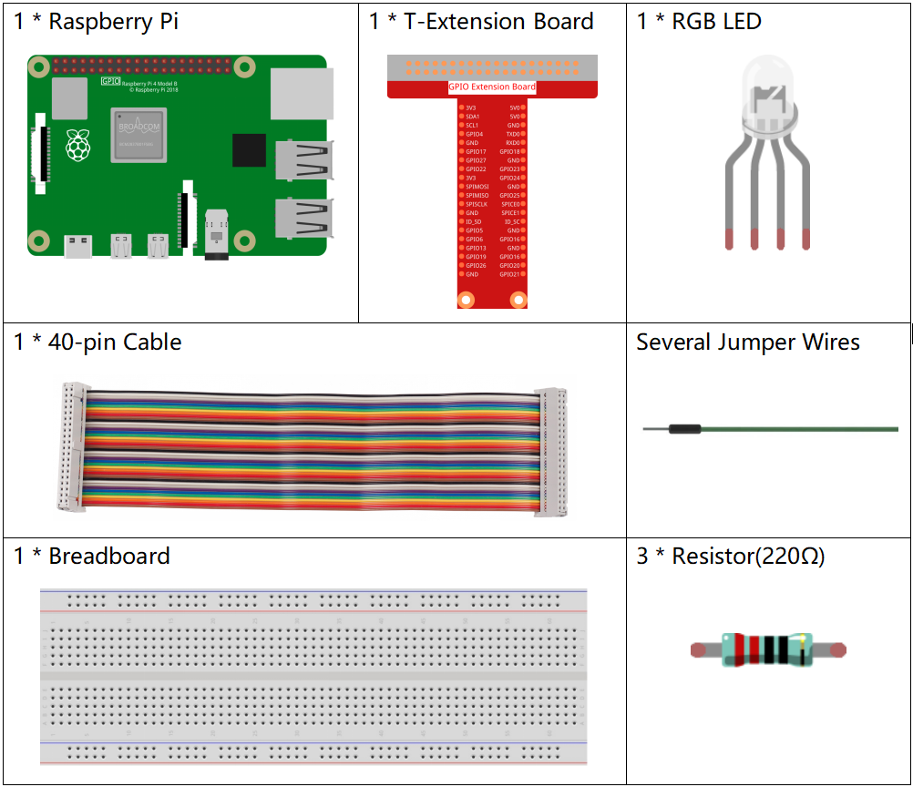

.. note::

    Ciao, benvenuto nella SunFounder Raspberry Pi & Arduino & ESP32 Enthusiasts Community su Facebook! Approfondisci le tue conoscenze su Raspberry Pi, Arduino ed ESP32 insieme ad altri appassionati.

    **Perché Unirsi?**

    - **Supporto Esperto**: Risolvi problemi post-vendita e sfide tecniche con l'aiuto della nostra community e del nostro team.
    - **Impara e Condividi**: Scambia suggerimenti e tutorial per migliorare le tue competenze.
    - **Anteprime Esclusive**: Accedi in anteprima agli annunci dei nuovi prodotti.
    - **Sconti Speciali**: Approfitta di sconti esclusivi sui nostri nuovi prodotti.
    - **Promozioni Festive e Omaggi**: Partecipa a omaggi e promozioni speciali per le festività.

    👉 Pronto a esplorare e creare con noi? Clicca su [|link_sf_facebook|] e unisciti subito!

1.1.2 LED RGB
================

Introduzione
--------------

In questo progetto, controlleremo un LED RGB per farlo lampeggiare in vari colori.

Componenti
--------------

Schema Elettrico
-----------------------

Dopo aver collegato i pin R, G e B a una resistenza limitatrice di corrente, 
connettili rispettivamente a GPIO17, GPIO18 e GPIO27. Il pin più lungo (GND) 
del LED si collega alla massa (GND) del Raspberry Pi. Quando ai tre pin vengono 
assegnati diversi valori PWM, il LED RGB mostrerà colori diversi.

.. image:: img/rgb_led_schematic.png

Procedura Sperimentale
----------------------------

**Passo 1:** Costruisci il circuito.

.. image:: img/image61.png
   :width: 6.59097in
   :height: 4.29722in

**Passo 2:** Vai alla cartella del codice.

.. raw:: html

    <run></run>

.. code-block::

    cd ~/davinci-kit-for-raspberry-pi/nodejs/

**Passo 3:** Esegui il codice.

.. raw:: html

    <run></run>

.. code-block::

    sudo node rgb_led.js

Dopo aver eseguito il codice, vedrai che l'RGB mostrerà colori come rosso, verde, blu, giallo, rosa e ciano.

**Codice**

.. code-block:: js

    const Gpio = require('pigpio').Gpio;
    const ledred = new Gpio(17, { mode: Gpio.OUTPUT });
    const ledgreen = new Gpio(18, { mode: Gpio.OUTPUT });
    const ledblue = new Gpio(27, { mode: Gpio.OUTPUT });

    function colorset(r, g, b) {
        ledred.pwmWrite(r);
        ledgreen.pwmWrite(g);
        ledblue.pwmWrite(b);
    }

    var color_index = -1;

    setInterval(() => {
    color_index += 1;
    switch (color_index) {
        case 0:
            colorset(0xff, 0x00, 0xFF);
            break;
        case 1:
            colorset(0x00, 0xff, 0x00);
            break;
        case 2:
            colorset(0x00, 0x00, 0xff);
            break;
        case 3:
            colorset(0xff, 0xff, 0x00);
            break;
        case 4:
            colorset(0xff, 0x00, 0xff);
            break;
        case 5:
            colorset(0xc0, 0xff, 0x3e);
            break;
        default:
            color_index=-1;
        }
    }, 500);  

**Spiegazione del Codice**

.. code-block:: js

    const ledred = new Gpio(17,{mode: Gpio.OUTPUT});
    const ledgreen = new Gpio(18,{mode: Gpio.OUTPUT});
    const ledblue = new Gpio(27,{mode: Gpio.OUTPUT});

Inizializza i pin 17, 18 e 27 in modalità output e assegnali rispettivamente alle costanti ``ledred``, ``ledgreen`` e ``ledblue``.

.. code-block:: js

    function colorset(r,g,b){
        ledred.pwmWrite(r);
        ledgreen.pwmWrite(g);
        ledblue.pwmWrite(b);
    }

Implementa una funzione ``colorset(r,g,b)``, utilizzata per scrivere i valori di impulso sui pin 17, 18, 27. La libreria Gpio incapsula la funzione ``pwmWrite()`` per scrivere sui pin il valore PWM, che varia da 0x00 a 0xff. Tramite la funzione ``colorset(r,g,b)`` è possibile scrivere i valori RGB sul LED RGB, in modo che mostri una varietà di colori.

.. note::
    Per domande su RGB, fai riferimento al sito web: https://www.rapidtables.com/web/color/RGB_Color.html

.. code-block:: js

    var color_index = -1;

    setInterval(() => {
    color_index += 1;
    switch (color_index) {
        case 0:
            colorset(0xff, 0x00, 0xFF);
            break;
        case 1:
            colorset(0x00, 0xff, 0x00);
            break;
        case 2:
            colorset(0x00, 0x00, 0xff);
            break;
        case 3:
            colorset(0xff, 0xff, 0x00);
            break;
        case 4:
            colorset(0xff, 0x00, 0xff);
            break;
        case 5:
            colorset(0xc0, 0xff, 0x3e);
            break;
        default:
            color_index=-1;
        }
    }, 500);  

Il LED RGB è controllato dalla funzione ``colorset()`` eseguita ogni 500 ms.
Qui è usato un costrutto switch case per selezionare il colore emesso dai LED RGB.
Poiché ``color_index`` cambia di uno a ogni ciclo, il colore di questo LED RGB cambierà in sequenza.

Immagine del Fenomeno
------------------------

.. image:: img/image62.jpeg
