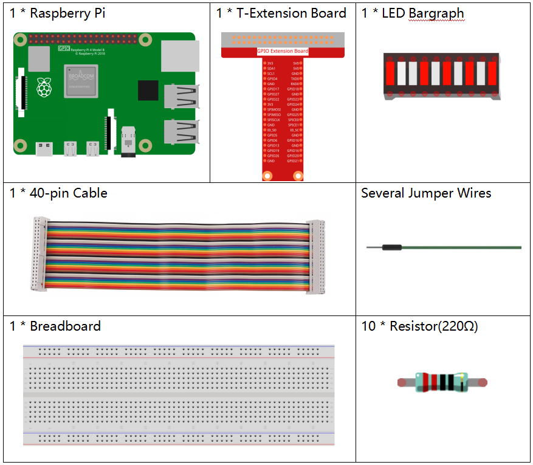
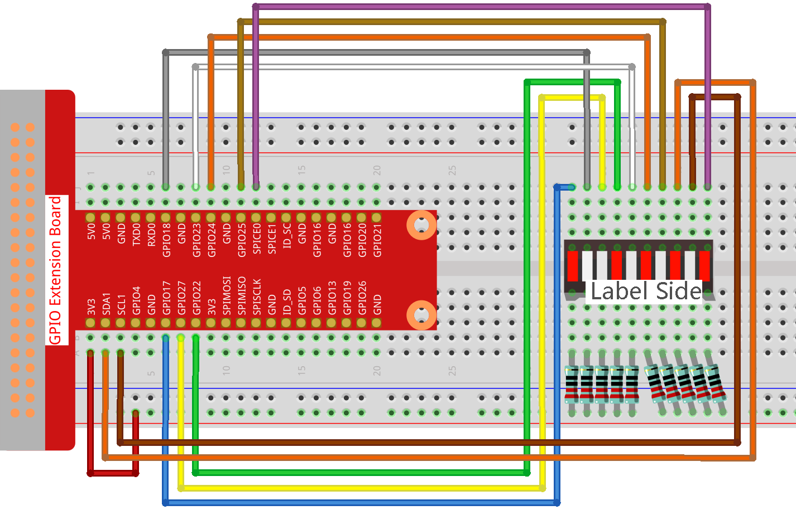

.. note::

    Hello, welcome to the SunFounder Raspberry Pi & Arduino & ESP32 Enthusiasts Community on Facebook! Dive deeper into Raspberry Pi, Arduino, and ESP32 with fellow enthusiasts.

    **Why Join?**

    - **Expert Support**: Solve post-sale issues and technical challenges with help from our community and team.
    - **Learn & Share**: Exchange tips and tutorials to enhance your skills.
    - **Exclusive Previews**: Get early access to new product announcements and sneak peeks.
    - **Special Discounts**: Enjoy exclusive discounts on our newest products.
    - **Festive Promotions and Giveaways**: Take part in giveaways and holiday promotions.

    👉 Ready to explore and create with us? Click [|link_sf_facebook|] and join today!

1.1.3 LED Bar Graph
======================

Introduction
-------------

In this project, we sequentially illuminate the lights on the LED Bar
Graph.

Components
----------------

Schematic Diagram
-------------------------

.. image:: img/schematic_led_bar.png

Experimental Procedures
------------------------------

**Step 1**: Build the circuit.

.. note::
    Pay attention to the direction when connecting. If you connect it backwards, it will not light up.

**Step 2**: Go to the folder of the code.

.. raw:: html

    <run></run>

.. code-block:: 

    cd ~/davinci-kit-for-raspberry-pi/nodejs/ 

**Step 3**: Compile the code.

.. raw:: html

    <run></run>

.. code-block:: 

    sudo node led_bar_graph.js

After the code runs, you will see the LEDs on the LED bar turn on and off regularly.

**Code**

.. code-block:: js

    const Gpio = require('pigpio').Gpio;

    var pins = [17, 18, 27, 22, 23, 24, 25, 2, 3, 8];
    var leds = [];
    for (let i = 0; i < pins.length; i++) {
        leds[i] = new Gpio(pins[i], { mode: Gpio.OUTPUT });
    }

    function oddLedBarGraph() {
        for (let i = 0; i < leds.length; i++) {
            if (i % 2 == 1) {
                leds[i].digitalWrite(1);
            } else {
                leds[i].digitalWrite(0);
            }
        }
    }

    function evenLedBarGraph() {
        for (let i = 0; i < leds.length; i++) {
            if (i % 2 == 0) {
                leds[i].digitalWrite(1);
            } else {
                leds[i].digitalWrite(0);
            }
        };
    }

    var odd_even = 0;

    setInterval(() => {
        odd_even = (odd_even + 1) % 2;
        if (odd_even == 1) {
            oddLedBarGraph();
        } else {
            evenLedBarGraph();
        }
    }, 500);
  

**Code Explanation**

.. code-block:: js

    var pins = [17,18,27,22,23,24,25,2,3,8];

Because the led bar graph will use multiple pins, we create a constant array ``pins`` to store them in batches.

.. code-block:: js

    var leds = [];
    for (let i = 0; i < pins.length; i++) {
        leds[i] = new Gpio(pins[i], { mode: Gpio.OUTPUT });
    }

Instantiate these pins as leds objects with a for loop.

.. code-block:: js

    function oddLedBarGraph() {
        for (let i = 0; i < leds.length; i++) {
            if (i % 2 == 1) {
                leds[i].digitalWrite(1);
            } else {
                leds[i].digitalWrite(0);
            }
        }
    }

Implement an ``oddLedBarGraph()`` function to make the LEDs on the 
odd digits of the LED bar graph light up.    

.. code-block:: js

    function evenLedBarGraph() {
        for (let i = 0; i < leds.length; i++) {
            if (i % 2 == 0) {
                leds[i].digitalWrite(1);
            } else {
                leds[i].digitalWrite(0);
            }
        };
    }

Implement an ``evenLedBarGraph()`` function to make the LEDs on the 
even digits of the LED bar graph light up. 

.. code-block:: js

    var odd_even = 0;

    setInterval(() => {
        odd_even = (odd_even + 1) % 2;
        if (odd_even == 1) {
            oddLedBarGraph();
        } else {
            evenLedBarGraph();
        }
    }, 500);

The working state of the LED is switched every 500ms.

Phenomenon Picture
---------------------------

.. image:: img/image67.jpeg

