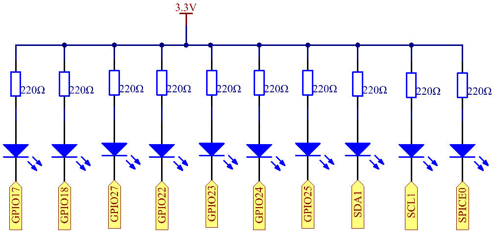

1.1.3 LED Bar Graph
======================

Introduction
-------------

In this project, we sequentially illuminate the lights on the LED Bar
Graph.

Components
----------------

.. image:: img/list_led_bar.png

* :ref:`GPIO Extension Board`
* :ref:`Breadboard`
* :ref:`Resistor`
* :ref:`LED Bar Graph`

Schematic Diagram
-------------------------

Experimental Procedures
------------------------------

**Step 1**: Build the circuit.

.. node::
    Pay attention to the direction when connecting. If you connect it backwards, it will not light up.

.. image:: img/image66.png

**Step 2**: Go to the folder of the code.

.. raw:: html

    <run></run>

.. code-block::

    cd /home/pi/davinci-kit-for-raspberry-pi/nodejs/ 

**Step 3**: Compile the code.

.. raw:: html

    <run></run>

.. code-block::

    sudo node led_bar_graph.js

After the code runs, you will see the LEDs on the LED bar turn on and off regularly.

**Code**

.. code-block:: python

    const Gpio = require('pigpio').Gpio;

    const pins = [17,18,27,22,23,24,25,2,3,8];

    function delay(ms){
        var start = new Date().getTime();	
        while(true){
            if(new Date().getTime() - start > ms){
                break;		
            }	  
        }
    }

    function oddLedBarGraph(){
        for(var i=0; i<5; i++){
            var j = i*2;
            new Gpio(pins[j], {mode: Gpio.OUTPUT}).digitalWrite(1);
            delay(300);
            new Gpio(pins[j], {mode: Gpio.OUTPUT}).digitalWrite(0);
            delay(300);  
        }
    }

    function evenLedBarGraph(){
        for(var i=0; i<5; i++){
            var j = i*2+1;
            new Gpio(pins[j], {mode: Gpio.OUTPUT}).digitalWrite(1);
            delay(300);
            new Gpio(pins[j], {mode: Gpio.OUTPUT}).digitalWrite(0);
            delay(300);  
        }
    }

    function allLedBarGraph(){
        for(var i=0; i<10; i++){
            new Gpio(pins[i], {mode: Gpio.OUTPUT}).digitalWrite(1);
            delay(300);
            new Gpio(pins[i], {mode: Gpio.OUTPUT}).digitalWrite(0);
            delay(300);  
        }
    }

    setInterval(() => {
        oddLedBarGraph();
        delay(300);
        evenLedBarGraph();
        delay(300);
        allLedBarGraph();
        delay(300);
    },300);    

**Code Explanation**

.. code-block::

    var pins = [17,18,27,22,23,24,25,2,3,8];

Because the led bar graph will use multiple pins, we create a constant array ``pins`` to store them in batches.

.. code-block::

    function oddLedBarGraph(){
        for(var i=0; i<5; i++){
            var j = i*2;
            new Gpio(pins[j], {mode: Gpio.OUTPUT}).digitalWrite(1);
            delay(300);
            new Gpio(pins[j], {mode: Gpio.OUTPUT}).digitalWrite(0);
            delay(300);  
        }
    }

Implement an ``oddLedBarGraph()`` function to make the LEDs on the odd digits of the LED bar graph light up in sequence.    

.. code-block::

    function evenLedBarGraph(){
        for(var i=0; i<5; i++){
            var j = i*2+1;
            new Gpio(pins[j], {mode: Gpio.OUTPUT}).digitalWrite(1);
            delay(300);
            new Gpio(pins[j], {mode: Gpio.OUTPUT}).digitalWrite(0);
            delay(300);  
        }
    }

Implement an ``evenLedBarGraph()`` function to make the LEDs on the even digits of the LED bar graph light up in sequence. 

.. code-block::

    function allLedBarGraph(){
        for(var i=0; i<10; i++){
            new Gpio(pins[i], {mode: Gpio.OUTPUT}).digitalWrite(1);
            delay(300);
            new Gpio(pins[i], {mode: Gpio.OUTPUT}).digitalWrite(0);
            delay(300);  
        }
    }

Implement an ``allLedBarGraph()`` function to make the LEDs on the LED bar graph light up one by one. 

Phenomenon Picture
---------------------------

.. image:: img/image67.jpeg

