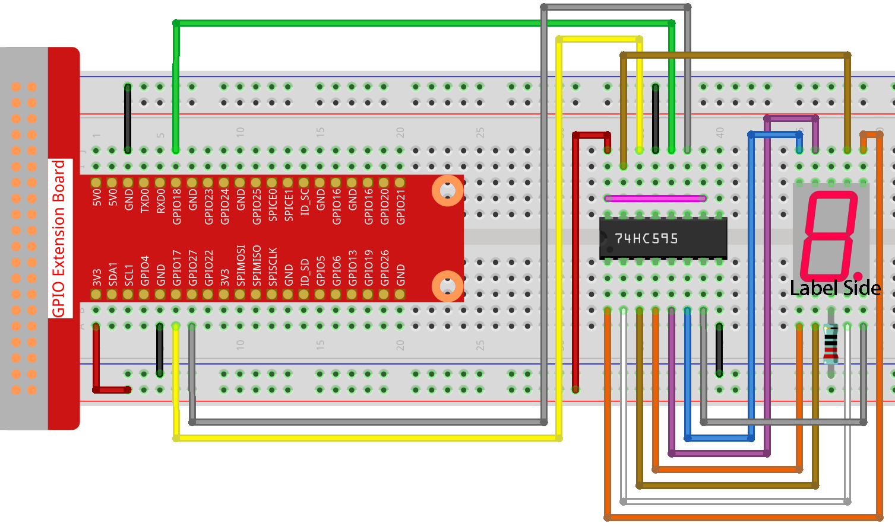

.. note::

    ¡Hola! Bienvenido a la Comunidad de Entusiastas de SunFounder para Raspberry Pi, Arduino y ESP32 en Facebook. Sumérgete en el apasionante mundo de Raspberry Pi, Arduino y ESP32 junto a otros entusiastas.

    **¿Por qué unirte?**

    - **Soporte Experto**: Resuelve problemas postventa y desafíos técnicos con la ayuda de nuestra comunidad y equipo.
    - **Aprende y Comparte**: Intercambia consejos y tutoriales para mejorar tus habilidades.
    - **Avances Exclusivos**: Obtén acceso anticipado a nuevos anuncios de productos y adelantos exclusivos.
    - **Descuentos Especiales**: Disfruta de descuentos exclusivos en nuestros productos más recientes.
    - **Promociones Festivas y Sorteos**: Participa en sorteos y promociones especiales de temporada.

    👉 ¿Listo para explorar y crear con nosotros? Haz clic en [|link_sf_facebook|] y únete hoy mismo.

1.1.4 Pantalla de 7 Segmentos
=================================

Introducción
---------------

Vamos a aprender a controlar una pantalla de 7 segmentos para mostrar cifras de 0 a 9 y de A a F.

Componentes
-------------

.. image:: img/list_7_segment.png

Diagrama del Circuito
-----------------------

Conecta el pin ST_CP del 74HC595 al GPIO18 de la Raspberry Pi, SH_CP a GPIO27 
y DS a GPIO17. Los puertos de salida paralelos se conectan a los 8 segmentos 
de la pantalla LED. Introduce datos en el pin DS al registro de desplazamiento 
cuando SH_CP (entrada de reloj del registro de desplazamiento) está en el flanco 
ascendente, y al registro de memoria cuando ST_CP (entrada de reloj de la memoria) 
está en el flanco ascendente. Puedes controlar los estados de SH_CP y ST_CP a 
través de los GPIO de la Raspberry Pi para transformar la entrada de datos 
seriales en salida de datos paralelos, ahorrando así pines GPIO en la Raspberry Pi y 
manejando la pantalla.

.. image:: img/schematic_7_segment.png

Procedimiento Experimental
------------------------------

**Paso 1:** Construye el circuito.

**Paso 2:** Dirígete a la carpeta del código.

.. raw:: html

    <run></run>

.. code-block::

    cd ~/davinci-kit-for-raspberry-pi/nodejs/

**Paso 3:** Ejecuta el código.

.. raw:: html

    <run></run>

.. code-block::

    sudo node 7-segment_display.js

Después de ejecutar el código, verás que la pantalla de 7 segmentos muestra de 0 a 9 y de A a F.

**Código**

.. code-block:: js

    const Gpio = require('pigpio').Gpio;

    const segCode = [0x3f, 0x06, 0x5b, 0x4f, 0x66, 0x6d, 0x7d, 0x07, 0x7f, 0x6f, 0x77, 0x7c, 0x39, 0x5e, 0x79, 0x71];

    const SDI = new Gpio(17, { mode: Gpio.OUTPUT });
    const RCLK = new Gpio(18, { mode: Gpio.OUTPUT });
    const SRCLK = new Gpio(27, { mode: Gpio.OUTPUT });

    function hc595_shift(dat) {
        for (let j = 0; j < 8; j++) {
            let code = 0x80 & (dat << j);
            if (code != 0) {
                code = 1;
            }
            SDI.digitalWrite(code);
            SRCLK.trigger(1,1);
        }
        RCLK.trigger(1,1);
    }

    let index = -1;
    setInterval(() => {
        index = (index+1)%16;
        hc595_shift(segCode[index]);
    }, 1000);

**Explicación del Código**

.. code-block:: js

    const segCode = [0x3f,0x06,0x5b,0x4f,0x66,0x6d,0x7d,0x07,0x7f,0x6f,0x77,0x7c,0x39,0x5e,0x79,0x71];

Define un arreglo de códigos de segmentos en hexadecimal (cátodo común) de 0 a F.

.. code-block:: js

    const SDI = new Gpio(17, { mode: Gpio.OUTPUT });
    const RCLK = new Gpio(18, { mode: Gpio.OUTPUT });
    const SRCLK = new Gpio(27, { mode: Gpio.OUTPUT });

Inicializa los pines 17, 18 y 27 en modo de salida, y los asigna a ``SDI``, ``RCLK`` y ``SRCLK`` respectivamente.

.. code-block:: js

    function hc595_shift(dat) {
        for (let j = 0; j < 8; j++) {
            let code = 0x80 & (dat << j);
            if (code != 0) {
                code = 1;
            }
            SDI.digitalWrite(code);
            SRCLK.trigger(1,1);
        }
        RCLK.trigger(1,1);
    }

Implementa una función ``hc595_shift`` para convertir los campos del 
arreglo ``segCode`` en números y mostrarlos en la pantalla de 7 segmentos.

.. code-block:: js

    let code = 0x80 & (dat << j);
    if (code != 0) {
        code = 1;
    }
    SDI.digitalWrite(code); 

Asigna los datos ``dat`` a SDI(DS) bit a bit. 
Por ejemplo, si ``dat=0x3f`` (0011 1111), cuando ``j=2``, 0x3f se desplazará a la derecha (<<) 2 bits. 
1111 1100 (0x3f << 2) & 1000 0000 (0x80) = 1000 0000, lo cual es verdadero.
En este momento, se escribe un 1 en SDI.

.. code-block:: js

    SRCLK.trigger(1,1);

Genera un pulso ascendente y transfiere los datos de DS al registro de desplazamiento.

``trigger(pulseLen, level)``
    * pulseLen - longitud del pulso en microsegundos (1 - 100)
    * level - 0 o 1

Envía un pulso de activación al GPIO. 
El GPIO se configura a nivel durante ``pulseLen`` microsegundos y luego se restablece a no nivel.

.. code-block:: js

    RCLK.trigger(1,1);

Genera un pulso ascendente y mueve los datos del registro de desplazamiento al registro de almacenamiento.

.. code-block:: js

    let index = -1;
    setInterval(() => {
        index = (index+1)%16;
        hc595_shift(segCode[index]);
    }, 1000);

Finalmente, utiliza la función ``hc595_shift()`` para convertir los 
campos en ``segCode`` y mostrarlos en la pantalla de 7 segmentos.

Imagen del Fenómeno
-----------------------

.. image:: img/image74.jpeg

