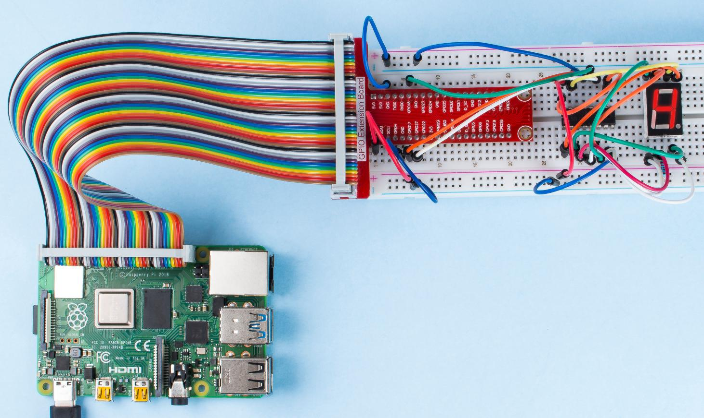

.. note::

    Hallo, willkommen in der SunFounder Raspberry Pi & Arduino & ESP32 Enthusiasten-Community auf Facebook! Tauchen Sie tiefer in Raspberry Pi, Arduino und ESP32 mit anderen Enthusiasten ein.

    **Warum beitreten?**

    - **Expertenunterstützung**: Lösen Sie nach dem Kauf auftretende Probleme und technische Herausforderungen mit Hilfe unserer Community und unseres Teams.
    - **Lernen & Teilen**: Tauschen Sie Tipps und Tutorials aus, um Ihre Fähigkeiten zu verbessern.
    - **Exklusive Vorschauen**: Erhalten Sie frühzeitigen Zugang zu neuen Produktankündigungen und Vorschauen.
    - **Spezielle Rabatte**: Genießen Sie exklusive Rabatte auf unsere neuesten Produkte.
    - **Festliche Aktionen und Gewinnspiele**: Nehmen Sie an Gewinnspielen und festlichen Aktionen teil.

    👉 Bereit, mit uns zu entdecken und zu kreieren? Klicken Sie auf [|link_sf_facebook|] und treten Sie noch heute bei!

1.1.4 7-Segment-Anzeige
=============================

Einführung
--------------

Versuchen wir, eine 7-Segment-Anzeige zu steuern, um eine Zahl von 0 bis 9 und
A bis F anzuzeigen.

Komponenten
----------------

.. image:: img/list_7_segment.png

Schaltplan
---------------------

Verbinden Sie den Pin ST_CP des 74HC595 mit dem Raspberry Pi GPIO18, SH_CP mit GPIO27, DS
mit GPIO17, die parallelen Ausgangsports mit den 8 Segmenten der LED-Segmentanzeige.
Geben Sie Daten in den DS-Pin des Schieberegisters ein, wenn SH_CP (der Takteingang des Schieberegisters) an der steigenden Flanke liegt, und in das Speicheregister, wenn ST_CP (der Takteingang des Speichers) an der steigenden Flanke liegt. Dann können Sie die Zustände von SH_CP und ST_CP über die
GPIOs des Raspberry Pi steuern, um serielle Dateneingaben in parallele Datenausgaben umzuwandeln, um so GPIOs des Raspberry Pi zu sparen und die Anzeige zu steuern.

.. image:: img/schematic_7_segment.png

Experimentelle Vorgehensweise
--------------------------

**Schritt 1:** Bauen Sie die Schaltung auf.

.. image:: img/image73.png

**Schritt 2:** Gehen Sie zum Ordner des Codes.

.. raw:: html

    <run></run>

.. code-block::

    cd ~/davinci-kit-for-raspberry-pi/nodejs/

**Schritt 3:** Führen Sie den Code aus.

.. raw:: html

    <run></run>

.. code-block::

    sudo node 7-segment_display.js

Nachdem der Code ausgeführt wurde, sehen Sie, dass die 7-Segment-Anzeige die Zahlen 0-9 und die Buchstaben A-F anzeigt.

**Code**

.. code-block:: js

    const Gpio = require('pigpio').Gpio;

    const segCode = [0x3f, 0x06, 0x5b, 0x4f, 0x66, 0x6d, 0x7d, 0x07, 0x7f, 0x6f, 0x77, 0x7c, 0x39, 0x5e, 0x79, 0x71];

    const SDI = new Gpio(17, { mode: Gpio.OUTPUT });
    const RCLK = new Gpio(18, { mode: Gpio.OUTPUT });
    const SRCLK = new Gpio(27, { mode: Gpio.OUTPUT });

    function hc595_shift(dat) {
        for (let j = 0; j < 8; j++) {
            let code = 0x80 & (dat << j);
            if (code != 0) {
                code = 1;
            }
            SDI.digitalWrite(code);
            SRCLK.trigger(1,1);
        }
        RCLK.trigger(1,1);
    }

    let index = -1;
    setInterval(() => {
        index = (index+1)%16;
        hc595_shift(segCode[index]);
    }, 1000);

**Code Erklärung**

.. code-block:: js

    const segCode = [0x3f,0x06,0x5b,0x4f,0x66,0x6d,0x7d,0x07,0x7f,0x6f,0x77,0x7c,0x39,0x5e,0x79,0x71];

Definieren Sie ein hexadezimales (gemeinsame Kathode) Segmentcode-Array von 0 bis F.   

.. code-block:: js

    const SDI = new Gpio(17, { mode: Gpio.OUTPUT });
    const RCLK = new Gpio(18, { mode: Gpio.OUTPUT });
    const SRCLK = new Gpio(27, { mode: Gpio.OUTPUT });

Initialisieren Sie die Pins 17, 18 und 27 im Ausgabemodus und weisen Sie sie den Konstanten ``SDI``, ``RCLK`` und ``SRCLK`` zu.

.. code-block:: js

    function hc595_shift(dat) {
        for (let j = 0; j < 8; j++) {
            let code = 0x80 & (dat << j);
            if (code != 0) {
                code = 1;
            }
            SDI.digitalWrite(code);
            SRCLK.trigger(1,1);
        }
        RCLK.trigger(1,1);
    }

Implementieren Sie eine ``hc595_shift``-Funktion, um die Felder im Array ``segCode`` in Zahlen umzuwandeln 
und sie auf dem digitalen Display anzuzeigen.

.. code-block:: js

    let code = 0x80 & (dat << j);
    if (code != 0) {
        code = 1;
    }
    SDI.digitalWrite(code); 

Weisen Sie die Daten ``dat`` bitweise dem SDI(DS) zu. 
Hier nehmen wir an, dat=0x3f (0011 1111), wenn j=2, wird 0x3f um 2 Bits nach rechts verschoben (<<). 
1111 1100 (0x3f << 2) & 1000 0000 (0x80) = 1000 0000, ist wahr.
Zu diesem Zeitpunkt wird eine 1 an SDI geschrieben.

.. code-block:: js

    SRCLK.trigger(1,1);

Erzeugen Sie einen steigenden Flankenimpuls und verschieben Sie die DS-Daten in das Schieberegister.

``trigger(pulseLen, level)``
    * pulseLen - Impulslänge in Mikrosekunden (1 - 100)
    * level - 0 oder 1

Sendet einen Triggerimpuls an den GPIO. 
Der GPIO wird für pulseLen Mikrosekunden auf level gesetzt und dann auf nicht level zurückgesetzt.

.. code-block:: js

    RCLK.trigger(1,1);

Erzeugen Sie einen steigenden Flankenimpuls und verschieben Sie die Daten vom Schieberegister in das Speicherregister.

.. code-block:: js

    let index = -1;
    setInterval(() => {
        index = (index+1)%16;
        hc595_shift(segCode[index]);
    }, 1000);

Verwenden Sie schließlich die Funktion ``hc595_shift()`` um die Felder in ``segCode`` umzuwandeln 
und sie über das digitale Display anzuzeigen.   

Phänomenbild
---------------------------

