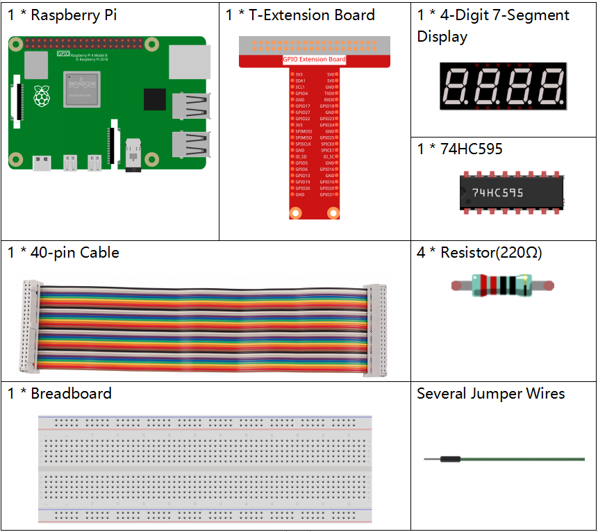
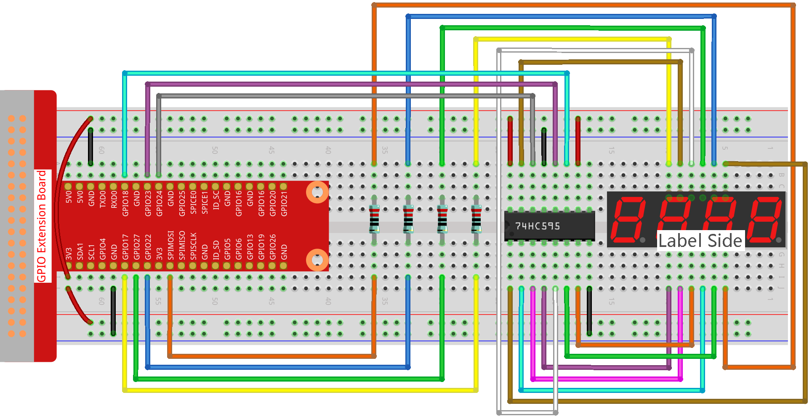

.. note::

    Hallo, willkommen in der SunFounder Raspberry Pi & Arduino & ESP32 Enthusiasten-Community auf Facebook! Tauchen Sie tiefer in Raspberry Pi, Arduino und ESP32 mit anderen Enthusiasten ein.

    **Warum beitreten?**

    - **Expertenunterstützung**: Lösen Sie nach dem Kauf auftretende Probleme und technische Herausforderungen mit Hilfe unserer Community und unseres Teams.
    - **Lernen & Teilen**: Tauschen Sie Tipps und Tutorials aus, um Ihre Fähigkeiten zu verbessern.
    - **Exklusive Vorschauen**: Erhalten Sie frühzeitigen Zugang zu neuen Produktankündigungen und Vorschauen.
    - **Spezielle Rabatte**: Genießen Sie exklusive Rabatte auf unsere neuesten Produkte.
    - **Festliche Aktionen und Gewinnspiele**: Nehmen Sie an Gewinnspielen und festlichen Aktionen teil.

    👉 Bereit, mit uns zu entdecken und zu kreieren? Klicken Sie auf [|link_sf_facebook|] und treten Sie noch heute bei!

1.1.5 4-stelliges 7-Segment-Display
====================================

Einführung
-----------------

Als nächstes versuchen wir, das 4-stellige 7-Segment-Display zu steuern.

Komponenten
------------

.. note::
    In diesem Projekt sollten wir für das 4-stellige 7-Segment-Display das BS-Modell verwenden. Wenn Sie das AS-Modell verwenden, leuchtet es möglicherweise nicht.

Schaltplan
--------------------

.. image:: img/schmatic_4_digit.png

Experimentelle Vorgehensweise
-------------------------

**Schritt 1:** Bauen Sie die Schaltung auf.

**Schritt 2:** Gehen Sie zum Ordner des Codes.

.. raw:: html

    <run></run>

.. code-block::

    cd ~/davinci-kit-for-raspberry-pi/nodejs/

**Schritt 3:** Führen Sie den Code aus.

.. raw:: html

    <run></run>

.. code-block::

    sudo node 4_digit_7_segment_display.js

Nachdem der Code ausgeführt wurde, zählt das Programm jede Sekunde um 1 hoch, und das 4-stellige 7-Segment-Display zeigt den Zählerstand an.

**Code**

.. code-block:: js

    const Gpio = require('pigpio').Gpio;

    var counter = 0;

    const number = [0xc0, 0xf9, 0xa4, 0xb0, 0x99, 0x92, 0x82, 0xf8, 0x80, 0x90]; //für BS
    
    const SDI = new Gpio(24, { mode: Gpio.OUTPUT });
    const RCLK = new Gpio(23, { mode: Gpio.OUTPUT });
    const SRCLK = new Gpio(18, { mode: Gpio.OUTPUT });

    const pin1 = new Gpio(10, { mode: Gpio.OUTPUT });
    const pin2 = new Gpio(22, { mode: Gpio.OUTPUT });
    const pin3 = new Gpio(27, { mode: Gpio.OUTPUT });
    const pin4 = new Gpio(17, { mode: Gpio.OUTPUT });
    const placePin = [pin1, pin2, pin3, pin4];

    function clearDisplay() {
        hc595_shift(0xff); //für BS
    }

    function hc595_shift(dat) {
        for (let j = 0; j < 8; j++) {
            let code = 0x80 & (dat << j);
            if (code != 0) {
                code = 1;
            }
            SDI.digitalWrite(code);
            SRCLK.trigger(1,1);
        }
        RCLK.trigger(1,1);
    }

    function pickDigit(digit) {
        for(let i=0;i<4;i++){
            placePin[i].digitalWrite(0);
        }
        placePin[digit].digitalWrite(1);
    }

    let digit = -1;
    setInterval(() => {
        digit = (digit +1)% 4;
        clearDisplay();
        pickDigit(digit);
        switch(digit){
            case 0:
                hc595_shift(number[Math.floor(counter % 10)]);  
                break;
            case 1:
                hc595_shift(number[Math.floor(counter % 100 / 10)]);
                break;        
            case 2:
                hc595_shift(number[Math.floor(counter % 1000 / 100)]);
                break;        
            case 3:
                hc595_shift(number[Math.floor(counter % 10000 / 1000)]);
                break;
        }
    }, 5);

    setInterval(() => {
        counter++;
    }, 1000);

**Code Erklärung**

.. code-block:: js

    const pin1 = new Gpio(10, {mode: Gpio.OUTPUT});
    const pin2 = new Gpio(25, {mode: Gpio.OUTPUT});
    const pin3 = new Gpio(27, {mode: Gpio.OUTPUT});
    const pin4 = new Gpio(17, {mode: Gpio.OUTPUT});
    const placePin = [pin1, pin2, pin3, pin4];    

Initialisieren Sie die Pins 10, 25, 27 und 17 im Ausgabemodus und platzieren Sie sie im Array ``placePin``, um die gemeinsame Anode des vierstelligen 7-Segment-Displays zu steuern.

.. code-block:: js

    const number = [0xc0, 0xf9, 0xa4, 0xb0, 0x99, 0x92, 0x82, 0xf8, 0x80, 0x90];

Definieren Sie ein konstantes Array ``number``, um den hexadezimalen Segmentcode von 0 bis 9 (gemeinsame Anode) darzustellen.

.. code-block:: js

    function clearDisplay() {
        hc595_shift(0xff); 
    }

Schreiben Sie 0xff, um die Anzeige auszuschalten.

.. code-block:: js

    function pickDigit(digit) {
        for(let i=0;i<4;i++){
            placePin[i].digitalWrite(0);
        }
        placePin[digit].digitalWrite(1);
    }

Wählen Sie die Stelle des Wertes aus. 
Es sollte jeweils nur eine Stelle aktiviert sein. 
Die aktivierte Stelle wird auf HIGH gesetzt.

.. code-block:: js

    let digit = -1;
    setInterval(() => {
        digit = (digit +1)% 4;
        clearDisplay();
        pickDigit(digit);
        switch(digit){
            case 0:
                hc595_shift(number[Math.floor(counter % 10)]);  
                break;
            case 1:
                hc595_shift(number[Math.floor(counter % 100 / 10)]);
                break;        
            case 2:
                hc595_shift(number[Math.floor(counter % 1000 / 100)]);
                break;        
            case 3:
                hc595_shift(number[Math.floor(counter % 10000 / 1000)]);
                break;
        }
    }, 5);

Dieser Code wird verwendet, um die auf dem 4-stelligen 7-Segment-Display angezeigte Zahl einzustellen.

Zuerst starten wir das vierte Segmentdisplay und schreiben die einstellige Zahl. 
Dann starten wir das dritte Segmentdisplay und geben die Zehnerstelle ein; 
danach starten wir nacheinander das zweite und das erste Segmentdisplay und schreiben jeweils die Hunderter- und Tausenderstellen. 
Da die Aktualisierungsgeschwindigkeit sehr hoch ist, sehen wir eine vollständige vierstellige Anzeige.

.. code-block:: js

    setInterval(() => {
        counter++;
    }, 1000);

Erhöhen Sie jede Sekunde den ``counter`` um eins 
(das vierstellige Digitaldisplay zeigt die um eins erhöhte Zahl an).

Phänomenbild
-------------------------

.. image:: img/image81.jpeg
